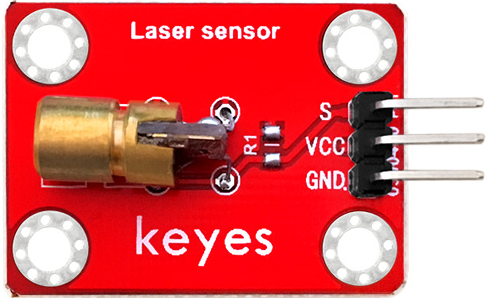
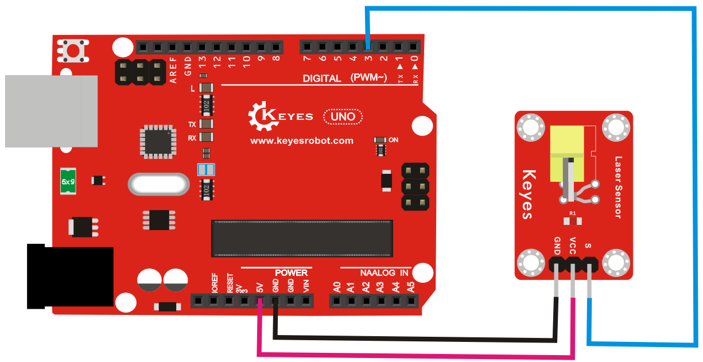

# **KE0077 Keyes 激光头模块教程**



---

## **1. 模块介绍**

KE0077 Keyes 激光头模块是一款基于激光二极管的光源模块，能够发射高亮度的红色激光光束。模块采用环保红色 PCB 板，具有高亮度、低功耗和易于使用的特点，适用于激光定位、激光测距、激光通信等应用场景。

#### **应用场景**
- 激光定位
- 激光测距
- 激光通信
- 激光指示器
- 光学实验

---

## **2. 模块特点**

- **高亮度**：发射清晰的红色激光光束。
- **低功耗**：适合电池供电设备。
- **易于使用**：只需简单供电即可工作。
- **环保设计**：采用红色环保 PCB 板，耐用且稳定。
- **小巧轻便**：适合嵌入式应用。

---

## **3. 规格参数**

| 参数            | 值                     |
|-----------------|------------------------|
| **工作电压**    | 5V（DC）               |
| **工作电流**    | ≤40mA                 |
| **激光波长**    | 650nm（红光）          |
| **激光功率**    | ≤5mW                  |
| **光束直径**    | 6mm（10米处）          |
| **尺寸**        | 20mm × 15mm × 3mm      |
| **重量**        | 3g                     |

---

## **4. 工作原理**

KE0077 激光头模块的核心是一个 650nm 的激光二极管，通过电流驱动发射红色激光光束。模块内置限流电阻，能够稳定激光二极管的工作电流，确保激光输出稳定。只需为模块提供 5V 电源即可正常工作。

---

## **5. 接口说明**

模块有 3 个主要引脚：
1. **VCC**：电源正极（5V）。  
   - 用于为模块供电。
2. **GND**：电源负极（接地）。  
   - 与 Arduino 或其他控制板的 GND 引脚连接。
3. **S**：控制信号输入。  
   - 接 Arduino 的数字输出引脚，用于控制激光的开关。

---

## **6. 连接图**

以下是 KE0077 模块与 Arduino UNO 的连接示意图：

| 模块引脚 | Arduino 引脚 |
| -------- | ------------ |
| **VCC**  | 5V           |
| **GND**  | GND          |
| **S**    | D3           |

连接图如下：



---

## **7. 示例代码**

以下是用于测试 KE0077 模块的 Arduino 示例代码，通过控制信号引脚实现激光的开关。

#### **代码示例**
```cpp
const int laserPin = 3;  // 激光模块的控制引脚连接到 Arduino 的 D3

void setup() {
  pinMode(laserPin, OUTPUT);  // 设置激光引脚为输出模式
}

void loop() {
  digitalWrite(laserPin, HIGH);  // 打开激光
  delay(1000);                   // 激光保持打开 1 秒
  digitalWrite(laserPin, LOW);   // 关闭激光
  delay(1000);                   // 激光保持关闭 1 秒
}
```

---

## **8. 实验现象**

1. **硬件连接**：按照连接图连接模块与 Arduino UNO。
2. **烧录代码**：将代码上传到 Arduino UNO。
3. **运行测试**：
   - 激光模块会以 1 秒的间隔打开和关闭。
   - 激光头发射出清晰的红色激光光束。
   - 可以通过调整代码中的 `delay()` 时间改变激光的开关频率。

---

## **9. 注意事项**

1. **供电电压**：模块仅支持 5V 电压，避免使用高于 5V 的电源，以免损坏模块。
2. **激光安全**：激光光束可能对眼睛造成伤害，避免直视激光或将激光对准人眼。
3. **环境光干扰**：在强光环境下，激光光束的可见性可能会降低。
4. **散热问题**：长时间连续使用时，注意模块的散热情况，避免过热。
5. **控制信号**：如果不需要控制激光开关，可以直接将 SIG 引脚接高电平（5V），激光会一直保持打开状态。

---

## **10. 参考链接**

- [激光安全标准](https://www.laserinstitute.org/)

---

如果需要进一步调整代码或有其他问题，请告诉我！
