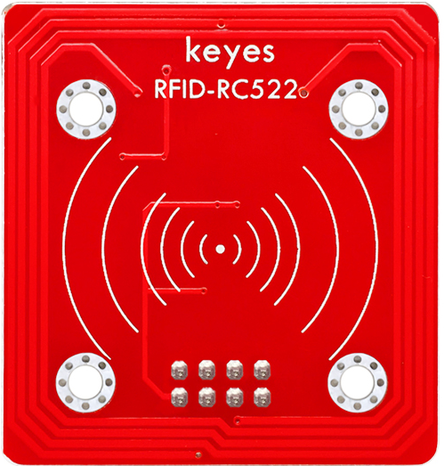
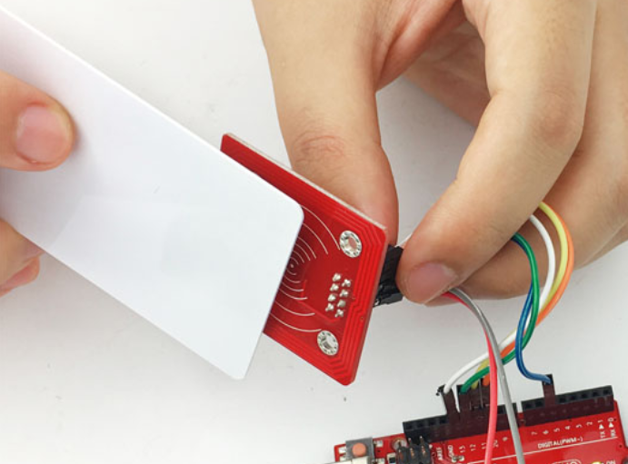

# KE0078 Keyes RFID-RC522 射频模块教程



---

## **1. 模块介绍**

KE0078 Keyes RFID-RC522 射频模块是一款基于 NXP MFRC522 芯片的 RFID 读写模块，支持 13.56MHz 的非接触式通信协议。该模块可以读取和写入 RFID 卡片的数据，支持 ISO14443A 标准协议，广泛应用于门禁系统、身份识别、物联网设备等场景。

模块采用环保红色 PCB 板，内置天线，具有低功耗、高性能的特点。通过 SPI 接口与 Arduino、树莓派等开发板连接，能够轻松实现 RFID 卡片的读写功能。

#### **应用场景**
- **门禁系统**：用于身份验证和门禁控制。
- **身份识别**：读取 RFID 卡片的唯一标识符（UID）进行身份认证。
- **物联网设备**：结合物联网技术，实现智能设备的身份管理。
- **数据加密与存储**：通过写入卡片数据，实现加密存储。
- **智能卡应用**：如公交卡、会员卡、考勤卡等。

---

## **2. 模块特点**

- **高性能**：基于 MFRC522 芯片，支持 ISO14443A 标准协议。
- **低功耗**：工作电流仅 13～26mA，适合电池供电设备。
- **多功能**：支持读取和写入 RFID 卡片数据。
- **内置天线**：无需外接天线，读取距离可达 0～5cm。
- **环保设计**：采用红色环保 PCB 板，耐用且稳定。
- **易于使用**：通过 SPI 接口与 Arduino 等开发板连接，提供丰富的开源库支持。

---

## **3. 规格参数**

| 参数            | 值                     |
|-----------------|------------------------|
| **工作电压**    | 3.3V ～ 5V（DC）       |
| **工作电流**    | 13～26mA               |
| **通信接口**    | SPI                    |
| **工作频率**    | 13.56MHz               |
| **支持协议**    | ISO14443A              |
| **读取距离**    | 0～5cm                 |
| **尺寸**        | 40mm × 60mm × 3mm      |
| **重量**        | 5g                     |

---

## **4. 工作原理**

RC522 是一款高集成度的 RFID 读写芯片，支持 13.56MHz 的非接触式通信协议。模块通过 SPI 接口与主控板通信，能够读取和写入 RFID 卡片的数据。

#### **工作流程**
1. **初始化模块**：通过 SPI 接口配置 RC522 芯片的寄存器，初始化模块。
2. **检测卡片**：模块通过内置天线发射射频信号，检测是否有 RFID 卡片靠近。
3. **读取 UID**：如果检测到卡片，模块会读取卡片的唯一标识符（UID）。
4. **数据读写**：通过模块的读写功能，可以读取或写入卡片的存储数据。
5. **停止通信**：完成操作后，停止与卡片的通信。

---

## **5. 接口说明**

模块有 8 个主要引脚，具体说明如下：

| 引脚名称 | 功能说明                                                     |
| -------- | ------------------------------------------------------------ |
| **VCC**  | 电源正极（3.3V ～ 5V）。用于为模块供电。                     |
| **GND**  | 电源负极（接地）。与 Arduino 或其他控制板的 GND 引脚连接。   |
| **RST**  | 复位引脚。用于复位模块，接 Arduino 的数字引脚（如 D5）。     |
| **IRQ**  | 中断引脚（可选）。通常不使用，可悬空。                       |
| **MISO** | SPI 主输入从输出引脚。用于 SPI 通信，接 Arduino 的 D12 引脚。 |
| **MOSI** | SPI 主输出从输入引脚。用于 SPI 通信，接 Arduino 的 D11 引脚。 |
| **SCK**  | SPI 时钟引脚。用于 SPI 通信，接 Arduino 的 D13 引脚。        |
| **SDA**  | SPI 片选引脚。用于选择模块，接 Arduino 的 D10 引脚。         |

---

## **6. 连接图**

以下是 KE0078 模块与 Arduino UNO 的连接示意图：

| 模块引脚 | Arduino 引脚 |
| -------- | ------------ |
| **VCC**  | 3.3V         |
| **GND**  | GND          |
| **RST**  | D5           |
| **IRQ**  | 不接         |
| **MISO** | D12          |
| **MOSI** | D11          |
| **SCK**  | D13          |
| **SDA**  | D10          |

连接图如下：


---

## **7. 示例代码**

以下是用于测试 KE0078 模块的 Arduino 示例代码，读取 RFID 卡片的 UID 并在串口监视器中显示。

#### **代码示例**

```cpp
#include <SPI.h>
#include <MFRC522.h>

#define RST_PIN 5   // 模块 RST 引脚连接到 Arduino 的 D5
#define SS_PIN 10   // 模块 SDA 引脚连接到 Arduino 的 D10

MFRC522 rfid(SS_PIN, RST_PIN);  // 创建 MFRC522 对象

void setup() {
  Serial.begin(9600);  // 初始化串口通信
  SPI.begin();         // 初始化 SPI 接口
  rfid.PCD_Init();     // 初始化 RC522 模块
  Serial.println("Place your card near the reader...");
}

void loop() {
  // 检查是否有新的 RFID 卡片
  if (!rfid.PICC_IsNewCardPresent()) {
    return;
  }

  // 检查是否能读取卡片的 UID
  if (!rfid.PICC_ReadCardSerial()) {
    return;
  }

  // 打印卡片的 UID
  Serial.print("Card UID: ");
  for (byte i = 0; i < rfid.uid.size; i++) {
    Serial.print(rfid.uid.uidByte[i] < 0x10 ? " 0" : " ");
    Serial.print(rfid.uid.uidByte[i], HEX);
  }
  Serial.println();

  // 停止与卡片的通信
  rfid.PICC_HaltA();
}
```

---

## **8. 实验现象**

1. **硬件连接**：按照连接图连接模块与 Arduino UNO。

2. **烧录代码**：将代码上传到 Arduino UNO。

3. **运行测试**：
   - 打开 Arduino IDE 的串口监视器，设置波特率为 9600。
   
   - 将 RFID 卡片靠近模块天线区域。
   
   	
   
   - 串口监视器会显示卡片的 UID（唯一标识符）。
   
   - 每次读取卡片时，UID 都会被打印到串口监视器中。

---

## **9. 注意事项**

1. **供电电压**：模块支持 3.3V 和 5V 电压，但建议使用 3.3V 供电以确保稳定性。
2. **通信接口**：模块使用 SPI 接口，与 Arduino 的 SPI 引脚连接时需确保引脚定义正确。
3. **读取距离**：模块的读取距离通常为 0～5cm，超过此范围可能无法正常读取。
4. **卡片兼容性**：模块支持 ISO14443A 标准的 RFID 卡片，确保使用兼容的卡片。
5. **干扰问题**：避免模块周围有金属物体或其他射频干扰源，以免影响读取效果。
6. **库安装**：使用前需安装 `MFRC522` 库，可通过 Arduino IDE 的库管理器搜索并安装。

---

## **10. 参考链接**

- [Arduino 官网](https://www.arduino.cc/)
- [Keyes 官网](http://www.keyes-robot.com/)
- [MFRC522 数据手册](https://www.nxp.com/docs/en/data-sheet/MFRC522.pdf)
- [MFRC522 Arduino 库](https://github.com/miguelbalboa/rfid)

---

如果需要进一步调整代码或有其他问题，请告诉我！
