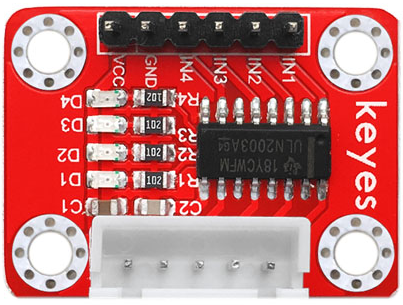
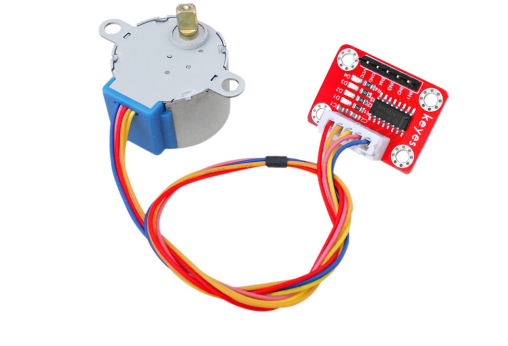
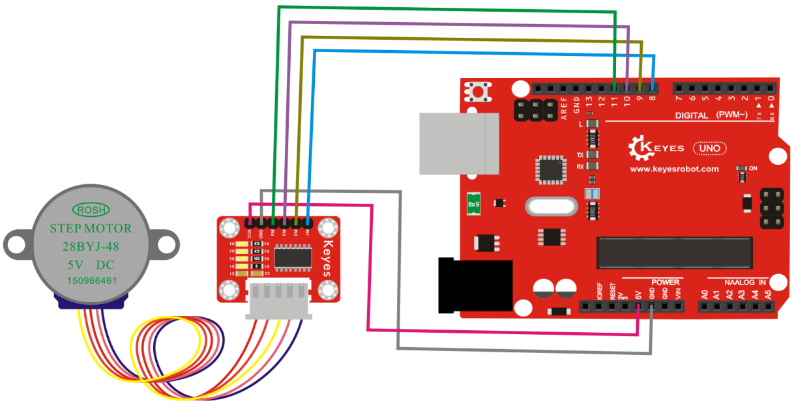

# **KE0079 Keyes ULN2003 步进电机驱动板教程**



---

## **1. 模块介绍**

KE0079 Keyes ULN2003 步进电机驱动板是一款基于 ULN2003 芯片的步进电机驱动模块，专为 4 相 5 线步进电机（如 28BYJ-48 步进电机）设计。模块通过简单的控制信号即可驱动步进电机，适用于机器人、机械臂、自动化设备等场景。



模块采用环保红色 PCB 板，内置 ULN2003 晶体管阵列，能够提供高达 500mA 的驱动电流，支持 5V 或 12V 的步进电机。

#### **应用场景**
- 机器人控制
- 机械臂驱动
- 自动化设备
- 精密定位系统
- DIY 项目

---

## **2. 模块特点**

- **高兼容性**：支持 4 相 5 线步进电机（如 28BYJ-48）。
- **高驱动能力**：内置 ULN2003 晶体管阵列，单通道最大驱动电流 500mA。
- **易于使用**：通过简单的控制信号即可驱动步进电机。
- **环保设计**：采用红色环保 PCB 板，耐用且稳定。
- **LED 指示灯**：每个通道配有 LED 指示灯，方便调试。

---

## **3. 规格参数**

| 参数            | 值                     |
|-----------------|------------------------|
| **工作电压**    | 5V ～ 12V（DC）        |
| **驱动电流**    | 最大 500mA（单通道）   |
| **支持电机类型**| 4 相 5 线步进电机      |
| **接口类型**    | 4 路控制信号输入       |
| **尺寸**        | 42mm × 31mm × 3mm      |
| **重量**        | 5g                     |

---

## **4. 工作原理**

ULN2003 是一款高电压、大电流达林顿晶体管阵列，内部包含 7 个达林顿晶体管，每个通道可以驱动高达 500mA 的电流。驱动板通过控制 ULN2003 的输入信号，依次激活步进电机的 4 个线圈，从而实现步进电机的旋转。

#### **步进电机的工作方式**
- 步进电机通过依次激活线圈产生旋转运动。
- 每次激活一个线圈，电机会旋转一个步距角。
- 通过改变线圈的激活顺序，可以控制电机的旋转方向（顺时针或逆时针）。

---

### **5. 接口说明**
模块有 10 个主要引脚，具体说明如下：

| 引脚名称 | 功能说明                                                                 |
|----------|--------------------------------------------------------------------------|
| **IN1**  | 控制信号输入 1，接 Arduino 的数字引脚。                                  |
| **IN2**  | 控制信号输入 2，接 Arduino 的数字引脚。                                  |
| **IN3**  | 控制信号输入 3，接 Arduino 的数字引脚。                                  |
| **IN4**  | 控制信号输入 4，接 Arduino 的数字引脚。                                  |
| **VCC**  | 电源正极（5V ～ 12V）。用于为步进电机供电。                              |
| **GND**  | 电源负极（接地）。与 Arduino 或其他控制板的 GND 引脚连接。               |
| **电机接口** | 4 相 5 线步进电机接口，用于连接步进电机（如 28BYJ-48）。             |

---

## **6. 连接图**

以下是 KE0079 模块与 Arduino UNO 的连接示意图：

| 模块引脚 | Arduino 引脚 |
|----------|--------------|
| **IN1**  | D8           |
| **IN2**  | D9           |
| **IN3**  | D10          |
| **IN4**  | D11          |
| **VCC**  | 5V           |
| **GND**  | GND          |

连接图如下：



步进电机通过模块的电机接口连接到驱动板。

---

## **7. 示例代码**

以下是用于测试 KE0079 模块的 Arduino 示例代码，通过控制步进电机实现顺时针和逆时针旋转。

#### **代码示例**
```cpp
// 定义步进电机的控制引脚
#define IN1 8
#define IN2 9
#define IN3 10
#define IN4 11

// 定义步进电机的步序表
int steps[8][4] = {
  {1, 0, 0, 0},
  {1, 1, 0, 0},
  {0, 1, 0, 0},
  {0, 1, 1, 0},
  {0, 0, 1, 0},
  {0, 0, 1, 1},
  {0, 0, 0, 1},
  {1, 0, 0, 1}
};

void setup() {
  // 设置控制引脚为输出模式
  pinMode(IN1, OUTPUT);
  pinMode(IN2, OUTPUT);
  pinMode(IN3, OUTPUT);
  pinMode(IN4, OUTPUT);
}

void loop() {
  // 顺时针旋转
  for (int i = 0; i < 512; i++) { // 512 步为一圈
    stepMotor(i % 8);
    delay(2); // 调整延迟时间以改变转速
  }
  delay(1000); // 停止 1 秒

  // 逆时针旋转
  for (int i = 511; i >= 0; i--) {
    stepMotor(i % 8);
    delay(2);
  }
  delay(1000); // 停止 1 秒
}

// 控制步进电机的步进函数
void stepMotor(int step) {
  digitalWrite(IN1, steps[step][0]);
  digitalWrite(IN2, steps[step][1]);
  digitalWrite(IN3, steps[step][2]);
  digitalWrite(IN4, steps[step][3]);
}
```

---

## **8. 实验现象**

1. **硬件连接**：按照连接图连接模块与 Arduino UNO。
2. **烧录代码**：将代码上传到 Arduino UNO。
3. **运行测试**：
   - 步进电机会顺时针旋转一圈，停止 1 秒后逆时针旋转一圈。
   - 可以通过调整代码中的 `delay()` 时间改变电机的转速。
   - 模块上的 LED 指示灯会依次点亮，指示当前激活的线圈。

---

## **9. 注意事项**

1. **供电电压**：模块支持 5V ～ 12V 电压，确保步进电机的供电电压与模块匹配。
2. **电机类型**：模块适用于 4 相 5 线步进电机（如 28BYJ-48），其他类型的电机可能无法正常工作。
3. **电流限制**：ULN2003 的单通道最大驱动电流为 500mA，避免超出此范围。
4. **散热问题**：长时间连续使用时，注意模块的散热情况，避免过热。
5. **调试指示灯**：模块上的 LED 指示灯可以帮助调试电机的工作状态。

---

## **10. 参考链接**

- [ULN2003 数据手册](https://www.ti.com/lit/ds/symlink/uln2003a.pdf)

---

如果需要进一步调整代码或有其他问题，请告诉我！
