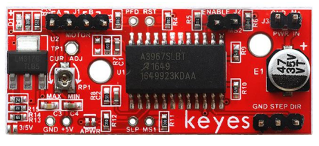
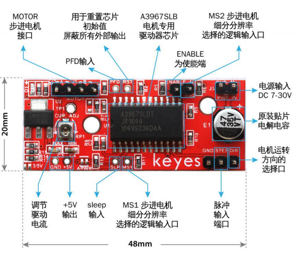
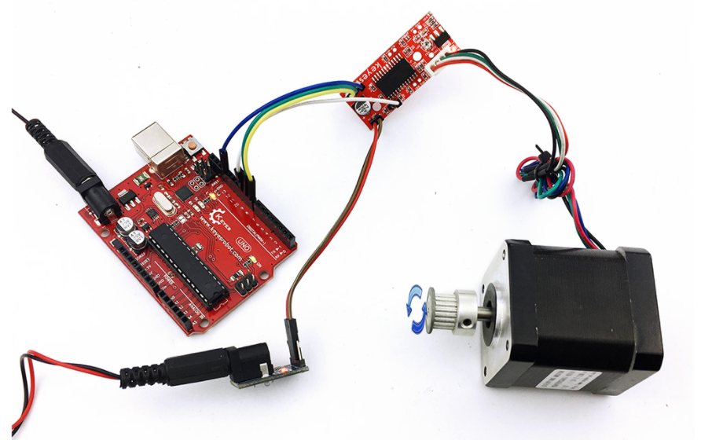

# **KE0090 Keyes A3967 步进电机驱动板教程**



---

## **1. 模块介绍**

KE0090 Keyes A3967 步进电机驱动板是一款基于 A3967 驱动芯片的高性能步进电机驱动模块，支持双极性步进电机的驱动，适用于 4 线或 6 线步进电机。模块支持微步驱动（1/8 步），通过简单的控制信号即可实现步进电机的精准控制，广泛应用于 CNC 控制、3D 打印机、机器人等场景。

模块采用环保红色 PCB 板，具有高效率、低功耗和易于使用的特点。

#### **应用场景**
- CNC 控制
- 3D 打印机
- 精密定位系统
- 机器人控制
- 自动化设备

---

## **2. 模块特点**

- **高性能驱动**：基于 A3967 驱动芯片，支持双极性步进电机。
- **微步驱动**：支持全步、半步、1/4 步和 1/8 步模式。
- **高兼容性**：适用于 4 线或 6 线步进电机。
- **低功耗**：内置电流控制和过热保护功能。
- **环保设计**：采用红色环保 PCB 板，耐用且稳定。
- **易于使用**：通过简单的 STEP 和 DIR 信号即可控制电机。

---

## **3. 规格参数**

| 参数            | 值                     |
|-----------------|------------------------|
| **工作电压**    | 4.5V ～ 30V（DC）      |
| **驱动电流**    | 最大 750mA（每相）     |
| **支持电机类型**| 双极性步进电机（4 线或 6 线） |
| **微步模式**    | 全步、半步、1/4 步、1/8 步 |
| **接口类型**    | STEP 和 DIR 信号输入   |
| **尺寸**        | 42mm × 31mm × 3mm      |
| **重量**        | 5g                     |

---

## **4. 工作原理**

A3967 是一款高性能的步进电机驱动芯片，支持双极性步进电机的全步、半步、1/4 步和 1/8 步驱动模式。通过控制 STEP 和 DIR 信号，可以实现步进电机的精准控制。

## **工作流程**

1. **方向控制**：通过 DIR 引脚设置电机的旋转方向（高电平为顺时针，低电平为逆时针）。
2. **步进控制**：每次向 STEP 引脚发送一个脉冲信号，电机会旋转一个步距角。
3. **微步模式**：通过配置 MS1 和 MS2 引脚，可以选择全步、半步、1/4 步或 1/8 步模式。
4. **电流控制**：A3967 内置电流控制功能，能够根据电机的需求自动调整驱动电流。

---

## **5. 接口说明**



模块有 10 个主要引脚，具体说明如下：

| 引脚名称 | 功能说明                                                                 |
|----------|--------------------------------------------------------------------------|
| **VCC**  | 电源正极（4.5V ～ 30V）。用于为步进电机供电。                              |
| **GND**  | 电源负极（接地）。与 Arduino 或其他控制板的 GND 引脚连接。                 |
| **STEP** | 步进信号输入，每个脉冲信号使电机旋转一个步距角。                           |
| **DIR**  | 方向控制信号，高电平为顺时针，低电平为逆时针。                             |
| **MS1**  | 微步模式选择引脚 1，用于设置微步模式（与 MS2 配合使用）。                  |
| **MS2**  | 微步模式选择引脚 2，用于设置微步模式（与 MS1 配合使用）。                  |
| **ENABLE** | 使能信号，低电平使能驱动，高电平关闭驱动。                              |
| **电机接口** | 4 线或 6 线步进电机接口，用于连接步进电机。                            |

#### **微步模式设置**
| MS1 | MS2 | 驱动模式 |
|-----|-----|----------|
| LOW | LOW | 全步     |
| HIGH| LOW | 半步     |
| LOW | HIGH| 1/4 步   |
| HIGH| HIGH| 1/8 步   |

---

## **6. 连接图**

以下是 KE0090 模块与 Arduino UNO 的连接示意图：

| 模块引脚 | Arduino 引脚 |
|----------|--------------|
| **VCC**  | 5V 或外部电源 |
| **GND**  | GND          |
| **STEP** | D3           |
| **DIR**  | D4           |
| **MS1**  | D5（可选）   |
| **MS2**  | D6（可选）   |
| **ENABLE** | GND（默认使能）|

连接图如下：

```
Arduino UNO         KE0090模块
   5V   ------------>  VCC
   GND  ------------>  GND
   D3    ------------>  STEP
   D4    ------------>  DIR
   D5    ------------>  MS1（可选）
   D6    ------------>  MS2（可选）
```

步进电机通过模块的电机接口连接到驱动板。

---

## **7. 示例代码**

以下是用于测试 KE0090 模块的 Arduino 示例代码，通过控制步进电机实现顺时针和逆时针旋转。

#### **代码示例**
```cpp
// 定义步进电机的控制引脚
#define STEP_PIN 3
#define DIR_PIN 4
#define MS1_PIN 5
#define MS2_PIN 6

void setup() {
  // 设置控制引脚为输出模式
  pinMode(STEP_PIN, OUTPUT);
  pinMode(DIR_PIN, OUTPUT);
  pinMode(MS1_PIN, OUTPUT);
  pinMode(MS2_PIN, OUTPUT);

  // 设置微步模式为 1/8 步
  digitalWrite(MS1_PIN, HIGH);
  digitalWrite(MS2_PIN, HIGH);
}

void loop() {
  // 顺时针旋转
  digitalWrite(DIR_PIN, HIGH); // 设置方向为顺时针
  for (int i = 0; i < 1600; i++) { // 1600 步为一圈（1/8 步模式）
    digitalWrite(STEP_PIN, HIGH);
    delayMicroseconds(500); // 调整延迟时间以改变转速
    digitalWrite(STEP_PIN, LOW);
    delayMicroseconds(500);
  }
  delay(1000); // 停止 1 秒

  // 逆时针旋转
  digitalWrite(DIR_PIN, LOW); // 设置方向为逆时针
  for (int i = 0; i < 1600; i++) {
    digitalWrite(STEP_PIN, HIGH);
    delayMicroseconds(500);
    digitalWrite(STEP_PIN, LOW);
    delayMicroseconds(500);
  }
  delay(1000); // 停止 1 秒
}
```

---

## **8. 实验现象**



1. **硬件连接**：按照连接图连接模块与 Arduino UNO。
2. **烧录代码**：将代码上传到 Arduino UNO。
3. **运行测试**：
   - 步进电机会顺时针旋转一圈，停止 1 秒后逆时针旋转一圈。
   - 可以通过调整代码中的 `delayMicroseconds()` 时间改变电机的转速。
   - 如果需要更高的分辨率，可以通过设置 MS1 和 MS2 引脚选择更小的微步模式。

---

## **9. 注意事项**

1. **供电电压**：模块支持 4.5V ～ 30V 电压，确保步进电机的供电电压与模块匹配。
2. **电机类型**：模块适用于双极性步进电机（4 线或 6 线），其他类型的电机可能无法正常工作。
3. **电流限制**：A3967 的单通道最大驱动电流为 750mA，避免超出此范围。
4. **散热问题**：长时间连续使用时，注意模块的散热情况，避免过热。
5. **微步模式**：根据实际需求选择合适的微步模式，微步模式越高，电机的分辨率越高，但转速会降低。

---

## **10. 参考链接**

- [A3967 数据手册](https://www.allegromicro.com/-/media/files/datasheets/a3967-datasheet.ashx)

---

如果需要进一步调整代码或有其他问题，请告诉我！
