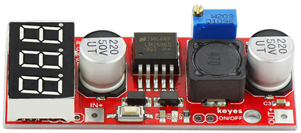
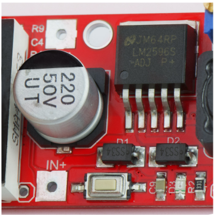
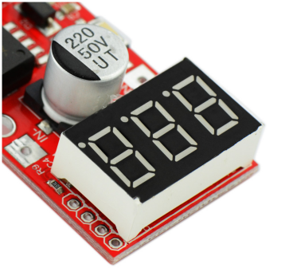
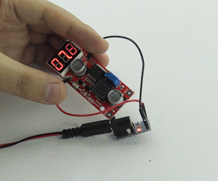

# **KE0091 Keyes LM2596S DC降压电源模块教程**



---

## **1. 模块介绍**

KE0091 Keyes LM2596S DC降压电源模块是一款基于 LM2596S 芯片的直流电压降压转换模块（Buck Converter），能够将较高的直流电压稳定降至所需的较低直流电压，为各种电路和开发板（如 Arduino、ESP 系列、树莓派等）提供稳压电源。

模块采用环保红色 PCB 板，内置高效率的开关稳压芯片 LM2596S，具有宽输入电压范围以及可调输出电压等特点；并配有大尺寸电感、整流二极管以及电位器，用于调节输出电压，适用于多种电源场合。



#### **应用场景**
- 机器人电源
- 传感器供电
- 工业控制电源
- 小型 DIY 项目
- 实验室电源调试

---

## **2. 模块特点**

- **高效率**：LM2596S 采用开关稳压技术，转换效率可达 90% 左右。  
- **宽输入电压范围**：4.5V ～ 40V DC 输入，输出可根据电位器调节。  
- **可调输出电压**：可通过电位器将输出电压调节到 1.25V ～ 35V（具体范围受输入电压限制）。  
- **大电流输出**：最大输出电流可达 3A（需加散热片或主动散热）。  
- **环保设计**：采用红色环保 PCB 板，自带滤波电容和整流电路，保证输出电压的稳定。

---

## **3. 规格参数**

| 参数                | 值                                         |
|---------------------|--------------------------------------------|
| **芯片型号**        | LM2596S                                    |
| **工作模式**        | Buck 降压模式                              |
| **输入电压范围**    | 4.5V ～ 40V DC                             |
| **输出电压范围**    | 1.25V ～ 35V DC（通过电位器可调）            |
| **输出电流**        | 最大 3A（需加强散热）                       |
| **转换效率**        | 最高可达 90%                                |
| **开关频率**        | 约 150kHz                                  |
| **工作温度**        | －40℃ ～ +85℃                              |
| **尺寸**            | 43mm × 21mm × 14mm (约)                    
| **重量**            | 10g (约)                                    |

---

## **4. 工作原理**

LM2596S 是一款高效率的开关降压稳压器，采用脉宽调制 (PWM) 技术。内部集成高边 MOSFET，通过高速切换将输入电压按一定占空比脉冲输出。再通过电感和二极管滤波，将脉冲信号转换为稳定的输出电压。

#### **核心流程**  
1. **开关动作**：LM2596S 内部的开关管（MOSFET）以 150kHz 左右的频率高速切换。  
2. **能量存储**：电感在开关闭合时储能，开关断开时释放能量，通过肖特基二极管和滤波电容平滑输出。  
3. **反馈调节**：电位器与芯片内部的反馈电路相连，根据输出电压与内部参考电压（1.25V）进行比较，通过调节脉冲占空比实现稳压输出。  
4. **电容滤波**：输入端、输出端均配备电容，用于滤除高频纹波，保证稳定输出。  

---

## **5. 接口说明**

模块主要包含以下几个接口与元件：

| 接口 / 元件 | 功能                                             |
|-------------|--------------------------------------------------|
| **VIN+**    | 直流输入电源正极，接 4.5V ～ 40V DC。             |
| **VIN-**    | 直流输入电源负极，接 GND。                        |
| **VOUT+**   | 降压后输出电压正极，连接负载或开发板的 VCC。      |
| **VOUT-**   | 降压后输出电压负极，连接 GND。                    |
| **电位器**  | 调节输出电压，通过顺时针或逆时针旋转改变输出电压。 |

---

## **6. 连接图**

典型连接示意如下：

```
输入电源 (4.5V-40V)         KE0091模块            负载/开发板
   + ----> VIN+ ---------------- VOUT+ -----> + (负载电源输入/开发板 VCC)
   - ----> VIN- ---------------- VOUT- -----> GND (负载/开发板 GND)
```

1. 将输入电源（如电池组、电源适配器等）的正极连接到模块的 VIN+，负极连接到 VIN-。  
2. 将负载或开发板的正极电源输入连接到模块的 VOUT+，负极连接到 VOUT-。  
3. 通电后，通过旋转电位器来调节输出电压，使之满足负载或开发板的供电需求。

---

## **7. 示例应用**

此类降压模块通常无需编程，但可结合 Arduino 等开发板做电源监测或电压调节自动化。下面是一个利用 Arduino 监测输出电压的简单示例（仅演示测量电压，无控制功能）。

#### **电路示意**  
1. KE0091 模块输出端 (VOUT+ / VOUT-) 作为 Arduino 的主电源输入。  
2. 同时，为确保安全，需要使用分压电阻将降压模块输出电压降到合理测量范围 (0～5V) 内，接到 Arduino 模拟口。

#### **代码示例**  
```cpp
/*
 * 此示例仅演示如何使用Arduino读取降压后输出的电压并在串口监视器打印。
 * 注意：如果降压输出电压高于5V，则必须使用分压器将电压降至5V以下再连接A0。
 */

const int voltagePin = A0;  // 模拟测量引脚
float voltageValue = 0.0;

void setup() {
  Serial.begin(9600);
}

void loop() {
  // 读取模拟值 (0 ~ 1023)
  int sensorValue = analogRead(voltagePin);

  // 将模拟值转换为实际电压 (假设无分压，参考电压为5V)
  // 如果使用了分压，请根据分压比进行计算
  voltageValue = sensorValue * (5.0 / 1023.0);

  Serial.print("Voltage: ");
  Serial.print(voltageValue);
  Serial.println(" V");

  delay(1000);
}
```

---

## **8. 实验现象**

1. **连接电源**：输入端连接一个高于所需输出电压的直流电源（例如 12V），输出端连接负载或开发板。  

2. **调节电位器**：顺时针或逆时针旋转电位器，可看到输出电压随之升高或降低。  

	

3. **输出电压监测**：若连接到开发板进行电压采样或使用万用表测量，读数应与调节后的输出电压相符。  

4. **稳定输出**：在合理负载范围内，输出电压应保持稳定不变，纹波较小。

---

## **9. 注意事项**

1. **输入电压与负载要求**：输入电压必须高于期望输出电压，且需确认负载功率及输出电流是否在模块范围内。  
2. **散热**：当输出电流较大（超过 2A 或 3A）时，建议给 LM2596S 芯片或模块加装散热片，以防温度过高。  
3. **调节范围**：输出电压受输入电压限制，通常输出电压应略小于输入电压（降压模式），不可升压。  
4. **极性防反接**：请确保输入电源与输出负载极性正确，反接可能损坏模块。  
5. **电容放电**：模块在工作后内部电容仍可能存有电量，断电后应等待几秒再进行操作，避免放电火花。  
6. **电位器调节**：需缓慢旋转电位器，急速调节可能导致输出电压瞬间过冲，损坏后端电路。  
7. **测试仪表**：使用万用表时注意量程，防止表笔或表档位设置不当造成的短路或读数失准。

