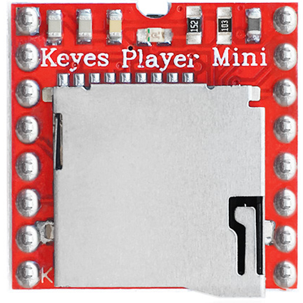
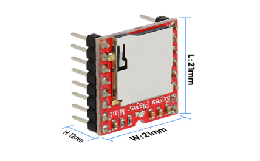
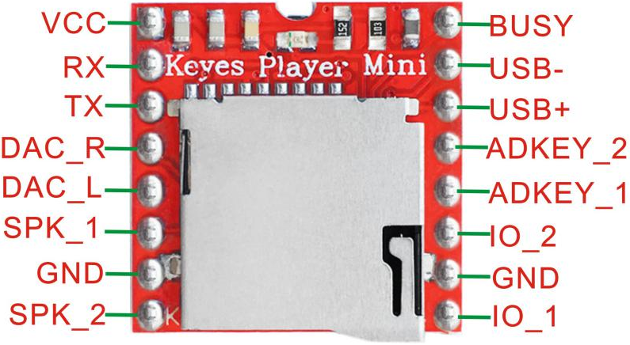

# **KE0092 Keyes Player Mini MP3模块教程**



---

## **1. 模块介绍**

KE0092 Keyes Player Mini MP3 模块是一款体积小巧、功能完善的音频播放模块，内部通常集成了 MP3 解码芯片与微型功率放大器，可通过 UART 串口进行简单的指令控制，实现 MP3 音频文件的播放、暂停、切换等功能。  
该模块常用于语音播报、音乐播放、语音提示等场景，适合与 Arduino、树莓派等主控板搭配使用，制作各类互动项目。

#### **应用场景**
- 语音提示系统（如电子称、智能售货机语音提示等）  
- 序列音乐播放（如圣诞灯光音乐秀）  
- 语音播报（如智能家居、信息提醒）  
- 自动答录机/语音导航系统

---

## **2. 模块特点**

- **体积小巧**：便于整合到各种嵌入式项目中。  
- **操作简便**：通过 UART 串口发送指令即可控制播放、暂停、调整音量等。  
- **多种功能**：支持播放下一个/上一个曲目、指定曲目、循环播放、随机播放等。  
- **稳定可靠**：采用专用 MP3 解码芯片，兼容多种音频格式（常见的 MP3、WAV 等）。  
- **LED 指示**：部分模块带有播放指示灯，便于观测播放状态。  

---

## **3. 规格参数**

| 参数                | 值                                            |
|---------------------|-----------------------------------------------|
| **供电电压**        | 3.2V ～ 5V（推荐 5V）                         |
| **通信接口**        | UART 串口（TX、RX）                            |
| **支持存储介质**    | MicroSD 卡（TF 卡，一般支持 32GB 及以下）       |
| **音频格式**        | MP3、WAV                                       |
| **输出方式**        | 1W～3W 功率放大输出，或 3.5mm 音频接口（视模块型号而定） |
| **工作温度**        | -10℃ ～ +70℃                                  |
| **尺寸**            | 约 30mm × 22mm × 9mm                           |
| **重量**            | 约 5g                                         |

> 注：具体参数可能因批次或模块版本不同而略有差异，使用前请参考产品实物或官方资料。



---

## **4. 工作原理**

Player Mini MP3 模块通常基于专用的 MP3 解码芯片（如 YX5200、MH2024K-16SS 等）。文件系统与音频文件存储在 TF 卡里，通过简单的串口指令控制 MP3 芯片进行解码并输出音频信号。

#### **核心流程**  
1. **存储准备**：将音频文件拷贝到 TF 卡，并按要求命名或放置在指定目录。  
2. **UART 串口通信**：主控板（Arduino 等）通过 RX、TX 引脚与 MP3 模块的 TX、RX 相连。  
3. **发送指令**：主控板向模块发送如「播放」、「暂停」、「指定曲目」等指令。  
4. **音频解码**：解码芯片对指定的 MP3 文件进行解码。  
5. **音频输出**：解码后的音频通过内置功放或耳机孔（视模块而定）输出到喇叭或耳机。

---

## **5. 接口说明**

以下为该模块可能具备的主要引脚及元件，实际布局以实物为准：

| 引脚 / 接口   | 功能说明                                                           |
|---------------|--------------------------------------------------------------------|
| **VCC**       | 电源正极，推荐 5V                                                 |
| **GND**       | 电源地                                                             |
| **RX**        | 串口接收引脚，接主控板的 TX                                       |
| **TX**        | 串口发送引脚，接主控板的 RX                                       |
| **BUSY/LED**  | 部分模块提供忙碌指示或播放指示功能输出                            |
| **SPK+ / SPK-** | 连接扬声器正负极（若模块集成功放）                                 |
| **DAC_L / DAC_R** | 左右声道音频输出（若提供耳机或外部功放接口）                    |
| **Micro SD 卡槽** | 用于插入 TF 卡存储音频文件                                     |



---

## **6. 连接图**

以下为与 ArduinoUNO 的常见连接示意：

```
Arduino UNO         KE0092 MP3模块
    5V -----------------> VCC
    GND ----------------> GND
    D10 (Software TX) ---> RX
    D11 (Software RX) ---> TX
               SPK+/SPK- -> 扬声器 (若带功放)
```

> 注：  
> 1. 若使用软串口(SoftwareSerial)，可选用其他数据脚，只需在代码中对应修改。  
> 2. 若 Arduino 主板使用硬串口 (0、1 引脚)，请注意与串口调试冲突问题。

---

## **7. 示例代码**

以下是 Arduino 使用 **DFPlayer Mini** 等兼容库控制 MP3 播放的示例代码（绝大多数 Player Mini MP3 模块的串口指令兼容此库）。  
如未安装该库，可在 Arduino Library Manager 中搜索「DFPlayer Mini Mp3 by Makuna」或类似库以安装。

```cpp
#include <SoftwareSerial.h>
#include <DFPlayer_Mini_Mp3.h>

SoftwareSerial mp3Serial(10, 11); // RX, TX

void setup() {
  Serial.begin(9600);         // 调试串口
  mp3Serial.begin(9600);      // MP3 模块串口
  mp3_set_serial(mp3Serial);  // DFPlayer 库函数，设置软件串口
  
  delay(1000);
  Serial.println("Initializing MP3 player...");

  if(!mp3_initialize()) {
    Serial.println("MP3 player initialization failed!");
    while(true);
  }
  Serial.println("MP3 player ready!");

  // 设置音量为中等 (0~30)
  mp3_set_volume(15);

  // 播放第 1 号曲目
  Serial.println("Playing track 1...");
  mp3_play(1);
}

void loop() {
  // 可在此处根据实际需求添加暂停/继续/切换等操作
}
```

---

## **8. 实验现象**

1. **音频输出**：当主控板发送「播放」指令后，扬声器或耳机中会发出对应音频文件的声音。  
2. **串口监视器调试**：可以在串口调试窗口中查看初始化信息及发送指令的状态。  
3. **LED/BUSY 指示**：若模块自带 LED，播放时可能会点亮或闪烁。  
4. **切换/暂停**：发出相应指令后，音频可快速切换或暂停/继续播放。

---

## **9. 注意事项**

1. **供电**：推荐 5V 电源，如使用 3.3V 供电，需要确认模块兼容性及实测稳定性。  
2. **音频文件命名**：某些芯片对文件名称、放置路径有特定要求，建议将文件名改为「001.mp3」「002.mp3」等并置于根目录或指定文件夹。  
3. **串口波特率**：默认常见为 9600，可检查库文档或使用 AT 指令修改。  
4. **音量及喇叭**：若使用内置功放，接有扬声器时音量较大可能导致失真或供电不足；可选择外接功放或调低音量。  
5. **TF 卡格式**：建议使用 FAT16 或 FAT32 格式化的卡，容量不宜过大（一般 ≤ 32GB）。  
6. **软串口限制**：Arduino UNO 使用软件串口与模块通信时，需确保正确的引脚和波特率，调试输出与通信争用会带来冲突。  

---

## **10. 参考链接**

- [DFPlayer Mini Mp3 by Makuna (GitHub)](https://github.com/DFRobot/DFPlayer-Mini-mp3)  

