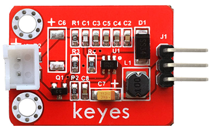
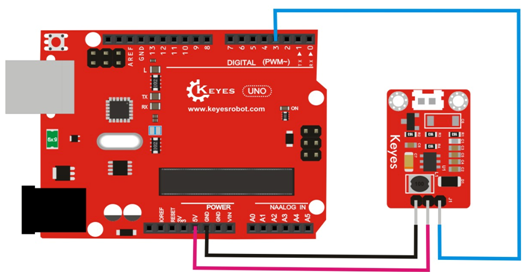
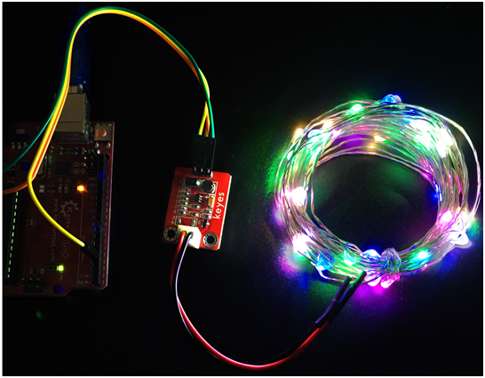
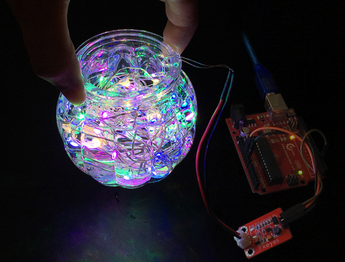

# **KE0103 Keyes LED灯串驱动模块教程**



---

## **1. 模块介绍**

KE0103 Keyes LED灯串驱动模块是一款用于驱动低压 LED 灯串的控制模块，可搭配 Arduino 等主控板对 LED 灯串进行开关、闪烁等效果的控制。该模块采用红色环保 PCB 板设计，内置晶体管/MOSFET 等驱动器件，通过输入信号轻松控制外接 LED 灯串或小功率负载。

#### **应用场景**
- 节日灯饰控制（如圣诞灯串、派对灯饰等）  
- 室内/户外装饰灯光效果制作  
- 互动式雕塑或模型的亮灯效果控制  
- DIY 项目的简单照明控制  

---

## **2. 模块特点**

- **使用简单**：仅需单路输入控制信号即可控制灯串的通断。  
- **支持多种负载**：可驱动 LED 灯串、小功率直流负载（功率需在模块范围内）。  
- **环保红色 PCB**：耐用且散热性能优良。  
- **指示灯**：部分模块配有电源或输出指示灯，方便调试。  

---

## **3. 规格参数**

| 参数             | 值                                   |
|------------------|--------------------------------------|
| **工作电压**     | 5V 或 12V（根据模块及灯串规格而定）      |
| **控制信号电平** | 兼容 3.3V 或 5V（Arduino 等常见主控）    |
| **驱动电流**     | 取决于内部晶体管/MOSFET 等器件；一般不超过 1A  |
| **接口类型**     | 接线端子或排针，可连接灯串和输入信号 GPIO |
| **尺寸**         | 约 35mm × 30mm × 13mm (视版本略有差异)   |

> 注：具体参数请以产品实物或商家资料为准，使用前需核对灯串的工作电压与电流。

---

## **4. 工作原理**

该驱动模块的核心原理是利用晶体管或 MOSFET 作为开关器件。当主控板输出一个高电平信号时（如 Arduino 数字引脚输出 HIGH），晶体管或 MOSFET 导通，允许电流通过灯串，灯光点亮；输出低电平时，晶体管或 MOSFET 关断，灯串熄灭。

#### **核心流程**  
1. **控制输入**：Arduino 或其他主控板将数字引脚设置为高/低电平。  
2. **开关驱动**：模块根据输入信号驱动内部三极管/MOSFET 实现导通或关断。  
3. **灯串发光**：若电路导通，电流通过灯串实现点亮。  

---

## **5. 接口说明**

以下为 KE0103 模块可能包含的关键引脚/接口 (以常见版本为例)：

| 引脚 / 接口    | 功能说明                                                           |
|----------------|--------------------------------------------------------------------|
| **VCC**        | 电源正极（5V 或 12V，具体看灯串需求），为外接灯串供电。              |
| **GND**        | 电源负极，与主控板共地。                                           |
| **IN**         | 控制输入信号，引入来自 Arduino 等主控板的数字 GPIO。               |
| **OUT+ 、OUT-**| 连接 LED 灯串的正极和负极（或同一灯串的一端与电源并联）。            |
| **电源指示灯**   | (可选) 当模块上电时，指示灯点亮。                                 |
| **状态指示灯**   | (可选) 当三极管/MOSFET 导通时点亮，显示当前输出状态。               |

> 注：有的版本模块直接使用 2 或 3Pin 接线端子，也有的使用排针，实际要根据模块标识进行确认。

---

## **6. 连接图**

以下演示使用 5V 灯串（小型灯串）和 Arduino UNO 的典型接线：



1. 将灯串的一端或正极接到模块上的输出端子 (OUT+)；  
2. 灯串另一端 (负极) 接 OUT- (一般共 GND，也可能模块内部帮你接好 GND)；  
3. 为模块提供 5V 或 12V (看灯串标称电压) 电源，同时与 Arduino 公共地 (GND)。  
4. Arduino 数字引脚 (如 D8) 接至驱动模块的 IN，引脚输出 HIGH 时灯串通电亮灯。

---

## **7. 示例代码**

以下简单代码演示如何用 Arduino 控制 KE0103 模块进行循环闪烁灯串：

```cpp
/*
  示例功能：灯串每隔1秒闪烁一次
*/

#define LED_PIN 8  // 与 KE0103 模块的IN相连

void setup() {
  pinMode(LED_PIN, OUTPUT);
}

void loop() {
  digitalWrite(LED_PIN, HIGH);  // 打开灯串
  delay(1000);
  digitalWrite(LED_PIN, LOW);   // 关闭灯串
  delay(1000);
}
```

---

## **8. 实验现象**





1. **上电检查**：为模块接入电源后，如果自带电源指示灯，应点亮；  
2. **灯串闪烁**：根据示例代码，灯串会以 1 秒亮、1 秒灭的频率循环闪烁；  
3. **状态指示**：若模块带输出状态指示灯，也会同步闪烁；  
4. **电压监测**：若测量 OUT+ 与 OUT- 间电压，可随 Arduino 数字引脚的控制在 0V 与接近电源电压之间切换。

---

## **9. 注意事项**

1. **电源与灯串匹配**：确定灯串所需工作电压与电流均在模块与电源的可承受范围内；  
2. **共地**：务必将主控板 GND 与模块 GND 连接到一起，以确保信号参考正确；  
3. **极性**：接线时注意灯串或负载极性正确，避免反接或短路；  
4. **散热问题**：若负载电流过大，需考虑加装散热器或降低工作负载，防止模块过热；  
5. **安规防护**：高压环境下或户外场合，要确保电源和灯串的安全，做好绝缘和防水防护；  
6. **模块识别**：不同版本的 Keyes LED 驱动模块可能电路略有差别，使用时请参阅具体丝印或商家资料。  

---

## **10. 参考链接**

- [Keyes 官网](http://www.keyes-robot.com/)  
- [Arduino 官网](https://www.arduino.cc/)  
- [LED 与驱动简单原理说明](https://www.electronics-tutorials.ws/)  

---

若对 KE0103 Keyes LED灯串驱动模块的使用方法或注意事项有任何疑问，欢迎继续提问！
