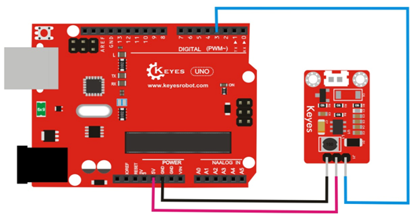
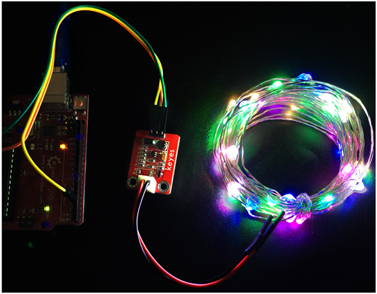

# KE0105 Keyes LED灯串驱动模块 + 灯带套件使用教程


## 1. 模块概述

KE0105 Keyes LED灯串驱动模块 + 灯带套件 主要由一块可进行数字/模拟信号控制的单通道驱动板和相应规格的 LED 灯带组成。通过 Arduino 等控制器即可轻松实现对灯带的点亮、闪烁及亮度调整等效果，广泛适用于节日装饰、趣味 DIY、科创项目及教学实践等场景。

### 主要功能特色

- **简易驱动**：仅需一个数字IO或PWM信号即可控制灯带的开关和亮度调节；  
- **集成保护**：板上通常带有限流或MOSFET反接保护电路，提升使用安全；  
- **体积小巧**：红色环保 PCB 工艺，小型扩展板便于集成到各类项目；  
- **多种灯带兼容**：可搭配 5V 或 12V 工作电压版本的 LED（单色灯带或简单灯串）。

---

## 2. 模块与灯带参数

> 以下参数根据常见配置整理，具体请参考实际产品规格。

1. **驱动模块**  
   - 供电电压：5V / 12V（因灯带规格决定）  
   - 控制电平：3.3V / 5V 兼容  
   - 驱动电流：适用于中小功率 LED（总电流数百毫安 ~1A 内；具体看驱动芯片承受能力）  
   - 引脚接口：VCC、GND、IN、OUT+、OUT-（或类似）  

   

2. **LED 灯带**  
   - 电压规格：5V 或 12V  
   - 灯珠数量：若干（如 30 颗 / 50 颗 / 60 颗等等）  
   - 功率估算：典型每颗 LED 约 0.06~0.2W，需根据总灯珠数量计算所需电流  
   - 接线方式：一般正、负极两线输出；有些灯带可能带插头或接头，请注意正负极对应  

   

---

## 3. 硬件连接图

以下以 Arduino UNO + 5V 灯带为例：

1. **供电**  
   - 将 Arduino 5V 与驱动模块 VCC 相连；  
   - 模块 GND 与 Arduino GND 共地；  
   - 如使用 12V 灯带，则需从 12V 电源为驱动板供电，同时把模块 GND 与 Arduino GND、12V 电源负极连在一起。  

2. **控制信号**  
   - Arduino 数字引脚（如 D8） -> 模块 IN（控制输入）；  
   - 当数字口为 HIGH，模块输出便驱动灯带；为 LOW 则熄灭。若需亮度调节，可用 PWM 引脚（如 D9、D10 等）。  

   
   
3. **灯带输出**  
   - 灯带的正极 (+) 通常接到模块 OUT+；  
   - 灯带的负极 (-) 接到模块 OUT-；  
   - 若灯带自带插头，需要弄清正负极后再对应接入模块。  

---

## 4. 示例代码

### 4.1 数字IO开关 按秒闪烁

使用 Arduino UNO 的 D8 作为输出，每隔 1 秒切换灯带的 ON/OFF。

```cpp
/*
  KE0105 Keyes LED灯串驱动模块示例：
  每隔1秒点亮灯带，再隔1秒熄灭，循环往复。
*/

#define LED_PIN 3  // 驱动模块IN引脚接到Arduino的数字口D3

void setup() {
  pinMode(LED_PIN, OUTPUT);
}

void loop() {
  // 开灯
  digitalWrite(LED_PIN, HIGH);
  delay(1000);

  // 关灯
  digitalWrite(LED_PIN, LOW);
  delay(1000);
}
```

### 4.2 PWM亮度渐变

若想实现灯带亮度的渐变或调光，可将驱动模块 IN 接至支持 PWM 的引脚（如 D9），并使用 `analogWrite()` 输出占空比 0～255。

```cpp
/*
  使用PWM引脚(如D9) 让LED灯带亮度从暗到亮，再从亮到暗渐变
*/

#define LED_PIN 9  // 选择Arduino UNO具有PWM功能的数字口
int brightness = 0;
int fadeAmount = 5;

void setup() {
  pinMode(LED_PIN, OUTPUT);
}

void loop() {
  // 输出PWM，范围0~255
  analogWrite(LED_PIN, brightness);

  // 修改亮度值
  brightness += fadeAmount;

  // 当亮度到达边界(0或255)时反向
  if(brightness <= 0 || brightness >= 255) {
    fadeAmount = -fadeAmount;
  }
  delay(30);
}
```

> 如果灯带功率较大，需要确保驱动板可承受对应电流，或者另行搭配高功率驱动方式。

---

## 5. 测试现象与结果

1. **灯带闪烁**：在数字IO代码下，灯带每 1 秒亮、1 秒灭；在 PWM 代码下，可看到灯带亮度随占空比逐渐变化。  

	

2. **功率与发热**：灯带亮度越大，电流越高，驱动板及灯带可能有升温现象，注意通风或短时测试，避免过热。  

3. **供电稳定性**：如果仅使用 USB 供电且灯带功率稍高，可能出现电压不稳定，建议外接适配器或电源。

---

## 6. 使用注意事项

1. **电源选择**：根据灯带额定电压（5V或12V）选择对应电源，确保电流输出足够。  
2. **共地**：务必将 Arduino 的 GND 与驱动模块 GND 和电源负极相连；否则会导致无法正常驱动。  
3. **正负极不能接反**：错误接线可能烧坏 LED 或驱动板。  
4. **大功率时散热**：若灯带有较多LED，使用时间较长或环境温度较高，需要确保驱动板上 MOSFET 等器件有足够散热。  
5. **导线规格**：若灯带电流较大，选用合适横截面积的导线并缩短布线长度，减少线路压降。

---

## 7. 结语

通过 **KE0105 Keyes LED灯串驱动模块 + 灯带套件**，可以快速完成对单色 LED 灯带的数字开关或 PWM 调光。若想实现更多炫彩效果（如 RGB WS2812、RGB 流水灯等），可选择相应可编程灯带。你也可配合定制外壳或反光材料，为灯光增添更佳的装饰性。  

### 相关链接
- [Keyes 官网](http://www.keyes-robot.com/)  
- [Arduino 官方文档](https://www.arduino.cc/) 
