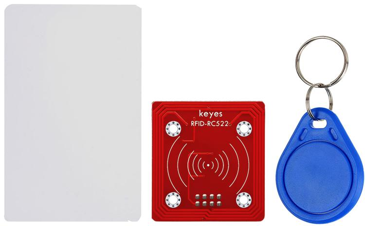
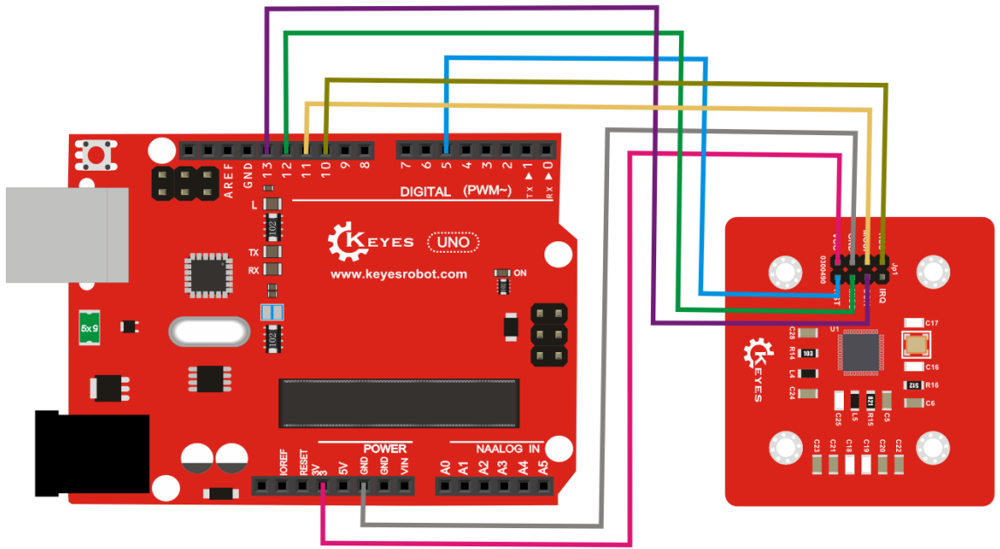
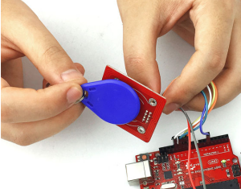
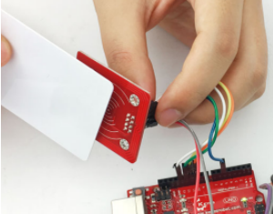

# KE0106 Keyes RFID-RC522射频模块 + 钥匙扣 + 白卡套件使用教程




## 1. 模块介绍

**KE0106 Keyes RFID-RC522 射频模块 + 钥匙扣 + 白卡套件**由以下部分组成：  
1. **RC522 RFID 模块**：工作在 13.56MHz 频段，支持 Mifare 系列（Classic S50、S70等）卡片读写。  
2. **RFID 钥匙扣**：内置写入了相应芯片，适合随身携带使用。  
3. **RFID 白卡**：标准卡尺寸，可进行读写测试或二次开发。  

> 该套件可搭配 Arduino 等控制板，用于门禁系统、考勤打卡、身份识别等应用。  

---

## 2. 功能与特点

1. **操作便捷**：通过 SPI 接口与主控板通信，库函数丰富，上手简单。  
2. **多卡支持**：兼容 ISO14443 Type A 协议，可读写协议下的常见 Mifare 卡片、钥匙扣等。  
3. **集成天线**：板载天线，读卡范围约 0～5cm（与供电、环境有关），无需额外外接天线。  
4. **安全加密**：支持 Mifare 1K/4K 卡片读写权限管理，通过市面常见库可实现加密读写。  
5. **低功耗**：适合手持式装备或低功耗场景，且读写响应速度快。  

---

## 3. 规格参数

| 项目              | 参数说明                             |
|-------------------|--------------------------------------|
| 工作电压          | 3.3V（部分Keyes模块可用5V，通过板载稳压降至3.3V） |
| 工作频率          | 13.56MHz                              |
| 通信方式          | SPI (MOSI, MISO, SCK, SDA/SS)         |
| 支持卡类型        | Mifare 1 S50、S70 等 (ISO/IEC14443 A) |
| 读写距离          | 0 ~ 5cm（与环境、电源等因素有关）      |
| 协议支持          | ISO14443 A (NXP MIFARE)              |
| 模块尺寸          | 约 40mm × 60mm（不同版本稍有差异）     |

> 注意：RC522 芯片官方推荐使用 3.3V 电源。如果模块宣称 5V 直连，需确认板载 LDO 稳压和电平转换电路是否齐备。

---

## 4. 工作原理

RC522 芯片通过环形线圈（板载天线）产生 13.56MHz 射频场，当符合频段的 RFID 卡片靠近该区域时，两者会进行能量耦合与数据交互。  
- 模块会对天线上的微弱信号进行放大和解调，获取卡片 UID（唯一标识符）及卡内数据；  
- 卡片则能通过模块提供的射频能量完成部分工作，如响应读写操作等。  
- 上层通过 SPI 接口将数据与 Arduino 等主控通信，进而实现身份验证或存储操作。

---

## 5. 接口说明

常见 Keyes RC522 模块接口如下（具体丝印可能有出入）：

| 引脚   | 功能                 | 建议连接 (Arduino UNO) |
|:------:|:-------------------- |:-----------------------|
| VCC    | 电源输入              | 3.3V（若模块支持5V则可接5V）  |
| GND    | 电源地               | GND                   |
| SDA/SS | SPI片选信号           | D10 (默认库配置)       |
| SCK    | SPI时钟              | D13                   |
| MOSI   | 主输出从机输入       | D11                   |
| MISO   | 主输入从机输出       | D12                   |
| IRQ    | 中断请求(可选)       | 不接                  |
| RST    | 模块复位引脚         | D5         |

---

## 6. 连接图

以下示意以 Arduino UNO 为例，若使用其他开发板，请参考相应的 SPI 引脚分布。

```
   RC522          Arduino UNO
   VCC  --------> 3.3V   (若板载5V→3.3V稳压，也可接5V)
   GND  --------> GND
   SDA/SS ------> D10
   SCK  --------> D13
   MOSI --------> D11
   MISO --------> D12
   RST  --------> D5
   IRQ  --------> (留空)
```

> 若内部库默认使用了其他引脚作为 SDA/SS 或 RST，则需对应修改连线或在代码中重新设置。

---

## 7. 示例代码

下例展示基于 [MFRC522](https://github.com/miguelbalboa/rfid) 库读取卡片 UID 的方式。

```cpp
#include <SPI.h>
#include <MFRC522.h>

#define SS_PIN 10    // 对应模块 SDA/SS
#define RST_PIN 5    // 对应模块 RST

MFRC522 mfrc522(SS_PIN, RST_PIN); // 创建RFID实例

void setup() {
  Serial.begin(9600);
  SPI.begin();               // 初始化SPI总线
  mfrc522.PCD_Init();        // 初始化RC522模块
  Serial.println("RC522启动成功，等待刷卡...");
}

void loop() {
  // 如果没有检测到新卡片，直接返回
  if (!mfrc522.PICC_IsNewCardPresent()) {
    return;
  }
  // 如果无法读取卡片序列号，直接返回
  if (!mfrc522.PICC_ReadCardSerial()) {
    return;
  }

  // 打印卡片UID
  Serial.print("卡片UID:");
  for (byte i = 0; i < mfrc522.uid.size; i++) {
    Serial.print(mfrc522.uid.uidByte[i] < 0x10 ? " 0" : " ");
    Serial.print(mfrc522.uid.uidByte[i], HEX);
  }
  Serial.println();

  // 用完后挂起该卡
  mfrc522.PICC_HaltA();
}
```

---

## 8. 实验现象

1. **初始化成功**：串口输出“RC522启动成功，等待刷卡...”。  
2. **卡片感应**：当 RFID 白卡或钥匙扣靠近模块天线 (约0~5cm），串口上会显示卡片的 UID（十六进制）。  
3. **多卡兼容**：若使用其他支持 Mifare 协议的卡片，也可被正常检测识别。  
4. **识别距离变化**：若供电不足或干扰较大，读卡距离会减小；较好的环境下可读到数厘米范围。



---

## 9. 注意事项

1. **供电电源**：RC522 官方推荐 3.3V。若使用 5V，需确认板载稳压与电平转换电路。  
2. **SPI冲突**：若同时使用其他 SPI 设备，需保证片选引脚 (SS) 互不冲突，并每次只使能一个设备。  
3. **卡片权限**：Mifare 1K/4K 分区需要正确密码写入或读出，否则操作会失败。示例库提供相应函数。  
4. **环境干扰**：避免金属环境或强磁场干扰，保证读卡时模块与卡之间无金属阻隔。  
5. **静电保护**：RFID 读卡器和卡均有射频芯片，需避免静电放电，操作时勿随意触摸芯片焊点。

---

## 10. 参考链接

- [Arduino 官网](https://www.arduino.cc/)  
- [Keyes 官网](http://www.keyes-robot.com/)  
- [MFRC522 Arduino 库 (GitHub)](https://github.com/miguelbalboa/rfid)  
- [MIFARE Classic / NXP 文档](https://www.nxp.com/products/rfid-nfc/mifare-classic)

如果你需要进一步开发（如写卡、加密、门禁联动等），可在现有示例基础上拓展，实现更多 RFID 智能应用。祝你项目进展顺利！
