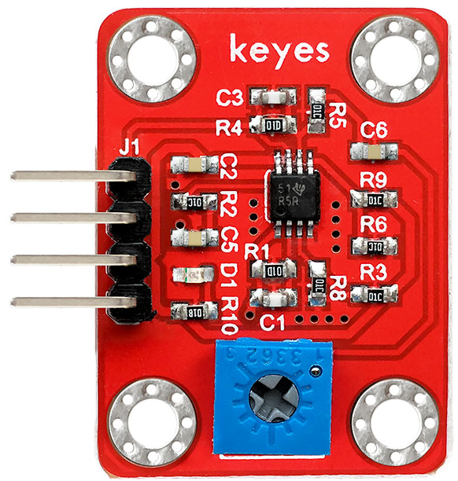

# KE0107 Keyes LMV358 运算放大模块使用教程




## 1. 模块介绍

**LMV358** 是一款双运算放大器（Op-Amp），与传统 LM358 相似，但具有更低电压、更低功耗等特性，适合电池供电或低电压场景。该 Keyes 模块将 LMV358 封装在一块小型 PCB 上，并提供焊盘孔进出接口，方便与外部电路焊接或嵌入其他项目中。

### 适用场景
- 传感器信号调理（如光照、温度、气体传感器等信号的放大）  
- A/D 转换前级放大  
- 小信号处理、比较、滤波  
- 低功耗或低电压供电场合（3.3V 或 5V 系统下工作）  

---

## 2. 主要特点

1. **低功耗**：LMV358 典型电源电流较低，适合便携设备。  
2. **宽电源范围**：可在 2.7V～5.5V 范围正常工作，兼容 3.3V/5V 系统。  
3. **轨到轨输出**：在某些版本中可近似满足满摆幅输出（具体要参考实际负载情况）。  
4. **稳定封装**：Keyes 模块红色环保工艺，搭载相应分立元件，并预留焊盘孔，方便二次开发。

---

## 3. 规格参数

以下参数为常见参考值，具体以产品和官方资料为准：

- **芯片型号**：LMV358（双运放）  
- **工作电压**：2.7V ～ 5.5V  
- **静态电流**：典型几百微安～ 1mA (具体看负载)  
- **增益带宽积**：1MHz 左右（适合中低速应用）  
- **封装形式**：SMD/贴片封装在 Keyes PCB 上  
- **尺寸**：约 30mm × 24mm × 12mm（按实际 PCB 设计略有差异）  

---

## 4. 工作原理

LMV358 作为运算放大器，具有两个放大通道（每个通道拥有两个输入端：反相输入 `-` 和同相输入 `+`，以及一个输出端）。在负反馈配置下，Op-Amp 会根据输入差分电压进行放大、滤波等运算处理；也可搭建为比较器等多种电路形式。

在本模块中，Keyes 预留了焊盘孔，用户可根据需要自行搭配外部电阻、电容组件，以构建以下应用：  
- **反相/同相放大电路**  
- **电压比较器电路**  
- **有源滤波（低通、高通、带通）**  
- **电压跟随器（Buffer）**  

.jpg)

---

## 5. 引脚接口说明

.jpg)

一个典型 LMV358 模块上，可能主要引出下列接口（不同厂家或板型略有差异）：

| 引脚名   | 功能                  | 说明                           |
|:--------:|:--------------------:|:-------------------------------|
| VCC      | 电源输入              | 2.7V ~ 5.5V                    |
| GND      | 地                   | 与系统公共地相连               |
| IN1&#43;   | 第一路同相输入端       | 第一路运放 (+) 输入              |
| IN1&#45;   | 第一路反相输入端       | 第一路运放 (−) 输入              |
| OUT1     | 第一路输出端          | 第一路运放输出                  |
| IN2&#43;   | 第二路同相输入端       | 第二路运放 (+) 输入              |
| IN2&#45;   | 第二路反相输入端       | 第二路运放 (−) 输入              |
| OUT2     | 第二路输出端          | 第二路运放输出                  |

根据应用需求，你可以只使用其中一路运放，也可将两路同时应用。

---

## 6. 连接与使用示意

以下以 Arduino UNO + 传感器信号放大为例，简要展示接线思路。假设要测量一个模拟电压信号 `Vin`（0～1V 范围），并放大到 0～5V 模拟量以供 Arduino 采集。

**例：同相放大电路**  
1. 在 module 的第 1 路运放上：  
   - IN1&#45; 接被测讯号 `Vin`；  
   - OUT1 接到 Arduino A0 (模拟输入)；  
   - 通过反馈电阻 Rf 和输入电阻 Rin 形成增益 `Av = (1 + Rf/Rin)`；  
   - IN1&#45; 连接在这串反馈电阻网络中，以实现同相放大；  
2. 电源部分：  
   - VCC 接 Arduino 5V（或 3.3V），GND 接公共地；  
3. 第二路运放 (IN2&#43;/IN2&#45;/OUT2) 可空置或搭建其它运算电路。

```
Arduino UNO (5V) --+---> VCC (LMV358 Module)
                  |
                [GND] -> GND (LMV358 Module)
Vin -> [Rin] -> IN1- (LMV358)
                |               
              [Rf]
                | 
              OUT1 ---> A0 (Arduino analog input)
IN1+ -> (接到中点或同相参考, 若同相放大可与Vin相连, 具体视电路设计)
```

> 具体电阻数值根据期望增益设置。例如，Rin = 1kΩ, Rf = 9kΩ，可得到约 10 倍放大。

---

## 7. 示例代码

以 Arduino 读取经放大后的模拟值，并在串口打印输出为例。  
**注意**：因 Op-Amp 电路本身不需要写入代码，只需在主控板端完成 ADC 读取或相应业务逻辑即可。

```cpp
/*
  示例功能：从A0端口读取经过LMV358放大后的传感器信号，并在串口输出。
*/

const int sensorPin = A0; // LMV358 模块 OUT1 接到 A0

void setup() {
  Serial.begin(9600);
  pinMode(sensorPin, INPUT);
}

void loop() {
  int adcValue = analogRead(sensorPin);  // 0~1023
  float voltage = adcValue * (5.0 / 1023.0); // 转换为电压值(假设5V供电)
  Serial.print("ADC = ");
  Serial.print(adcValue);
  Serial.print(", Voltage = ");
  Serial.print(voltage);
  Serial.println(" V");
  delay(500);
}
```

> 编译上传后，你可以在串口监视器看到不断更新的放大后电压值。

---

## 8. 实验现象

1. **电路输出稳定**：若输入信号稳定，放大后电压在 Arduino 串口监视器上应呈现恒定或小幅波动的数值。  
2. **增益可调**：修改反馈电阻与输入电阻之比，即可改变放大倍数。  
3. **饱和现象**：若输入信号放大后超出供电电压范围(如 >5V)，输出将被钳位在接近 5V，而无法继续增长。  
4. **零点漂移**：低电压下进行高倍放大时，可能观察到略微的零点漂移或噪声。可通过电路优化或校准减弱影响。

---

## 9. 注意事项

1. **电源限制**：LMV358 模块工作区间在 2.7V～5.5V，超出范围可能损坏芯片或导致异常。  
2. **信号范围**：输入信号若过大超过供电轨，需要前端限制或分压，否则会出现运放饱和或损坏输入级。  
3. **正确接地**：在多路传感器或多模块系统中，必须确保项目中所有 GND 共地，避免噪声耦合。  
4. **散热**：运放一般负载较小，通常不需额外散热。但在高电压或大输出电流情况下（驱动更大负载）需留意温升。  
5. **干扰抑制**：高增益应用中，应注意电磁/射频干扰，保持电路布线简短、合理屏蔽。

---

## 10. 参考链接

- [Arduino 官网](https://www.arduino.cc/)  
- [Keyes 官网](http://www.keyes-robot.com/)  
- [LMV358芯片资料（德州仪器）](https://www.ti.com/product/LMV358)  
- [运算放大器基础知识](https://www.electronics-tutorials.ws/opamp/op-amp-basics.html)  

如果你需要更复杂或精准的放大电路设置（如滤波、比较、PID 控制），可在以上资料基础上做进一步设计。祝你开发顺利！
