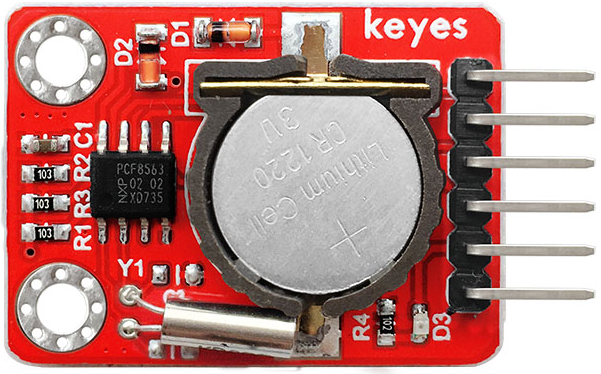
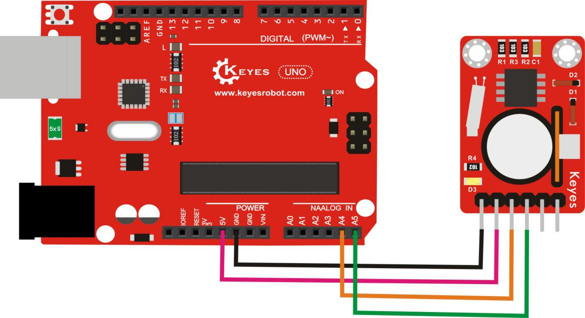
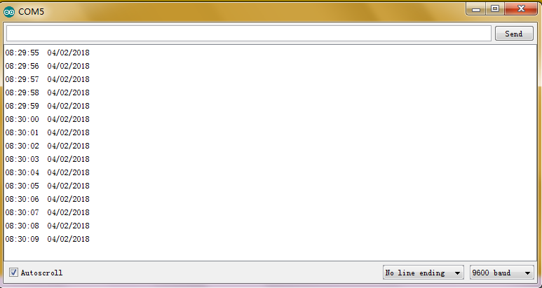

# KE0108 Keyes PCF8563 时钟模块使用教程



## 1. 模块介绍

**PCF8563** 是一款广受欢迎的 RTC（Real Time Clock）芯片，采用 I2C 接口，内置计时寄存器，可提供年、月、日、星期、时、分、秒等时间信息，并具有闹钟和定时功能。由于其功耗很低，可搭配纽扣电池或超级电容持续计时。Keyes 将该芯片封装在小巧 PCB 上，并提供必要电路，方便与 Arduino 等主控板对接使用。

## 2. 功能与特点

1. **低功耗**：在备用电池供电时，可长期保持走时；  
2. **I2C 接口**：只需 SDA、SCL 同步传输时间数据；  
3. **实时时间**：提供从秒到年的完整计时信息，带闰年计算；  
4. **报警与定时**：部分寄存器支持闹钟、秒中断或分钟定时中断；  
5. **备份电池**：板载纽扣电池接口（或其它备份电源接口）保证掉电不丢失时间信息。

## 3. 规格参数

- **主芯片**：NXP PCF8563  
- **供电电压**：一般 2.0～5.5V（模块多支持 3.3V 或 5V 供电）  
- **接口方式**：I2C 总线 （地址通常 0x51，可能因版本而异）  
- **时间精度**：晶振、温度和电路环境等会造成误差，一般可达数秒/天内；可通过定期软件校正提高精度  
- **工作温度**：-40℃～+85℃（具体参考官方数据）  
- **模块外形**：Keyes 红色环保小板，约 25mm × 25mm × 10mm（具体以实物为准）

## 4. 工作原理

1. **内部振荡**：PCF8563 模块使用外接 32.768 kHz 晶振作为时钟源，芯片内部计时并保存在寄存器中。  
2. **I2C 通信**：通过 SDA、SCL，与 Arduino 等主控通讯，读写时间数据寄存器，实现设置与读取当前时间。  
3. **备份电源**：在断电（主供电断开）时，纽扣电池或备用电路仍向芯片供电，保证时间继续计数。  
4. **闹钟/定时**：可配置芯片的闹钟寄存器，当时间匹配设定值时产生中断，也可建立周期性提醒功能。

## 5. 接口定义

.jpg)

以下为常见 Keyes PCF8563 模块的引脚说明：

| 引脚   | 功能            | 说明                             |
|:-----:|:--------------:|:--------------------------------|
| VCC   | 电源输入         | 一般可接 Arduino 3.3V 或 5V        |
| GND   | 电源地           | 与控制器 GND 公共地                |
| SDA   | I2C 数据线        | 接 Arduino A4 (UNO), SDA (其他板)   |
| SCL   | I2C 时钟线        | 接 Arduino A5 (UNO), SCL (其他板)   |
| SQW/INT | 输出方波/闹钟中断 | 可选接 Arduino GPIO，用于中断或方波 |

> 不同 Arduino 版本 I2C 引脚分布可能不同，如 Arduino UNO 为 A4(A5)，MEGA 为 20(21)，请查阅官方引脚资料。


## 6. 连接图

以 Arduino UNO 为例，连接如下：



若要使用闹钟或定时中断，可设置 PCF8563 芯片相应寄存器，当匹配条件触发时在 SQW/INT 引脚输出低电平供检测。


## 7. 示例代码

使用 [RTClib](https://github.com/adafruit/RTClib) 或其他 PCF8563 库均可快速实现读取时间。  
下面以示例展示如何读取/设置时间（基于 Adafruit RTClib 可能需要手动修改里面 PCF8563 支持或使用其他 PCF8563 专用库）。

```cpp
#include <Wire.h>
#include "RTClib.h"  // 若不支持PCF8563，可搜索并安装第三方库，如 PCF8563 Library

RTC_PCF8563 rtc; // 声明 PCF8563 实例

void setup() {
  Serial.begin(9600);
  Wire.begin();
  
  // 初始化时钟
  if (! rtc.begin()) {
    Serial.println("无法检测到 PCF8563，请检查硬件连接!");
    while (1);
  }
  
  // 若要设置当前时间，可执行以下操作 (示例：2025-3-12 10:30:00)
  // rtc.adjust(DateTime(2025, 3, 12, 10, 30, 0));
}

void loop() {
  // 读取当前时间
  DateTime now = rtc.now(); 
  
  Serial.print(now.year(), DEC);
  Serial.print('/');
  Serial.print(now.month(), DEC);
  Serial.print('/');
  Serial.print(now.day(), DEC);
  Serial.print(' ');
  Serial.print(now.hour(), DEC);
  Serial.print(':');
  Serial.print(now.minute(), DEC);
  Serial.print(':');
  Serial.print(now.second(), DEC);
  Serial.println();
  
  delay(1000);
}
```

> 提示：如果 `RTClib` 不支持 PCF8563，请使用其他专门的库（例如 `PCF8563 library`）或自己编写 I2C 读写函数来操作寄存器。


## 8. 实验现象

1. **时间连贯稳定**：上电后，查询时间应持续递增，不会跳动或停止。  

	

2. **断电保持**：即使Arduino断电，在备用电池供电下，重新上电后时间仍能正确往下走。  

3. **闹钟/中断**（可选）：若配置了闹钟寄存器，当时间到达预定点或周期时，SQW/INT 引脚拉低，可触发 Arduino 执行相应任务。


## 9. 注意事项

1. **供电选择**：若使用 5V，需要确认模块自带的电平转换或说明支持 5V，否则建议使用 3.3V；  
2. **时钟漂移**：受晶振及环境温度等影响会产生误差，建议在长期使用时定期（如每周）对 RTC 进行软件校准；  
3. **I2C 地址**：PCF8563 默认地址一般为 0x51，也可能有模块通过焊接跳线调整；  
4. **纽扣电池安装**：注意正负极朝向，且避免短路；长期未使用时建议取下电池以防过度放电；  
5. **时间进制**：有些库默认 24 小时制，也有可能是 12 小时制，需要查看库源码或配置函数。


## 10. 参考链接

- [Arduino 官网](https://www.arduino.cc/)  
- [Keyes 官网](http://www.keyes-robot.com/)  
- [PCF8563 Datasheet (NXP)](https://www.nxp.com/documents/data_sheet/PCF8563.pdf)  
- [Adafruit RTClib](https://github.com/adafruit/RTClib)  
- [PCF8563 Arduino Library](https://github.com/Thomsen/PCF8563)  

