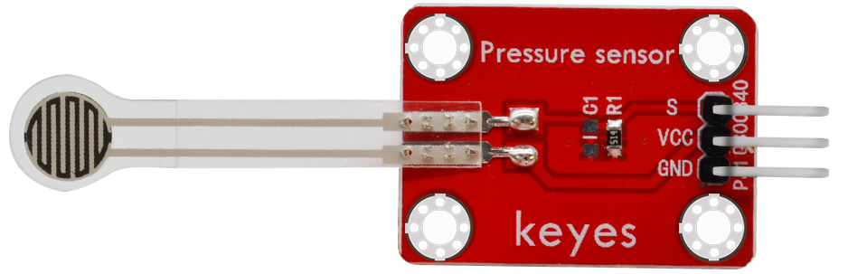
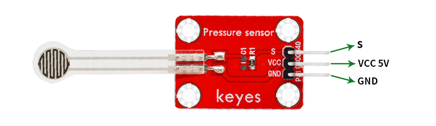
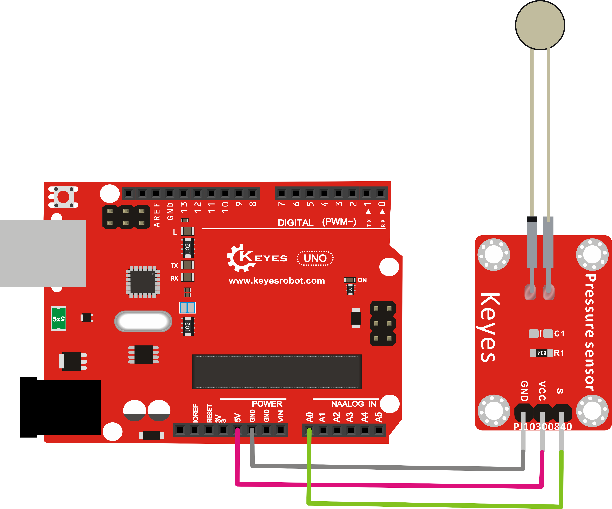
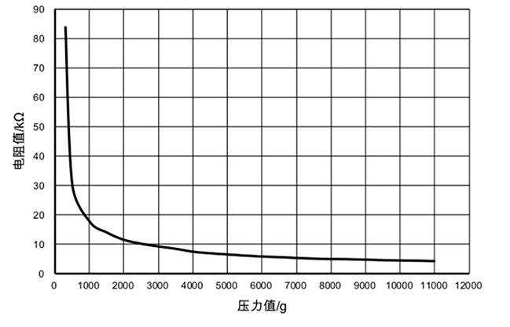

# KE0117 Keyes 薄膜压力传感器(焊盘孔) 使用教程



## 1. 传感器介绍

**薄膜压力传感器**（Force Sensitive Resistor, FSR）是一种能够随施加压力变化而改变其阻值的器件。无压力时传感器阻值较大（接近无穷大），随着外力/压力的增大，传感器阻值减小。该类传感器通常具有厚度薄、灵活度高、响应速度快等优点，可应用于电子秤、智能检测、防撞安全设计等。

**Keyes 薄膜压力传感器(焊盘孔)红色环保版**将感压膜封装在一个红色 PCB 上并留出焊盘孔，方便集成到 DIY 项目或其他相关测力应用中。

---

## 2. 特点与优势

1. **超薄柔性**：适应多种外形结构，可弯折一定角度；  
2. **阻值随压力线性或近似线性地变化**：易于对接模拟电路或 MCU；  
3. **快速响应**：对外力变化反应灵敏，可用于实时监测；  
4. **低功耗**：本身为阻值元件，无需供电，只在测量时有微量电流；  
5. **安装简便**：Keyes PCB 上提供焊盘孔，可快速连接杜邦线或焊接引线。

---

## 3. 规格参数

以下为常见薄膜压力传感器的通用参考，实际以 Keyes 官方参数为准：

- **外形尺寸**：传感器感应区薄，可根据 PCB 外形略有差异  
- **量程**：一般可检测从几十克到数千克的压力（需查看具体量程说明）  
- **输出阻值范围**：无压力时阻值可达数百 kΩ～MΩ 级别；当压力增大到上限时，阻值可降至几百欧姆～几千欧姆  
- **工作温度**：-30℃～+70℃（不同厂家型号略有出入）  
- **封装形式**：Keyes 红色环保 PCB，上方焊盘孔

---

## 4. 工作原理

1. **基本原理**：薄膜材料在受力后其导电颗粒压缩，内部呈现较小电阻；在无力状态下导电颗粒分散，阻值较大；  
2. **检测方式**：常常采用电阻分压电路，将感应到的阻值转换为模拟电压，再由主控 ADC 读取；  
3. **输出随压力递增**：通常表现为输入压力越大，输出模拟量越高（需根据电阻分配电路方向而定）。

---

## 5. 接线与接口说明



由于薄膜压力传感器本身仅为两端阻值变动的器件，Keyes PCB 焊盘孔上可能标注为常规引脚，如：

- **两端焊盘**：无特定极性，都可作为电阻两端。  
- **需要外部电路**：常见做法是与一个固定电阻（Rf）串联组成分压器，再将中点电压送入Arduino的模拟输入。

示意电路如下：



> Rf 一般可选 10kΩ 或根据需求自行调整，以在预期压力范围内得到合适的电压输出。

---

## 6. 示例代码

以下示例使用 Arduino UNO，通过分压电路将传感器输出接至 `A0` 引脚，并在串口打印当前检测到的电压值，进而反映压力大小。

```cpp
/*
  示例功能：读取薄膜压力传感器电压，并将数值打印到串口监视器。
  接线：薄膜压力传感器 + 10kΩ 电阻分压 => A0
*/

const int sensorPin = A0;

void setup() {
  Serial.begin(9600);
  pinMode(sensorPin, INPUT);
}

void loop() {
  int sensorValue = analogRead(sensorPin);     // 0 ~ 1023
  float voltage = sensorValue * (5.0 / 1023.0);  // 5V系统下转换电压

  Serial.print("Sensor Value = ");
  Serial.print(sensorValue);
  Serial.print(" / Voltage = ");
  Serial.print(voltage);
  Serial.println(" V");

  delay(500);
}
```

> 若使用 3.3V 供电或其他量程，请相应修改电压换算或校准。

---

## 7. 实验现象

1. **无压力**：传感器阻值很大，分压电压接近 0V 或 5V（取决于电路配置），串口数值较小或接近满量程；  
2. **轻压力**：传感器阻值开始减小，电压发生可观察的变化；  
3. **较大压力**：传感器阻值显著降低，输出电压接近分压区间的极限值；  
4. **线性度**：实际量程内可能近似线性，也可能有非线性段；可用实验标定法做较准确的映射。



---

## 8. 注意事项

1. **量程与标定**：若需得到准确力值，需要进行标定（将已知重量/力对照传感器输出），建立映射关系；  
2. **避免过载**：使用时应避免超过传感器的最大受力上限，以免损坏感压膜；  
3. **温度影响**：环境温度过高或过低可能影响电子特性，可在精密场景下做温度补偿；  
4. **电路噪声**：高增益或高灵敏度测量时，须注意布线简洁并适当滤波；  
5. **灵敏度不均**：薄膜压力传感器对不同接触面积或施力点位置反应略有差异，可通过结构设计改进施力方式。

---

## 9. 参考链接

- [FSR (Force Sensitive Resistor) 基础原理](https://www.sparkfun.com/datasheets/Sensors/Pressure/fsrguide.pdf)  

