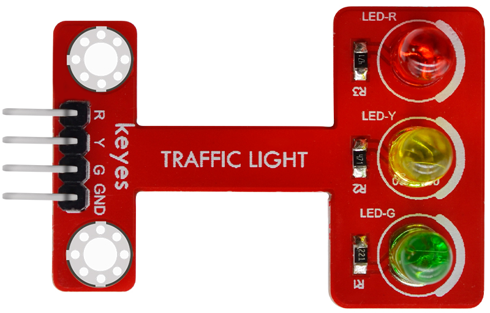
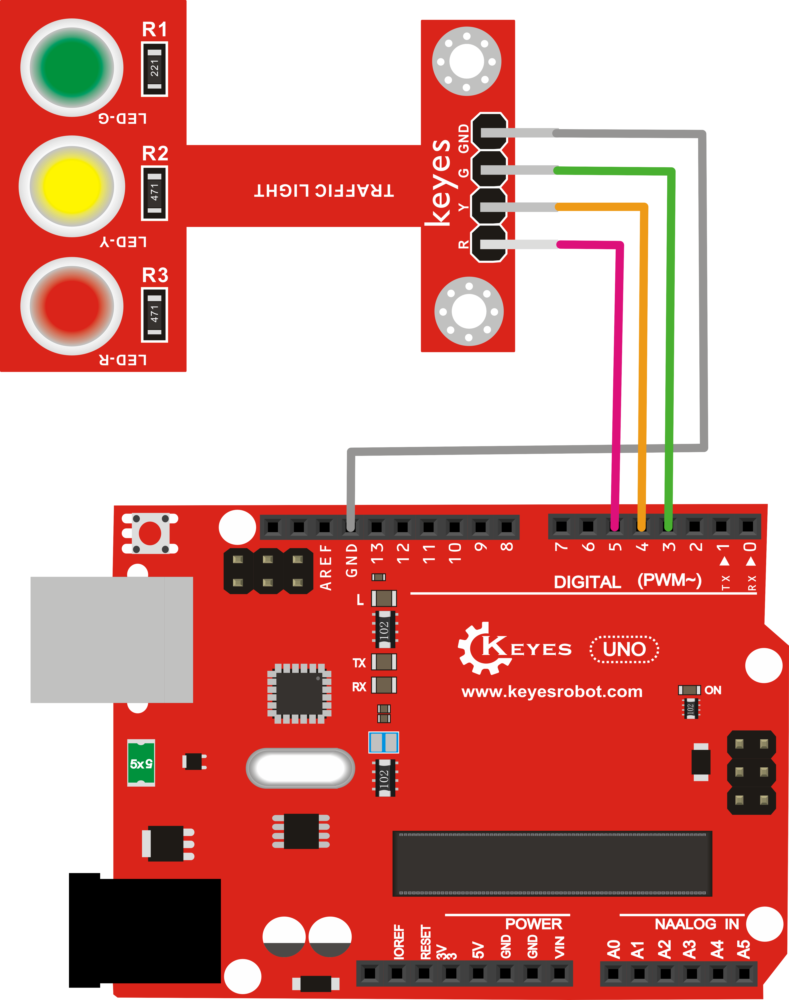

# KE0118 Keyes 交通灯模块 使用说明



## 1. 介绍  
KE0118 Keyes 交通灯模块 是一款LED 指示模块，集成了红、黄、绿三颗 LED 及相应的限流电阻，可用于模拟路口交通灯或多灯状态指示等场合。本模块的公共端需要接地 (GND)，适配 Arduino、树莓派、ESP32 等多种主控平台，适合电子教学、科研实验与创客项目。

## 2. 特点

1. **三灯集成**：红、黄、绿三色 LED 置于同一电路板，方便使用；  
2. **限流电阻**：已焊接限流电阻，无需额外增加；  
3. **共阴极设计**：公共端接 GND，编程逻辑更直观（输出高电平点亮）；  
4. **支持 3.3V/5V**：兼容多种主控平台；  
5. **焊盘式接口**：可焊接排针或杜邦线，空间利用灵活。

---

## 3. 规格参数  
| 项目         | 参数                                   |
|--------------|----------------------------------------|
| 工作电压      | DC 3.3V ～ 5V                           |
| 消耗电流      | 单灯约 5～20 mA (依电阻值与供电电压而定)   |
| 接口方式      | R、Y、G 三路独立信号 + 公共端 (GND) 人性化排布 |
| 模块尺寸      | 约 45 × 28 × 11 mm                       |
| 模块重量      | 约 3.5 g                                 |
| 指示灯颜色    | 红、黄、绿                               |

---

## 4. 工作原理  
1. **LED 导通**：当其中一个控制引脚输出高电平（HIGH），电流通过限流电阻至对应 LED，阴极端与 GND 公共，LED 即可点亮；  
2. **三灯独立**：R、Y、G 引脚分别控制红、黄、绿灯的导通；  
3. **交通灯模拟**：利用编程定时，按红绿灯规律输出不同的亮灭顺序、时长，实现交通灯循环示例。

---

## 5. 接口说明  
- **Red (R)**：红灯控制端  
- **Yellow (Y)**：黄灯控制端  
- **Green (G)**：绿灯控制端  
- **GND**：共阴极，即公共端，接到主控板的 GND  

---

## 6. 连接图  
以 Arduino UNO 为例，演示最常见的连接方式：  

```
Arduino UNO        Keyes交通灯模块（共阴极）
   D5  -----------> R (红灯)
   D4  -----------> Y (黄灯)
   D3  -----------> G (绿灯)
   GND -----------> GND (公共端)
   5V   -----------> （若模块有标注 VCC 可选接入 5V ）
```



---

## 7. 示例代码

利用 Arduino UNO 模仿典型交通灯流程：  
- 绿灯亮 5 秒  
- 黄灯闪烁 3 次  
- 红灯亮 5 秒  
- 循环往复

```cpp
int redled = 5;       // 红灯接 D5
int yellowled = 4;    // 黄灯接 D4
int greenled = 3;     // 绿灯接 D3

void setup() {
  pinMode(redled, OUTPUT);
  pinMode(yellowled, OUTPUT);
  pinMode(greenled, OUTPUT);
}

void loop() {
  // 绿灯亮 5 秒
  digitalWrite(greenled, HIGH);  // 共阴极时，高电平点亮
  delay(5000);
  digitalWrite(greenled, LOW);

  // 黄灯闪烁 3 次
  for(int i = 0; i < 3; i++){
    digitalWrite(yellowled, HIGH);
    delay(500);
    digitalWrite(yellowled, LOW);
    delay(500);
  }

  // 红灯亮 5 秒
  digitalWrite(redled, HIGH);
  delay(5000);
  digitalWrite(redled, LOW);
}
```

> 对于大多数共阴极 LED 模块，给控制引脚输出 HIGH 即可点亮灯珠。

---

## 8. 实验现象


1. **绿灯先持续亮 5 秒**，熄灭后；  
2. **黄灯闪烁 3 次**，间隔约 0.5 秒；  
3. **红灯亮 5 秒**，然后熄灭；  
4. 周期重复，形成标准交通灯循环示例。

---

## 9. 注意事项  
1. **鉴别相容版本**：确保是共阴极模块，避免错误的接线或相反的电平逻辑；  
2. **电压范围**：适用 3.3V～5V，若单片机是 3.3V 供电，可直接使用；  
3. **电流限制**：板载限流电阻通常足够，但仍应避免过大电流；  
4. **维护焊点**：如使用焊盘接口，需要牢固焊接，防止虚焊造成灯光闪断；  
5. **可调时序**：延时逻辑可根据需求更改，如需更逼真的交通灯，可自行调整秒数，或使用定时器替代 `delay()` 以避免阻塞程序其他功能。

---

## 10. 参考链接  
- [LED 基础原理 (Wikipedia)](https://en.wikipedia.org/wiki/Light-emitting_diode)  