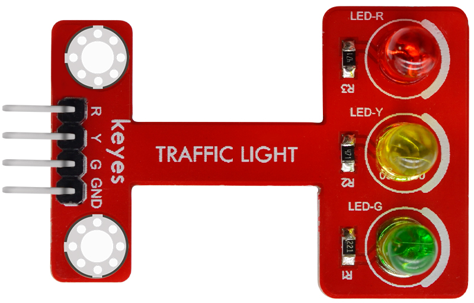
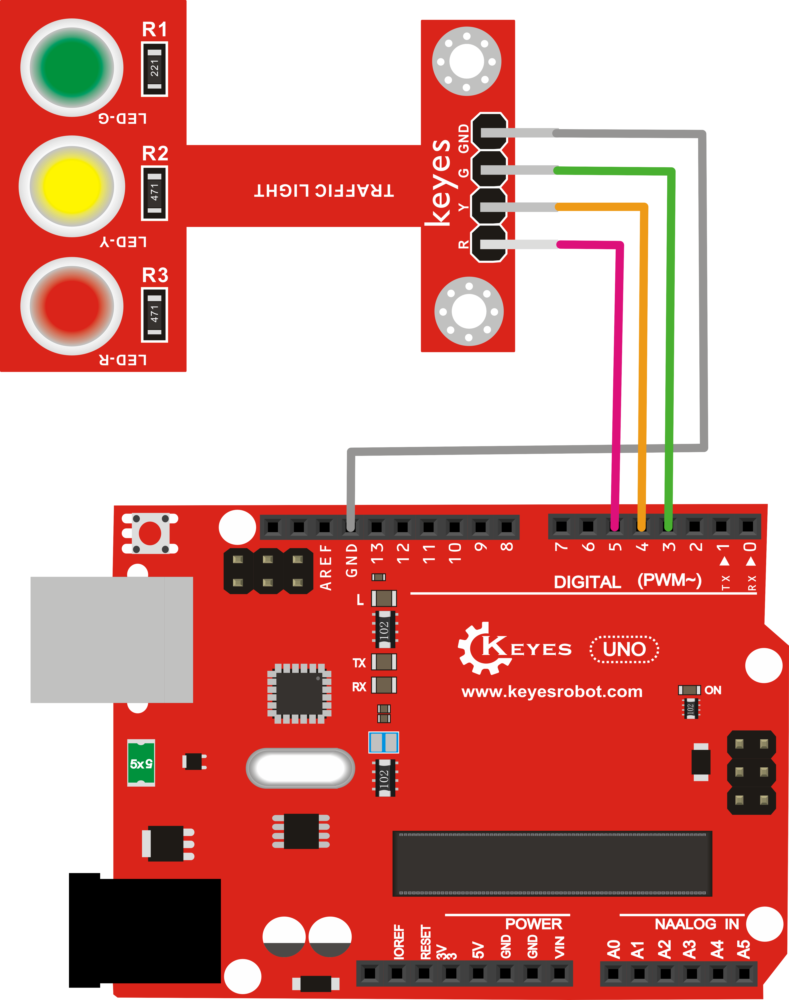
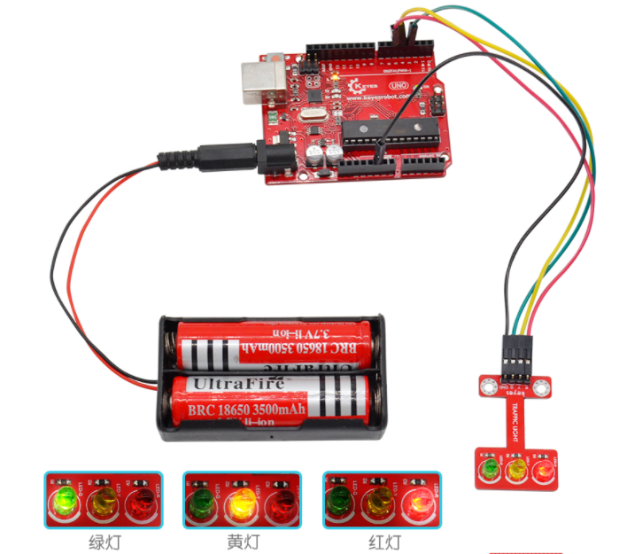

# KE0118 Keyes 红绿灯模块使用说明



## 1. 介绍  
**KE0118 Keyes 红绿灯模块** 集成了红、黄、绿三颗 LED（及相应的限流电阻），常用于模拟交通信号灯或者作为多重状态指示灯。焊盘与排针接口可供接线，适合在 Arduino、树莓派等多种主控平台中快速搭建示例和原型。

---

## 2. 特点  
1. **三灯一体**：在一块 PCB 上集成了红、黄、绿三色 LED；  
2. **预置限流电阻**：无需额外添加电阻，直接连接主控数字口；  
3. **焊盘式接口**：可选择焊接杜邦线或排针，灵活度高；  
4. **3.3V/5V 兼容**：适配 Arduino、树莓派等主控的常见电压；  
5. **低功耗，易开发**：轻松实现交通灯时序、闪烁指示等多种效果。

---

## 3. 规格参数  
| 项目         | 参数                                |
|--------------|-------------------------------------|
| 工作电压      | DC 3.3V ～ 5V                        |
| 消耗电流      | 单灯约 5～20 mA (取决于板载电阻与供电)  |
| 接口方式      | 数字 I/O (各灯独立控制引脚)            |
| 模块尺寸      | 约 45 × 28 × 11 mm                   |
| 模块重量      | 约 3.5 g                             |
| 灯珠颜色      | 红、黄、绿                           |

---

## 4. 工作原理  
1. **LED 导通**：当对应引脚输出高电平（或低电平，视共阳/共阴极），电流经限流电阻后，LED 导通发光；  
2. **三灯独立**：红、黄、绿灯各自对应一个数字 IO 口，软件上可分开控制亮灭；  
3. **交通灯模拟**：在 Arduino 程序中配合 `delay()` 或计时逻辑来控制各灯时序，即可模拟真实交通灯工作过程。

---

## 5. 接口说明  
通常模块提供四个焊盘或针脚：  
- **R（Red）**：红灯控制端  
- **Y（Yellow）**：黄灯控制端  
- **G（Green）**：绿灯控制端  
- **公共端（共阴或共阳）**：若是共阴极，需接 GND；若是共阳极，则接 VCC。

> 具体以模块上丝印标识为准 (如 “R”/“Y”/“G”/“GND”或“VCC”)。若连接后灯逻辑相反，可针对共阳/共阴极进行软件高低电平反转。

---

## 6. 连接图  
以 Arduino UNO（假设模块为共阴极）为例：  



> 如果模块为共阳极，则公共端需接 5V（或 3.3V），并将软件控制逻辑高/低电平互换。

---

## 7. 示例代码  
以下示例实现模拟交通信号灯：  
1. 绿灯常亮 5 秒；  
2. 黄灯闪烁 3 次；  
3. 红灯常亮 5 秒；  
4. 循环。

```cpp
int redled = 5;     
int yellowled = 4;  
int greenled = 3;   

void setup() {
  pinMode(redled, OUTPUT);
  pinMode(yellowled, OUTPUT);
  pinMode(greenled, OUTPUT);
}

void loop() {
  // 绿灯亮 5 秒
  digitalWrite(greenled, HIGH);
  delay(5000);
  digitalWrite(greenled, LOW);

  // 黄灯闪烁 3 次
  for(int i = 0; i < 3; i++){
    digitalWrite(yellowled, HIGH);
    delay(500);
    digitalWrite(yellowled, LOW);
    delay(500);
  }

  // 红灯亮 5 秒
  digitalWrite(redled, HIGH);
  delay(5000);
  digitalWrite(redled, LOW);
}
```

若为共阳极模块，请将 `HIGH` 和 `LOW` 对调即可实现相同效果。

---

## 8. 实验现象



1. **绿灯先亮起 5 秒**，随后熄灭；  
2. **黄灯闪烁 3 次**，每次约半秒；  
3. **红灯点亮 5 秒**；  
4. 流程完成后重复执行，实现循环往复的三灯演示。

---

## 9. 注意事项  
1. **辨别极性**：若灯不亮或亮度异常，可能是“共阴极/共阳极”接线与程序输出不匹配；  
2. **电源兼容**：确保使用 3.3V 或 5V 主控板时，模块在对应电压下正常工作；  
3. **避免过流**：板载限流电阻一般足够普通 LED 驱动，但请勿在超高电流状态下使用；  
4. **时序可调**：可重复修改 `delay()` 时长，或采用更精细的定时方案模拟真实交通灯周期；  
5. **焊接牢固**：如果使用焊盘对 Arduino 进行引线连接，注意焊点坚固，以免松动影响实验。

---

## 10. 参考链接  
- [Arduino 官网](https://www.arduino.cc/)  
- [Keyes 官网](http://www.keyes-robot.com/)  
- [LED 原理介绍 (Wikipedia)](https://en.wikipedia.org/wiki/Light-emitting_diode)  
- [Arduino Create](https://create.arduino.cc/) (在线编程平台)

通过 **KE0118 Keyes 红绿灯模块**，你可以在 Arduino 等开发平台中轻松实现趣味的交通灯模拟或多重指示灯效果，适合课堂教学、DIY 项目与原型设计。祝你使用愉快、创意无限！
