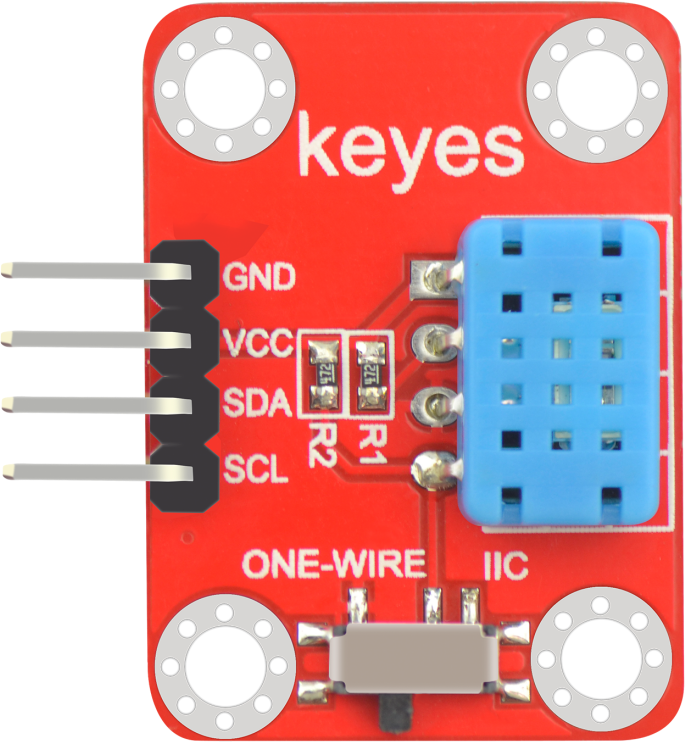

# KE0127 Keyes DHT12温湿度模块 详细教程



> 适用范围：温湿度检测等，支持 **I2C** 和 **单总线** 两种通信方式

## 1. 模块概述
Keyes DHT12 温湿度传感器模块使用 **DHT12** 芯片，可通过 **I2C** 或 **单总线**（Single-Wire）方式输出温度与湿度数据，检测精度高、体积小，方便嵌入各类项目。

### 主要特点
- **DHT12** 感应芯片   
- 支持 **I2C** （默认地址 `0x5C`） 和 **单总线** 通讯模式  
- 工作电压：**3.3 ~ 5V**  
- 测温范围：-20℃ ~ +60℃  
- 测湿范围：20% ~ 95%RH

## 2. 引脚说明
一般提供 4 个焊孔 / 针脚：  
1. **VCC**：3.3~5V 供电  
2. **GND**：接地  
3. **SCL**：I2C时钟线 / （单总线模式时可做DATA）  
4. **SDA**：I2C数据线  

> 若使用 I2C 通讯：需连接 VCC、GND、SCL、SDA  
> 若使用 单总线 通讯：仅需 VCC、GND、DATA 三条线（SCL/SDA 中任意一端即可与 MCU 某个数字口相连，具体依所用库决定）

---

## 3. I2C模式接线与示例代码

### 3.1 I2C模式接线 (以 Arduino UNO 为例)
- DHT12 VCC → Arduino 5V  
- DHT12 GND → Arduino GND  
- DHT12 SCL → Arduino A5 (UNO 的 I2C SCL)  
- DHT12 SDA → Arduino A4 (UNO 的 I2C SDA)


#### 提示  
- 部分 Arduino 兼容板的 I2C 引脚位置可能不同，例如 Leonardo、Mega2560、ESP8266 等，需要查阅其 I2C 默认引脚位置。

### 3.2 I2C模式示例代码
此示例使用 [Rob Tillaart 的 DHT12 库](https://github.com/RobTillaart/DHT12)；安装后，可按下面代码编写并在 Arduino IDE 上传。

```c
#include <Wire.h>
#include "DHT12.h"

// I2C 模式默认初始化
DHT12 dht12; // 若使用默认地址 0x5C

void setup() {
  Serial.begin(9600);
  Wire.begin();      // 初始化 I2C
  dht12.begin();     // 初始化 DHT12（I2C 模式）
}

void loop() {
  float temperature = dht12.readTemperature();
  float humidity    = dht12.readHumidity();

  if (!isnan(temperature) && !isnan(humidity)) {
    Serial.print("Temperature: ");
    Serial.print(temperature);
    Serial.println(" °C");

    Serial.print("Humidity: ");
    Serial.print(humidity);
    Serial.println(" %RH");
    Serial.println("-----------------------");
  } else {
    Serial.println("Failed to read DHT12 data (I2C mode)!");
  }
  delay(2000);
}
```

---

## 4. 单总线模式接线与示例代码

### 4.1 单总线模式接线 (以 Arduino UNO 为例)
- DHT12 VCC → Arduino 5V  
- DHT12 GND → Arduino GND  
- 模块上 DATA 焊盘 (SCL 或 SDA 那一针) → Arduino 数字引脚 (如 2 或 3)  
- 根据需要在 DATA 和 VCC 间加上一个 **10kΩ 上拉电阻**（有些模块板上已自带）

> 在单总线模式下，只需 3 根线：VCC、GND、DATA。  
> 库中通常通过构造函数设定 “数据脚引脚号”，并在内部负责单线通信。

### 4.2 单总线模式示例代码
仍使用 [DHT12 库 by Rob Tillaart](https://github.com/RobTillaart/DHT12)，但以 **单总线** 构造函数方式初始化：

```c
#include "DHT12.h"

// 声明对象时指定单总线数据引脚 (如 2)
DHT12 dht12(2);  // Single-Wire 模式 -> 数据脚接 D2

void setup() {
  Serial.begin(9600);
  // 单总线模式无需 Wire.begin()，直接 begin()
  dht12.begin();       
}

void loop() {
  float temperature = dht12.readTemperature();
  float humidity    = dht12.readHumidity();

  if (!isnan(temperature) && !isnan(humidity)) {
    Serial.print("Temperature: ");
    Serial.print(temperature);
    Serial.println(" °C");

    Serial.print("Humidity: ");
    Serial.print(humidity);
    Serial.println(" %RH");
    Serial.println("-----------------------");
  } else {
    Serial.println("Failed to read DHT12 data (Single-Wire mode)!");
  }
  delay(2000);
}
```

---

## 5. 注意事项
1. **供电电压**：推荐 3.3~5V，确保传感器性能。  
2. **读数间隔**：建议每 2 秒或更长时间获取一次，避免频繁读取影响精度。  
3. **单总线与 I2C 不可同时使用**：一个模块上若要切换通讯模式，需要检查板载焊接或跳线配置，并更换程序。  
4. **上拉电阻**：单总线方式一般需要在数据线与电源间加 4.7kΩ ~ 10kΩ 上拉电阻（部分模块可能已内置）。  
5. 模块在 **高湿度或灰尘环境** 下使用，需做好表面防护。长时间不使用或环境过脏时，请适度清洁以防影响测量。

---

## 6. 常见应用
- 家庭环境监测系统 (室温/室湿度)  
- 温室 / 冷链仓储监控  
- HVAC (空调) 智能控制  
- 室内外气象站  

---

## 7. 更多信息
- [Keyes 官方网站](http://www.keyes-robot.com/)  
- [DHT12 数据手册 (英文)](http://www.aosong.com)  
- [DHT12 Arduino 库 (GitHub)](https://github.com/RobTillaart/DHT12)

如有疑问，欢迎至论坛或官方平台提问，祝开发顺利！