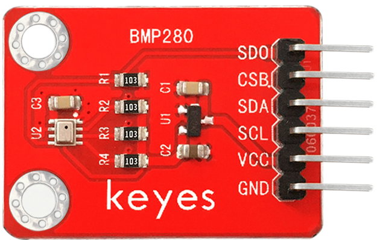

# KE0143 KEYES BMP280模块 (红色环保)



---

## 1. 介绍
**KEYES BMP280模块** 是基于 BMP280 传感器的气压和温度传感器模块，专为移动应用设计。该模块具有小尺寸、低功耗、高精度和长期稳定性，适用于多种环境监测应用。BMP280 采用成熟的压阻式压力传感器技术，提供灵活的工作选择，用户可以在功耗、分辨率和滤波性能方面进行优化。

---

## 2. 特点
- **高精度**：气压测量精度为 0.16Pa，温度测量精度为 0.01℃。
- **低功耗**：工作电流仅为 2.7μA @ 1Hz 采样率，适合电池供电的应用。
- **多种通信方式**：支持 I2C 和 SPI 两种通信方式，用户可根据需求选择。
- **广泛的应用领域**：适用于温度检测、大气压强检测、海拔高度检测等多种场景。
- **紧凑设计**：模块采用小尺寸封装，便于集成到各种设备中。

---

## 3. 规格参数
- **工作电压**：DC 5V  
- **工作电流**：2.7μA @ 1Hz 采样率  
- **气压测量范围**：300hPa ~ 1100hPa (海拔 +9000m ~ -500m)  
- **气压测量精度**：0.16Pa（±1米）  
- **温度测量范围**：0℃ ~ 65℃  
- **温度测量精度**：0.01℃  
- **工作温度**：-40℃ ~ +85℃  
- **平均测量时间**：5.5 ms  

---

## 4. 工作原理
BMP280 模块通过 I2C 或 SPI 接口与主控板（如 Arduino）进行通信。传感器内部采用压阻式技术测量气压和温度，数据通过数字信号输出。用户可以根据需要选择不同的通信方式，并通过编程读取传感器数据。

---

## 5. 接口
- **I2C 接口**：
  - SDA：数据线
  - SCL：时钟线
- **SPI 接口**：
  - SCK：时钟
  - MOSI：主设备输出从设备输入
  - MISO：主设备输入从设备输出
  - CS：片选

---

## 6. 连接图


以下是 BMP280 模块与 Arduino UNO 的接线示意图：


1. 将 BMP280 模块的 SDA 引脚连接到 Arduino 的 A4 引脚；  
2. 将 SCL 引脚连接到 Arduino 的 A5 引脚；  
3. 将 VCC 引脚连接到 Arduino 的 5V；  
4. 将 GND 引脚连接到 Arduino 的 GND。

---

## 7. 示例代码
**安装库**

- 下载库文件：[KE0143](./资料/KE0143.7z)

- 打开Arduino IDE，选择“项目”，选择“导入库”，再选择“添加.ZIP库”。

  

- 找到下载资料的存放位置，打开文件夹找到库文件，选择要导入的库，点击“打开”。

  

- 安装成功界面。

  

以下是使用 I2C 通信方式的测试代码示例：

```cpp
#include <Wire.h>
#include <SPI.h>
#include <Adafruit_Sensor.h>
#include <Adafruit_BMP280.h>

Adafruit_BMP280 bme; // I2C

void setup() {
  Serial.begin(9600);
  Serial.println(F("BMP280 test"));
  
  if (!bme.begin()) {  
    Serial.println("Could not find a valid BMP280 sensor, check wiring!");
    while (1);
  }
}
  
void loop() {
    Serial.print("Temperature = ");
    Serial.print(bme.readTemperature());
    Serial.println(" *C");
    
    Serial.print("Pressure = ");
    Serial.print(bme.readPressure());
    Serial.println(" Pa");

    // Serial.print("Approx altitude = ");
    // Serial.print(bme.readAltitude(1013.25)); // this should be adjusted to your local forecast
    // Serial.println(" m");
    
    Serial.println();
    delay(2000);
}
```

**如果安装以上的库后，上传代码报错(代码上传成功不用安装)，请按照上述步骤安装Wire库。**

- 下载库文件：[Wire](./资料/Wire.7z)

## 8. 实验现象
1. 确保使用 Arduino IDE 版本 1.6.1 进行测试，其他版本可能无法成功运行。  

2. 按照接线图连接好线，上传测试代码。  

3. 上电后，打开串口监视器，设置波特率为 9600，监视器将显示当前的温度和大气压强。

	

---

## 9. 注意事项
1. **电源输入**：确保输入电压为 DC 5V，避免过压损坏扩展板或 Arduino。  
2. **连接牢固**：在插拔 Arduino 和杜邦线时，确保连接牢固，避免接触不良。  
3. **杜邦线使用**：使用标准杜邦线连接扩展板与传感器，确保引脚对应正确。  
4. **实验环境**：保持实验环境干燥整洁，避免短路或静电损坏设备。

---

## 10. 参考链接
- **官方文档**  
  - [micro:bit 官方](https://microbit.org/)  
  - [Arduino 官方](https://www.arduino.cc/)  
- **开发辅助**  
	- [Adafruit BMP280 库](https://github.com/adafruit/Adafruit_BMP280_Library)  
	- [Arduino IDE 下载](https://www.arduino.cc/en/software)  
	- [BMP280 数据手册](https://cdn.sparkfun.com/assets/parts/1/1/0/0/0/13975-BMP280_Datasheet.pdf)  

如有更多疑问，请联系 Keyes 官方客服或加入相关创客社区交流。祝使用愉快！