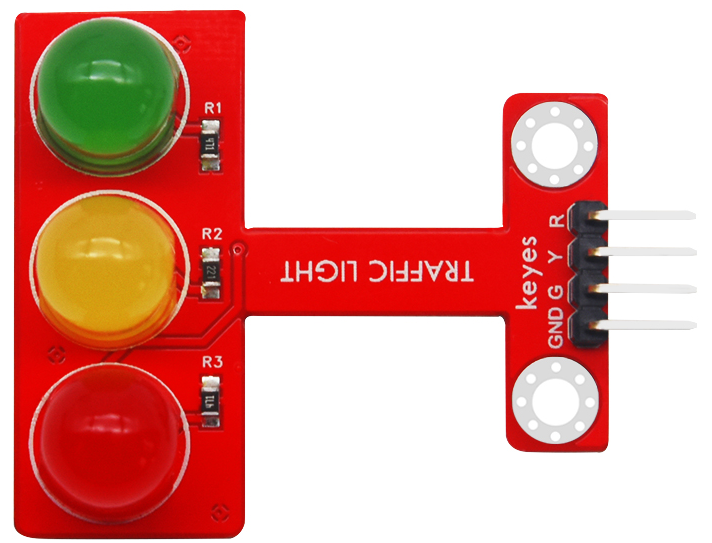
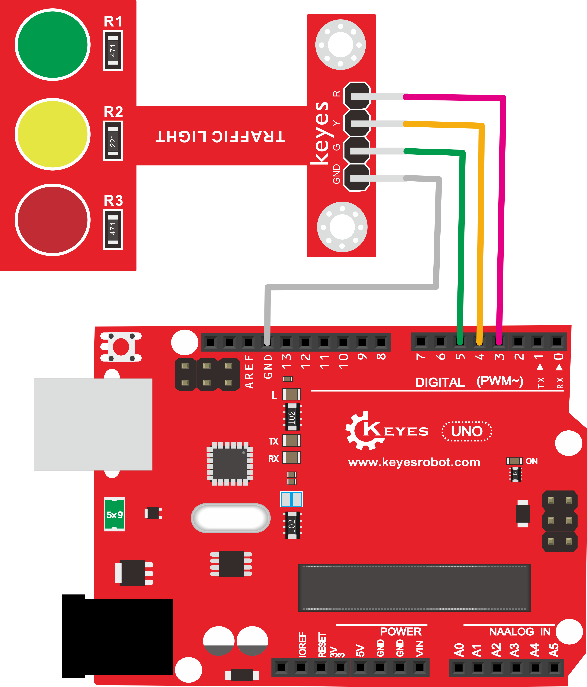
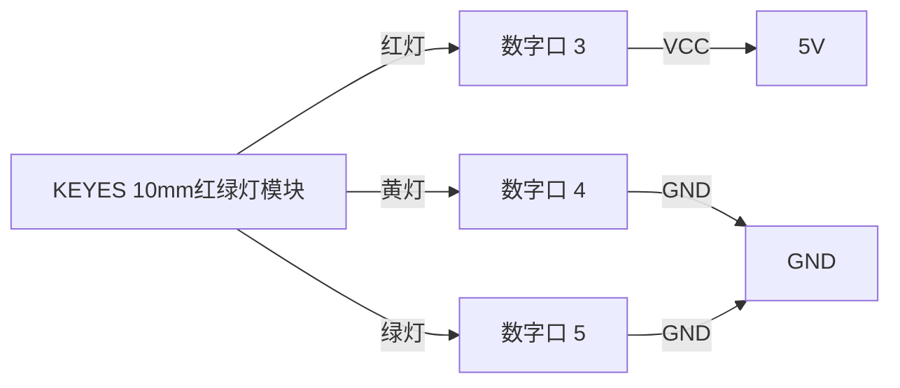

# KE0145 KEYES 10mm红绿灯模块 (焊盘孔) 红色环保



---

## 1. 介绍
**KEYES 10mm红绿灯模块** 是一款专为学习和实验设计的模块，集成了红、黄、绿三种高亮度 LED 灯，方便用户在单片机项目中模拟交通信号灯的功能。该模块具有简单的接线方式，兼容 Arduino 和树莓派系统，适合初学者和创客进行电子项目开发。

---

## 2. 特点
- **高亮度 LED**：模块上配备的 10mm LED 灯具有高亮度和颜色纯正的特点，确保在各种环境下都能清晰可见。
- **长寿命与稳定性**：LED 灯的使用寿命长，稳定性高，适合长期使用。
- **兼容性强**：完全兼容 Arduino 单片机和树莓派系统，适合多种开发环境。
- **易于接线**：模块设计简洁，接线方便，适合初学者快速上手。

---

## 3. 规格参数
- **工作电压**：DC 3.3V - 5V  
- **接口**：间距为 2.54mm 的 4-pin 排针  
- **接口类型**：数字口  
- **尺寸**：约 48mm × 37mm × 16mm  
- **重量**：约 6.6g  

---

## 4. 工作原理
该模块通过数字接口控制 LED 灯的亮灭状态。用户可以通过编程控制每个 LED 的状态，从而模拟交通信号灯的工作。模块内部的 LED 灯通过电流的变化来实现不同的亮度和颜色显示。

---

## 5. 接口
- **接口定义**：
  - **红灯**：连接到数字口 3
  - **黄灯**：连接到数字口 4
  - **绿灯**：连接到数字口 5
  - **VCC**：连接到电源（5V）
  - **GND**：连接到地

---

## 6. 连接图



以下是 KEYES 10mm 红绿灯模块与 Arduino 的接线示意图：



1. 将红灯连接到 Arduino 的数字口 3；  
2. 将黄灯连接到 Arduino 的数字口 4；  
3. 将绿灯连接到 Arduino 的数字口 5；  
4. 将模块的 VCC 引脚连接到 Arduino 的 5V；  
5. 将模块的 GND 引脚连接到 Arduino 的 GND。

---

## 7. 示例代码
以下是控制红绿灯模块的示例代码：

```cpp
int redled = 3;    // 定义红灯接口
int yellowled = 4; // 定义黄灯接口
int greenled = 5;  // 定义绿灯接口

void setup() {
    pinMode(redled, OUTPUT);    // 设置为输出
    pinMode(yellowled, OUTPUT); // 设置为输出
    pinMode(greenled, OUTPUT);  // 设置为输出
}

void loop() {
    digitalWrite(greenled, HIGH); // 绿灯亮起
    delay(5000);                   // 延迟5秒
    digitalWrite(greenled, LOW);  // 关闭绿灯

    for (int i = 0; i < 3; i++) { // 黄灯闪烁3次
        delay(500);                // 延迟0.5秒
        digitalWrite(yellowled, HIGH); // 打开黄灯
        delay(500);                // 延迟0.5秒
        digitalWrite(yellowled, LOW);  // 关闭黄灯
        delay(500);                // 延迟0.5秒
    }

    digitalWrite(redled, HIGH);   // 打开红灯
    delay(5000);                   // 延迟5秒
    digitalWrite(redled, LOW);    // 关闭红灯
}
```

---

## 8. 实验现象
上传代码成功后，上电后，模块上的三个 LED 将自动模拟交通灯的运行：
- 绿灯亮起 5 秒；
- 黄灯闪烁 3 次；
- 红灯亮起 5 秒。

---

## 9. 注意事项
1. **电源输入**：确保工作电压在 DC 3.3V - 5V 之间，避免过压损坏模块。  
2. **连接牢固**：在插拔杜邦线时，确保连接牢固，避免接触不良。  
3. **LED 使用**：LED 的正负极连接要正确，避免损坏 LED。  
4. **实验环境**：保持实验环境干燥整洁，避免短路或静电损坏设备。

---

## 10. 参考链接
- **Arduino 官方文档**  
  - [Arduino 官方](https://www.arduino.cc/)  
- **Keyes 相关**  
  - [Keyes 官网](http://www.keyes-robot.com/)  
- **开发辅助**  
  - [Arduino IDE 下载](https://www.arduino.cc/en/software)  
  - [LED 使用指南](https://learn.adafruit.com/leds)  

如有更多疑问，请联系 Keyes 官方客服或加入相关创客社区交流。祝使用愉快！