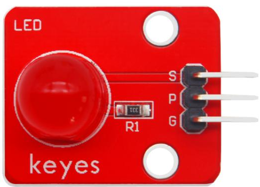
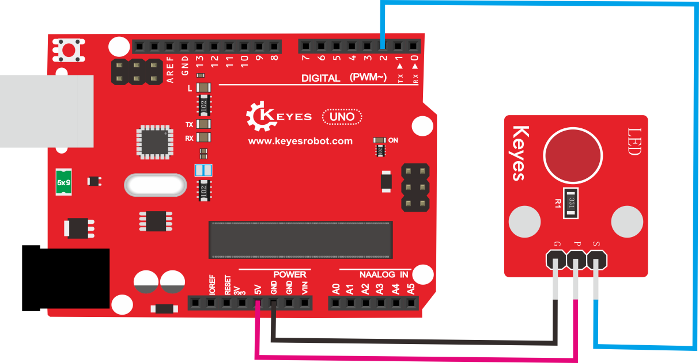
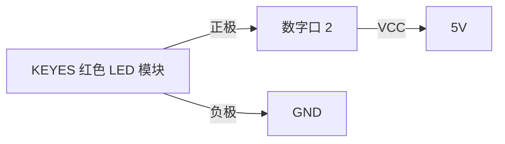
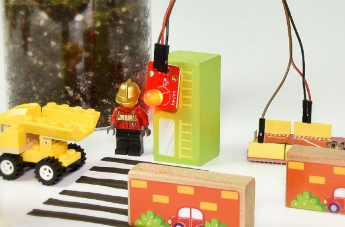

# KE0147 KEYES 红色LED模块 (红色环保)



---

## 1. 概述
**KEYES 红色LED模块** 是一款高亮度 LED 发光模块，采用直径为 10mm 的红色 LED 元件，具有颜色纯正、寿命长、稳定性高等特点。该模块能够连接各种型号的单片机，使用时可以将模块的 S 端接到单片机的数字口上，通过单片机数字口控制模块上 LED 的状态。同时，模块自带 2 个定位孔，方便将模块固定在其他设备上。

---

## 2. 规格参数
- **工作电压**：3.3V - 5V（DC）  
- **接口**：间距为 2.54mm 的 3-pin 排针  
- **输入信号**：数字信号  
- **尺寸**：30mm × 21mm × 16mm  
- **重量**：3.1g  

---

## 3. 连接图



以下是 KEYES 红色 LED 模块与 Arduino 的接线示意图：



1. 将 LED 模块的正极连接到 Arduino 的数字口 2；  
2. 将 LED 模块的负极连接到 Arduino 的 GND；  
3. 将模块的 VCC 引脚连接到 Arduino 的 5V。

---

## 4. 测试代码
以下是控制红色 LED 模块的示例代码：

```cpp
int led = 2; // 定义数字口 2

void setup() {
    pinMode(led, OUTPUT); // 设置 LED 为输出
}

void loop() {
    digitalWrite(led, HIGH); // 开启 LED
    delay(2000);             // 延迟 2 秒
    digitalWrite(led, LOW);  // 关闭 LED
    delay(2000);             // 延迟 2 秒
}
```

---

## 5. 测试结果
烧录好代码，连接好线，上电后，红色 LED 将闪烁，亮 2 秒，灭 2 秒。



---

## 6. 注意事项
1. **电源输入**：确保工作电压在 3.3V - 5V 之间，避免过压损坏模块。  
2. **连接牢固**：在插拔杜邦线时，确保连接牢固，避免接触不良。  
3. **LED 使用**：LED 的正负极连接要正确，避免损坏 LED。  
4. **实验环境**：保持实验环境干燥整洁，避免短路或静电损坏设备。

---

## 7. 参考链接
- **Arduino 官方文档**  
  - [Arduino 官方](https://www.arduino.cc/)  
- **Keyes 相关**  
  - [Keyes 官网](http://www.keyes-robot.com/)  
- **开发辅助**  
  - [Arduino IDE 下载](https://www.arduino.cc/en/software)  
  - [LED 使用指南](https://learn.adafruit.com/leds)  

如有更多疑问，请联系 Keyes 官方客服或加入相关创客社区交流。祝使用愉快！