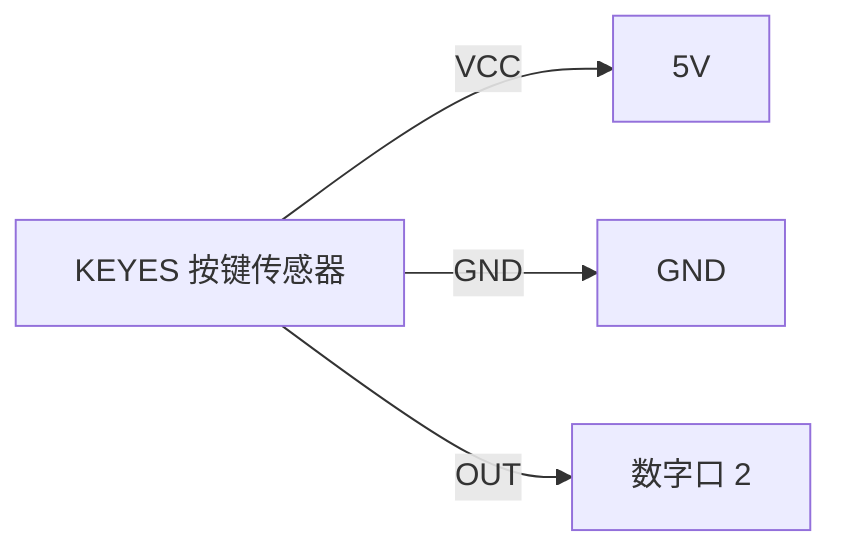

# KE0151 KEYES 按键传感器（焊盘孔）红色绿色按键帽

---

## 1. 介绍
**KEYES 按键传感器** 是一款用于电子项目的按键输入模块，配备红色和绿色按键帽，设计用于与各种单片机（如 Arduino、树莓派等）配合使用。该模块通过按键的开关状态来控制电路的通断，适合用于各种交互式项目和实验。

---

## 2. 特点
- **易于使用**：模块设计简单，方便接线，适合初学者和教育用途。
- **高可靠性**：采用高质量的按键开关，具有良好的触感和长寿命。
- **环保材料**：模块采用环保材料，符合现代电子产品的设计标准。
- **焊盘孔设计**：模块提供焊盘孔，方便用户根据需要进行自定义连接。

---

## 3. 规格参数
- **工作电压**：3.3V - 5V（DC）  
- **接口**：间距为 2.54mm 的 2-pin 排针  
- **输入信号**：数字信号  
- **尺寸**：约 20mm × 20mm × 10mm  
- **重量**：约 5g  

---

## 4. 工作原理
按键传感器通过数字接口控制按键的开关状态。当按键被按下时，模块的输出端会输出高电平信号；当按键释放时，输出端则返回低电平信号。用户可以通过编程读取按键状态，从而实现不同的功能。

---

## 5. 接口
- **接口定义**：
  - **VCC**：连接到电源（3.3V - 5V）
  - **GND**：连接到地
  - **OUT**：连接到单片机的数字输入口

---

## 6. 连接图
以下是 KEYES 按键传感器与 Arduino 的接线示意图：



1. 将按键传感器的 VCC 引脚连接到 Arduino 的 5V；
2. 将按键传感器的 GND 引脚连接到 Arduino 的 GND；
3. 将按键传感器的 OUT 引脚连接到 Arduino 的数字口 2。

---

## 7. 示例代码
以下是读取按键状态的示例代码：

```cpp
int buttonPin = 2; // 定义按键接口

void setup() {
    pinMode(buttonPin, INPUT); // 设置按键为输入
    Serial.begin(9600);         // 初始化串口
}

void loop() {
    int buttonState = digitalRead(buttonPin); // 读取按键状态
    if (buttonState == HIGH) {
        Serial.println("按键被按下"); // 输出按键被按下的状态
    } else {
        Serial.println("按键未被按下"); // 输出按键未被按下的状态
    }
    delay(500); // 延迟 500 毫秒
}
```

---

## 8. 实验现象
上传代码成功后，上电后，按下按键时，串口监视器将显示“按键被按下”；释放按键时，将显示“按键未被按下”。

---

## 9. 注意事项
1. **电源输入**：确保工作电压在 3.3V - 5V 之间，避免过压损坏模块。  
2. **连接牢固**：在插拔杜邦线时，确保连接牢固，避免接触不良。  
3. **按键使用**：按键的正负极连接要正确，避免损坏模块。  
4. **实验环境**：保持实验环境干燥整洁，避免短路或静电损坏设备。

---

## 10. 参考链接
- **Arduino 官方文档**  
  - [Arduino 官方](https://www.arduino.cc/)  
- **Keyes 相关**  
  - [Keyes 官网](http://www.keyes-robot.com/)  
- **开发辅助**  
  - [Arduino IDE 下载](https://www.arduino.cc/en/software)  
  - [按键模块使用指南](https://learn.adafruit.com/adafruit-arduino-lesson-3-button)  

如有更多疑问，请联系 Keyes 官方客服或加入相关创客社区交流。祝使用愉快！