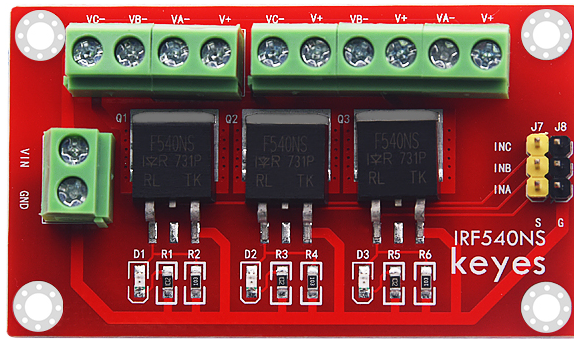
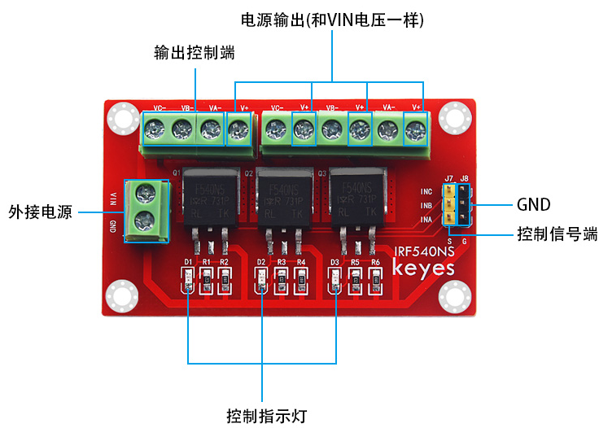
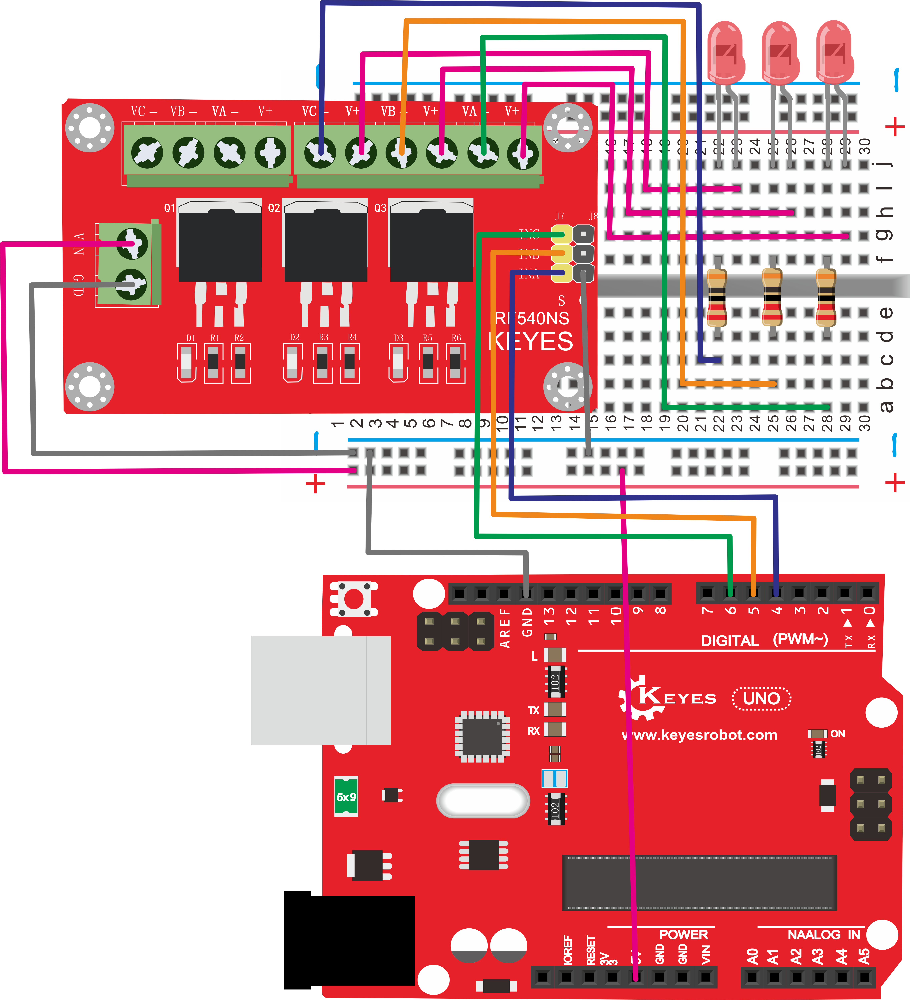
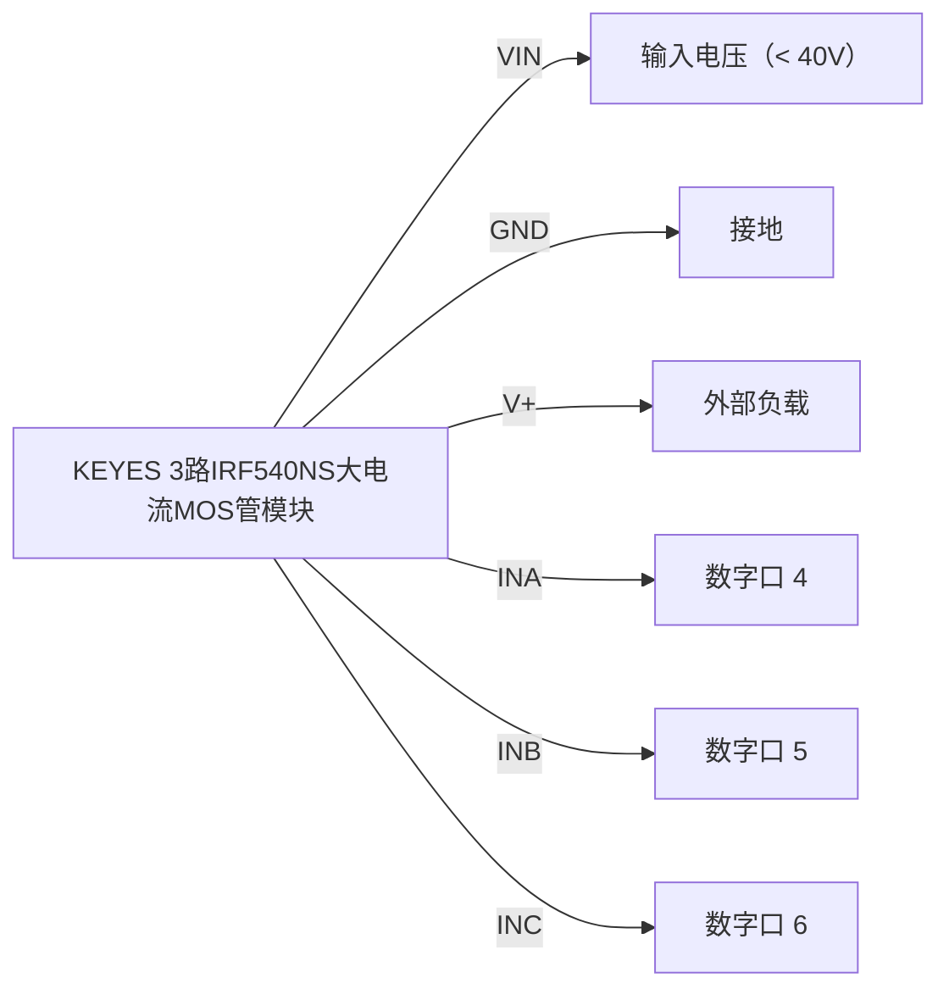
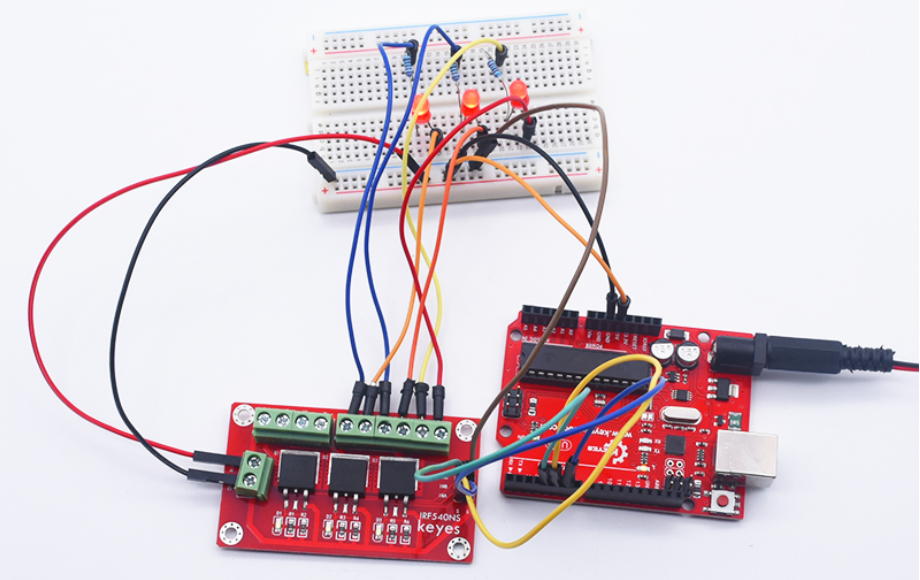

# KE0152 KEYES 3路IRF540NS大电流MOS管模块



---

## 1. 介绍
**KEYES 3路IRF540NS大电流MOS管模块** 是一种利用 MOS 管开关控制大电流的模块，类似于继电器元件。该模块可用于驱动舵机、大电流 LED 灯等设备。通过小电流控制大电流，方便在各种电子项目中使用。

---

## 2. 特点
- **高电流控制**：支持最大 10A 的工作电流，适合驱动大功率负载。
- **高电压输入**：支持 VIN 输入电压小于 40V，适应多种应用场景。
- **LED 指示**：模块上配有 LED 指示灯，便于观察工作状态。
- **环保材料**：采用环保材料，符合现代电子产品的设计标准。
- **固定孔设计**：模块自带 4 个直径为 3mm 的定位孔，方便固定在其他设备上。

---

## 3. 规格参数
- **工作电压**：VIN 端小于 DC 40V  
- **工作电流**：小于 10A  
- **工作温度**：-20℃ ～ +60℃  
- **尺寸**：68mm × 40mm × 14mm  
- **重量**：21.7g  

---

## 4. 工作原理
该模块通过控制 INA、INB、INC 端的高低电平来控制 NA-、NB-、NC- 3 个接线端的接地状态。当 INA、INB、INC 端为高电平时，NA-、NB-、NC- 3 个接线端接地，LED 指示灯亮起；当 INA、INB、INC 端为低电平时，NA-、NB-、NC- 3 个接线端悬空，LED 指示灯熄灭。

---

## 5. 接口说明
- **VIN**：输入电压（小于 40V）
- **GND**：接地
- **V+**：模块电源输出
- **INA**、**INB**、**INC**：控制信号输入
- **NA-**、**NB-**、**NC-**：输出端



---

## 6. 连接图



以下是 KEYES MOS 管模块与 Arduino 的接线示意图：



1. 将 VIN 引脚连接到输入电压（小于 40V）；
2. 将 GND 引脚连接到地；
3. 将 V+ 引脚连接到外部负载；
4. 将 INA、INB、INC 引脚连接到 Arduino 的数字口 4、5、6。

---

## 7. 示例代码
以下是控制 MOS 管模块的示例代码：

```cpp
int BASE = 4; 
int NUM = 3; 

void setup() {
    for (int i = BASE; i < BASE + NUM; i++) {
        pinMode(i, OUTPUT); 
    }
}

void loop() {
    for (int i = BASE; i < BASE + NUM; i++) {
        digitalWrite(i, HIGH);  
        delay(200);       
    }
    for (int i = BASE; i < BASE + NUM; i++) {
        digitalWrite(i, LOW);    
        delay(200); 
    }  
}
```

---

## 8. 实验现象
按照接线图接线，上传代码，上电后，模块上 NA-、NB-、NC- 3 个接线端陆续接地，LED 指示灯会陆续亮起，外接 LED 也会陆续亮起；然后 NA-、NB-、NC- 3 个接线端陆续悬空，LED 指示灯会陆续熄灭，外接 LED 也会陆续熄灭；循环交替。



---

## 9. 注意事项
1. **电源输入**：确保 VIN 输入电压小于 40V，避免损坏模块。  
2. **工作电流**：确保工作电流小于 10A，避免过载。  
3. **连接牢固**：在插拔杜邦线时，确保连接牢固，避免接触不良。  
4. **温度范围**：确保工作环境温度在 -20℃ ～ +60℃ 之间。  
5. **单片机电压**：确保使用 5V 单片机，避免 3.3V 单片机连接。

---

## 10. 参考链接
- **Arduino 官方文档**  
  - [Arduino 官方](https://www.arduino.cc/)  
- **Keyes 相关**  
  - [Keyes 官网](http://www.keyes-robot.com/)  
- **开发辅助**  
  - [Arduino IDE 下载](https://www.arduino.cc/en/software)  
  - [MOSFET 使用指南](https://learn.adafruit.com/adafruit-arduino-lesson-4-mosfets)  

如有更多疑问，请联系 Keyes 官方客服或加入相关创客社区交流。祝使用愉快！