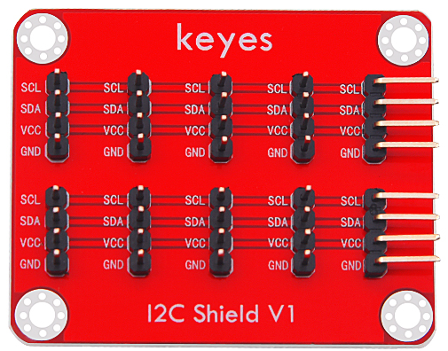
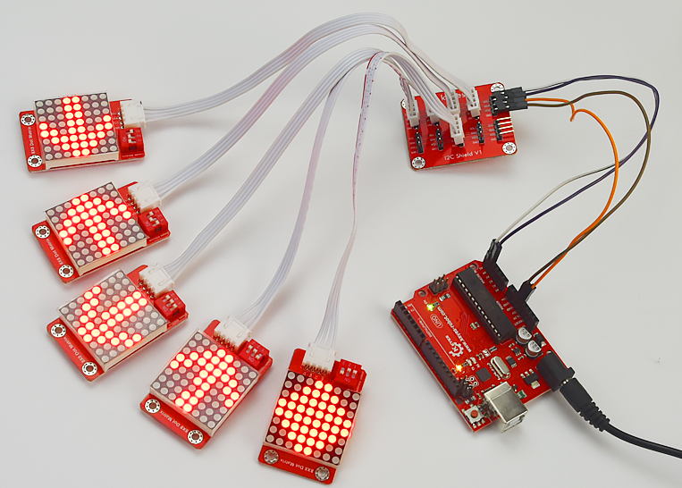
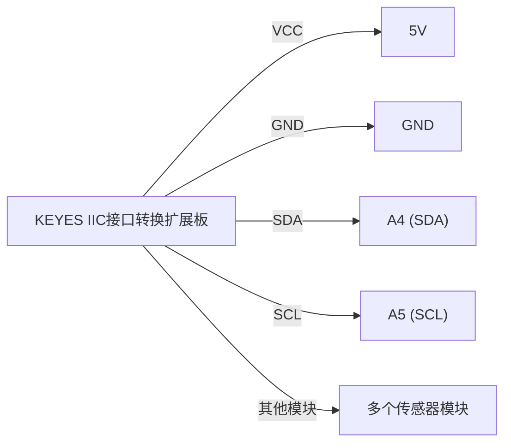

# KE0154 KEYES IIC接口转换扩展板



---

## 1. 说明
**KEYES IIC接口转换扩展板** 是一款用于 I2C 通信的扩展板。当单片机与其他传感器模块通信时，通常需要使用 I2C 通信方式。通过更改地址，可以同时与多个传感器模块进行 I2C 通信。一般单片机仅引出一个 I2C 通信接口，这样不够方便。使用此扩展板后，可以将 I2C 通信端口通过间距为 2.54mm 的 4-pin 排针引出，共引出 10 个通信端口，确保单片机可以同时与 9 个传感器模块进行 I2C 通信。

---

## 2. 技术参数
- **工作电压**：DC 5V  
- **通信方式**：I2C 通信  
- **排针间距**：2.54mm  
- **尺寸**：50mm × 40mm × 12mm  
- **重量**：9.2g  

---

## 3. 使用方法
我们可以利用 Arduino UNO R3 板和扩展板控制 8 个 KE2058 Keyes brick 8X8 点阵模块（可选地址）显示不同图案。以下是连接和代码示例：



### 3.1 连接示意图
以下是 KEYES IIC 接口转换扩展板与 Arduino UNO 的接线示意图：



1. 将扩展板的 VCC 引脚连接到 Arduino 的 5V；
2. 将扩展板的 GND 引脚连接到 Arduino 的 GND；
3. 将 SDA 引脚连接到 Arduino 的 A4（SDA）；
4. 将 SCL 引脚连接到 Arduino 的 A5（SCL）；
5. 连接其他传感器模块到扩展板的 I2C 接口。

### 3.2 示例代码
以下是控制 8 个 KE2058 点阵模块的示例代码：

```cpp
#include <Wire.h>
#include <Adafruit_GFX.h>
#include <Adafruit_LEDBackpack.h>

Adafruit_BicolorMatrix matrix1 = Adafruit_BicolorMatrix();
Adafruit_BicolorMatrix matrix2 = Adafruit_BicolorMatrix();
Adafruit_BicolorMatrix matrix3 = Adafruit_BicolorMatrix();
Adafruit_BicolorMatrix matrix4 = Adafruit_BicolorMatrix();
Adafruit_BicolorMatrix matrix5 = Adafruit_BicolorMatrix();
Adafruit_BicolorMatrix matrix6 = Adafruit_BicolorMatrix();
Adafruit_BicolorMatrix matrix7 = Adafruit_BicolorMatrix();
Adafruit_BicolorMatrix matrix8 = Adafruit_BicolorMatrix();

void setup() {
  Wire.begin();
  matrix1.begin(0x70); // 地址 0x70
  matrix2.begin(0x71); // 地址 0x71
  matrix3.begin(0x72); // 地址 0x72
  matrix4.begin(0x73); // 地址 0x73
  matrix5.begin(0x74); // 地址 0x74
  matrix6.begin(0x75); // 地址 0x75
  matrix7.begin(0x76); // 地址 0x76
  matrix8.begin(0x77); // 地址 0x77
}

void loop() {
  // 在这里添加显示图案的代码
  // 例如，显示不同的图案在不同的点阵模块上
}
```

---

## 4. 注意事项
1. **电源输入**：确保工作电压为 DC 5V，避免损坏扩展板和连接的模块。
2. **连接牢固**：在插拔杜邦线时，确保连接牢固，避免接触不良。
3. **I2C 地址**：确保每个传感器模块的 I2C 地址不同，以避免冲突。
4. **温度范围**：确保工作环境适合模块的工作温度。

---

## 5. 参考链接
- **Arduino 官方文档**  
  - [Arduino 官方](https://www.arduino.cc/)  
- **Keyes 相关**  
  - [Keyes 官网](http://www.keyes-robot.com/)  
- **开发辅助**  
  - [Arduino IDE 下载](https://www.arduino.cc/en/software)  
  - [I2C 通信指南](https://learn.adafruit.com/adafruit-i2c-lcd-backpack)  

如有更多疑问，请联系 Keyes 官方客服或加入相关创客社区交流。祝使用愉快！