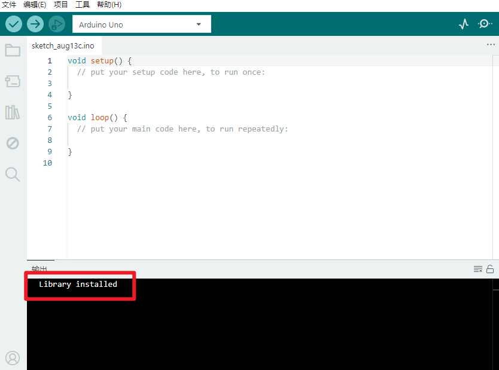

# KE0155 KEYES MPU-6050 Balance Car Shield V3平衡车扩展板

---

## 1. 说明
**KEYES MPU-6050 Balance Car Shield V3** 是一款专为平衡车设计的扩展板，集成了 MPU-6050 六轴传感器，能够实时监测平衡车的姿态和运动状态。该扩展板通过 I2C 接口与单片机（如 Arduino）进行通信，适用于制作平衡车、机器人等项目。

---

## 2. 技术参数
- **工作电压**：DC 5V  
- **通信方式**：I2C  
- **尺寸**：约 100mm × 70mm × 15mm  
- **重量**：约 30g  
- **环保属性**：ROHS  

---

## 3. 接口和主要元件说明
- **MPU-6050**：六轴传感器，用于检测加速度和角速度。
- **I2C 接口**：用于与单片机通信，通常连接到 SDA 和 SCL 引脚。
- **电源接口**：为扩展板供电，通常为 5V。
- **电机驱动接口**：用于连接电机驱动模块，控制平衡车的运动。
- **LED 指示灯**：用于指示工作状态。

---

## 4. 连接示例
以下是 KEYES MPU-6050 平衡车扩展板与 Arduino 的接线示意图：


1. 将扩展板的 VCC 引脚连接到 Arduino 的 5V；
2. 将扩展板的 GND 引脚连接到 Arduino 的 GND；
3. 将 SDA 引脚连接到 Arduino 的 A4（SDA）；
4. 将 SCL 引脚连接到 Arduino 的 A5（SCL）；
5. 将电机驱动接口连接到电机驱动模块。

---

## 5. 示例代码
**安装库**

- 打开Arduino IDE，点击“项目”，选择“管理库”。

  

- 方框输入“MPU6050”，选择“MPU6050”，点击“安装”。

  

- 安装成功界面。
- 

以下是使用 MPU-6050 传感器控制平衡车的示例代码：

```cpp
#include <Wire.h>
#include <MPU6050.h>

MPU6050 mpu;

void setup() {
    Wire.begin();
    Serial.begin(9600);
    mpu.initialize();
    Serial.println("MPU6050 initialized");
}

void loop() {
    int16_t ax, ay, az;
    int16_t gx, gy, gz;
    mpu.getMotion6(&ax, &ay, &az, &gx, &gy, &gz);
    
    Serial.print("Accel: ");
    Serial.print(ax); Serial.print(", ");
    Serial.print(ay); Serial.print(", ");
    Serial.print(az); Serial.println();
    
    Serial.print("Gyro: ");
    Serial.print(gx); Serial.print(", ");
    Serial.print(gy); Serial.print(", ");
    Serial.print(gz); Serial.println();
    
    delay(500);
}
```

**如果安装MPU6050库，上传代码后报错(代码上传成功不用安装)，请按如下安装Wire库**

- 下载库文件: [Wire](./资料/Wire.7z)

- 打开Arduino IDE，选择“项目”，选择“导入库”，再选择“添加.ZIP库”。

  

- 找到下载资料的存放位置，打开文件夹找到库文件，选择要导入的库，点击“打开”。

  wire：

- 安装成功界面。
- 

## 6. 实验现象

上传代码后，打开串口监视器，可以看到 MPU-6050 传感器的加速度和角速度数据。通过这些数据，可以实现对平衡车的控制和调节。

---

## 7. 注意事项
1. **电源输入**：确保工作电压为 DC 5V，避免损坏扩展板和传感器。
2. **连接牢固**：在插拔杜邦线时，确保连接牢固，避免接触不良。
3. **温度范围**：确保工作环境适合模块的工作温度。
4. **I2C 地址**：确保 I2C 地址设置正确，以避免通信冲突。

---

## 8. 参考链接
- **MPU-6050 数据手册**  
  - [MPU-6050 数据手册](https://www.invensense.com/wp-content/uploads/2015/02/MPU-6000-Datasheet1.pdf)  
- **开发辅助**  
  - [Arduino IDE 下载](https://www.arduino.cc/en/software)  
  - [MPU-6050 使用指南](https://learn.adafruit.com/adafruit-mpu6050-6-dof-accelerometer-and-gyroscope)  

如有更多疑问，请联系 Keyes 官方客服或加入相关创客社区交流。祝使用愉快！