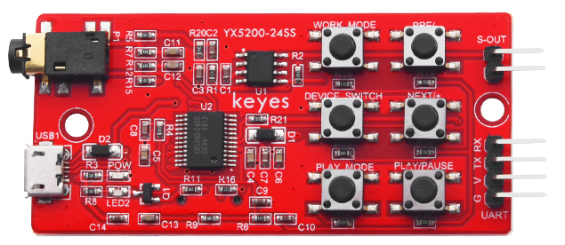
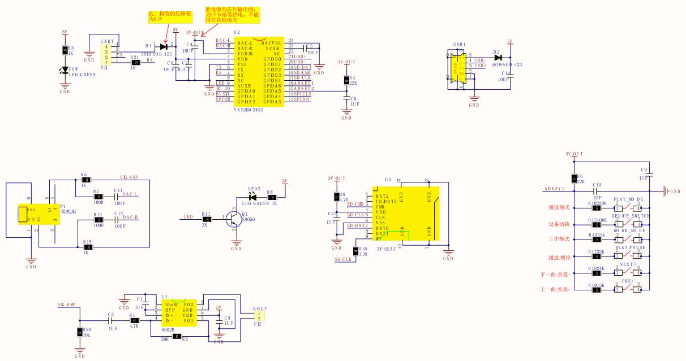
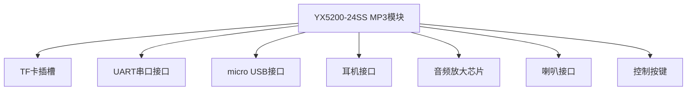
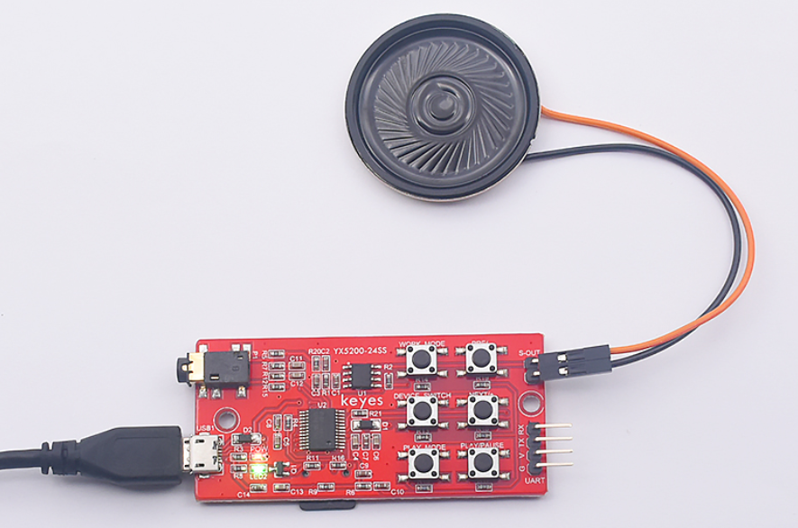

# KE0157 KEYES YX5200-24SS MP3模块



---

## 1. 介绍
**KEYES YX5200-24SS MP3模块** 是一款用于学习和开发的音乐模块。它的核心是 YX5200-24SS 语音芯片，完美集成了 MP3、WAV、WMA 的硬件接口，支持 TF 卡驱动，具有使用方便、稳定可靠的特点。该模块广泛应用于音频播放、语音提示、音乐播放器等项目中。

---

## 2. 特点
- **多种音频格式支持**：支持 MP3、WAV、WMA 格式的音频文件。
- **TF 卡支持**：自带 TF 卡插槽，最大支持 32GB 存储。
- **串口控制**：通过 UART 接口进行串口通信，方便控制音频播放。
- **USB 接口**：支持 micro USB 接口，方便读取 SD 卡内容和下载音乐。
- **音频放大**：集成音频放大芯片，最大输出功率为 1.2W，音频放大倍数为 8 倍。
- **多种接口**：提供耳机接口和喇叭接口，方便连接不同的音频输出设备。
- **按键控制**：外置六个常用按键，方便控制和验证指令。

---

## 3. 规格参数
- **工作电压**：DC 5V  
- **工作电流**：最大 1A  
- **最大功耗**：5W  
- **工作温度**：10~40℃  
- **音频放大倍数**：8 倍  
- **支持 TF 卡**：最大 32G  
- **尺寸**：33mm × 77mm × 9mm  
- **重量**：11.2g  

---

## 4. 工作原理
YX5200-24SS MP3模块通过 UART 接口接收控制指令，控制音频的播放、暂停、音量调节等功能。模块内部集成了音频解码芯片，能够直接读取 TF 卡中的音频文件并进行解码播放。音频信号经过放大后，通过耳机接口或喇叭接口输出。



---

## 5. 接口
- **TF 卡插槽**：用于插入 TF 卡，读取音频文件。
- **UART 接口**：用于与微控制器进行串口通信，控制音频播放。
- **micro USB 接口**：用于读取 SD 卡内容和下载音乐。
- **耳机接口（P1）**：用于连接耳机。
- **喇叭接口（S-OUT）**：用于连接外部喇叭。
- **按键接口**：用于连接外部按键，控制音频播放。

---

## 6. 连接图
以下是 YX5200-24SS MP3模块的连接示意图：



---

## 7. 示例代码
以下是一个简单的示例代码，用于通过串口控制 YX5200-24SS MP3模块播放音频：

```cpp
#include <SoftwareSerial.h>

SoftwareSerial mySerial(10, 11); // RX, TX

void setup() {
  mySerial.begin(9600);
  Serial.begin(9600);
  delay(1000);
  
  // 播放第一首曲目
  mySerial.write(0x7E); // 起始位
  mySerial.write(0xFF); // 版本号
  mySerial.write(0x06); // 数据长度
  mySerial.write(0x03); // 指令：指定曲目
  mySerial.write(0x00); // 保留
  mySerial.write(0x01); // 曲目编号
  mySerial.write(0xFE); // 校验位
  mySerial.write(0xEF); // 结束位
}

void loop() {
  // 这里可以添加其他控制逻辑
}
```

---

## 8. 实验现象
- **正常播放**：当发送播放指令后，模块能够正常播放指定的音频文件。
- **音量调节**：通过发送音量加减指令，音量能够相应变化。
- **曲目切换**：发送下一曲或上一曲指令，模块能够切换到相应的曲目。



---

## 9. 注意事项

- 确保 TF 卡格式为 FAT32，并且音频文件命名符合要求（如 001.mp3）。
- 在连接喇叭时，注意喇叭的功率和阻抗，以免损坏模块。
- 使用 USB 供电时，确保电源稳定，避免电压波动影响模块工作。
- 在发送指令时，确保指令格式正确，以免导致模块无法响应。

### **控制指令**：

| 功能               | 发送的指令                                                   | 备注                                                         |
| ------------------ | ------------------------------------------------------------ | ------------------------------------------------------------ |
| [下一首]           | 7E FF 06 01 00 00 00 FE FA EF                                |                                                              |
| [上一首]           | 7E FF 06 02 00 00 00 FE F9 EF                                |                                                              |
| [指定曲目]         | 7E FF 06 03 00 00 01 FE F7 EF                                | 指定第一首播放                                               |
|                    | 7E FF 06 03 00 00 02 FE F6 EF                                | 指定第二首                                                   |
|                    | 7E FF 06 03 00 00 0A FE EE EF                                | 指定第10首                                                   |
| 音量加             | 7E FF 06 04 00 00 00 FE F7 EF                                |                                                              |
| 音量减             | 7E FF 06 05 00 00 00 FE F6 EF                                |                                                              |
| [指定音量]         | 7E FF 06 06 00 00 1E FE D7 EF                                | 指定音量为30级                                               |
| [指定 EQ]          | 7E FF 06 07 00 00 01 FE F3 EF                                | 保留                                                         |
| [循环播放曲目]     | 7E FF 06 08 00 00 01 FE F2 EF                                | 循环播放第一首                                               |
|                    | 7E FF 06 08 00 00 02 FE F1 EF                                | 循环播放第二首                                               |
|                    | 7E FF 06 08 00 00 0A FE E9 EF                                | 循环播放第十首                                               |
| [指定播放设备]     | 7E FF 06 09 00 00 01 FE F1 EF                                | 指定播放 UDISK                                               |
|                    | 7E FF 06 09 00 00 02 FE F0 EF                                | 指定播放 TF                                                  |
|                    | 7E FF 06 09 00 00 03 FE EF EF                                | 指定播放设备-PC(下载模式)                                    |
|                    | 7E FF 06 09 00 00 04 FE EE EF                                | 指定播放 FLASH                                               |
|                    | 7E FF 06 09 00 00 05 FE ED EF                                | 指定播放设备-SLEEP                                           |
| [进入睡眠模式]     | 7E FF 06 0A 00 00 00 FE F1 EF                                |                                                              |
| [唤醒睡眠]         | 7E FF 06 0B 00 00 00 FE F0 EF                                |                                                              |
| [模块复位]         | 7E FF 06 0C 00 00 00 FE EF EF                                |                                                              |
| [播放]             | 7E FF 06 0D 00 00 00 FE EE EF                                |                                                              |
| [暂停]             | 7E FF 06 0E 00 00 00 FE ED EF                                |                                                              |
| [指定文件夹文件名] | 7E FF 06 0F 00 01 01 FE EA EF                                | "01"的文件夹， 曲目为"001"                                   |
|                    | 7E FF 06 0F 00 01 02 FE E9 EF                                | "01"的文件夹， 曲目为"002"                                   |
| 停止播放           | 7E FF 06 16 00 00 00 FE E5 EF                                | 停止软件解码                                                 |
| 指定文件夹循环播放 | 7E FF 06 17 00 00 01 FE E3 EF                                | 指定01文件夹循环播放                                         |
|                    | 7E FF 06 17 00 00 02 FE E2 EF                                | 指定02文件夹循环播放                                         |
| 单曲循环播放       | 7E FF 06 19 00 00 00 FE E2 EF                                | 单曲循环播放开启                                             |
|                    | 7E FF 06 19 00 00 01 FE E1 EF                                | 单曲循环播放关闭                                             |
| 带音量播放         | 7E FF 06 22 00 1E 01 FE BA EF                                | 30级音量播放第1曲                                            |
|                    | 7E FF 06 22 00 0F 01 FE C9 EF                                | 15级音量播放第1曲                                            |
|                    | 7E FF 06 22 00 0F 02 FE C8 EF                                | 15级音量播放第2曲                                            |
| 设置 DAC           | 7E FF 06 1A 00 00 00 FE E1 EF                                | 开 DAC                                                       |
|                    | 7E FF 06 1A 00 00 01 FE E0 EF                                | 关 DAC[高阻]                                                 |
| 组合播放           | 7E FF 09 21 01 02 02 03 01 04 EF                             | 播放[1,2][2,3][1,4] 括号第一个数字为文件夹名，后一个数字为歌曲名 |
|                    | 7E FF 15 21 01 02 02 03 01 04 01 03 01 04 01 05 02 08 03 04 03 01 FE 9A EF | 带校验 [1,2][2,3][1,4][1,3][1,4][1,5][1,8][3,4][3,1]         |
|                    | 7E FF 15 21 01 02 02 03 01 04 01 03 01 04 01 05 02 08 03 04 03 01 EF | [1,2][2,3][1,4][1,3][1,4][1,5][1,8][3,4][3,1]                |
| 停止播放广告       | 7E FF 06 15 00 00 00 FE E6 EF                                | 停止当广告，回到背景音乐继续播                               |
| 停止播放           | 7E FF 06 16 00 00 00 FE E5 EF                                | 停止软件解码                                                 |
| 插播广告           | 7E FF 06 13 00 00 01 FE E7 EF                                | "ADVERT"文件夹， 曲目为"0001"                                |
|                    | 7E FF 06 13 00 00 02 FE E6 EF                                | "ADVERT"文件夹， 曲目为"0002"                                |
|                    | 7E FF 06 13 00 00 FF FD E9 EF                                | "ADVERT"文件夹， 曲目为"0255"                                |
|                    | 7E FF 06 13 00 07 CF FE 12 EF                                | "ADVERT"文件夹， 曲目为"1999"                                |
|                    | 7E FF 06 13 00 0B B8 FE 25 EF                                | "ADVERT"文件夹， 曲目为"3000"                                |
| 插播广告-多文件夹  | 7E FF 06 25 00 01 01 FE D4 EF                                | "ADVERT1"的文件夹， 曲目为"001"                              |
|                    | 7E FF 06 25 00 01 02 FE D3 EF                                | "ADVERT1"的文件夹， 曲目为"002"                              |
|                    | 7E FF 06 25 00 02 01 FE D3 EF                                | "ADVERT2"的文件夹， 曲目为"001"                              |
| 随机播放           | 7E FF 06 18 00 00 00 FE E3 EF                                | 整个设备的随机播放                                           |

### **查询指令**：

| 功能                   | 发送的指令                    | 备注                     |
| ---------------------- | ----------------------------- | ------------------------ |
| [查询音量]             | 7E FF 06 43 00 00 00 FE B8 EF |                          |
| [查询当前 EQ]          | 7E FF 06 44 00 00 00 FE B7 EF | 保留此功能               |
| U 盘总文件数           | 7E FF 06 47 00 00 00 FE B4 EF | 当前设备的总文件数       |
| TF 总文件数            | 7E FF 06 48 00 00 00 FE B3 EF |                          |
| FLASH 总文件数         | 7E FF 06 49 00 00 00 FE B2 EF |                          |
| U 盘当前曲目           | 7E FF 06 4B 00 00 00 FE B0 EF | 当前播放的曲目           |
| TF 当前曲目            | 7E FF 06 4C 00 00 00 FE AF EF |                          |
| FLASH 当前曲目         | 7E FF 06 4D 00 00 00 FE AE EF |                          |
| 指定文件夹曲目总数查询 | 7E FF 06 4E 00 00 01 FE AC EF |                          |
| 查询当前设备总文件夹数 | 7E FF 06 4F 00 00 00 FE AC EF | 支持 TF 卡和 U 盘、FLASH |

### **返回信息**：

| 功能                             | 发送的指令                    | 备注                 |
| -------------------------------- | ----------------------------- | -------------------- |
| U 盘插入                         | 7E FF 06 3A 00 00 01 xx xx EF |                      |
| TF 插入                          | 7E FF 06 3A 00 00 02 xx xx EF |                      |
| PC 插入                          | 7E FF 06 3A 00 00 04 xx xx EF |                      |
| U 盘拔出                         | 7E FF 06 3B 00 00 01 xx xx EF |                      |
| TF 拔出                          | 7E FF 06 3B 00 00 02 xx xx EF |                      |
| PC 拔出                          | 7E FF 06 3B 00 00 04 xx xx EF |                      |
| U 盘播放完第1曲                  | 7E FF 06 3C 00 00 01 xx xx EF | U 盘播放第1曲完毕    |
| U 盘播放完第2曲                  | 7E FF 06 3C 00 00 02 xx xx EF | U 盘播放第2曲完毕    |
| TF 卡播放完第1曲                 | 7E FF 06 3D 00 00 01 xx xx EF | TF 卡播放第1曲完毕   |
| TF 卡播放完第2曲                 | 7E FF 06 3D 00 00 02 xx xx EF | TF 卡播放第2曲完毕   |
| FLASH 播放完第1曲                | 7E FF 06 3E 00 01 01 xx xx EF | FOLDER1的第1曲播放完 |
| FLASH 播放完第2曲                | 7E FF 06 3E 00 02 02 xx xx EF | FOLDER2的第2曲播放完 |
| U 盘 -- 在线                     | 7E FF 06 3F 00 00 01 xx xx EF | 各设备之间是或的关系 |
| TF -- 在线                       | 7E FF 06 3F 00 00 02 xx xx EF |                      |
| PC -- 在线                       | 7E FF 06 3F 00 00 04 xx xx EF |                      |
| FLASH -- 在线                    | 7E FF 06 3F 00 00 08 xx xx EF |                      |
| U 盘、TF -- 在线                 | 7E FF 06 3F 00 00 03 xx xx EF |                      |
| TF 卡和 FLASH 在线               | 7E FF 06 3F 00 00 0A xx xx EF |                      |
| TF和PC在线                       | 7E FF 06 3F 00 00 06 FE B6 EF |                      |
| U 盘、 TF 卡、 PC、 FLASH 均在线 | 7E FF 06 3F 00 00 1F xx xx EF |                      |
| U 盘播放完第1曲                  | 7E FF 06 3C 00 00 01 xx xx EF | U 盘播放第1曲完毕    |
| U 盘播放完第2曲                  | 7E FF 06 3C 00 00 02 xx xx EF | U 盘播放第2曲完毕    |
| TF 卡播放完第1曲                 | 7E FF 06 3D 00 00 01 xx xx EF | TF 卡播放第1曲完毕   |
| TF 卡播放完第2曲                 | 7E FF 06 3D 00 00 02 xx xx EF | TF 卡播放第2曲完毕   |
| FLASH 播放完第1曲                | 7E FF 06 3E 00 01 01 xx xx EF | FOLDER1的第1曲播放完 |
| FLASH 播放完第2曲                | 7E FF 06 3E 00 02 02 xx xx EF | FOLDER2的第2曲播放完 |

### **错误信息**：

| 功能             | 发送的指令                    | 备注                          |
| ---------------- | ----------------------------- | ----------------------------- |
| 返回忙           | 7E FF 06 40 00 00 01 xx xx EF | 模块在文件系统初始化时        |
| 当前是睡眠模式   | 7E FF 06 40 00 00 02 xx xx EF | 睡眠模式只支持指定设备        |
| 串口接收错误     | 7E FF 06 40 00 00 03 xx xx EF | 串口一帧数据没接收完毕        |
| 校验出错         | 7E FF 06 40 00 00 04 xx xx EF | 和校验出错                    |
| 指定文件超范围   | 7E FF 06 40 00 00 05 xx xx EF | 文件的指定超过设定的范围      |
| 未找到指定文件   | 7E FF 06 40 00 00 06 xx xx EF | 指定为文件没有被找到          |
| 插播错误         | 7E FF 06 40 00 00 07 xx xx EF | 插播只允许在播放的状态下进行  |
| 播放 TF 卡错误   | 7E FF 06 40 00 00 08 xx xx EF | TF 卡读取失败或者 TF 卡被拔出 |
| FLASH 初始化出错 | 7E FF 06 40 00 00 09 xx xx EF | FLASH 里面的文件系统信息错误  |
| 进入睡眠         | 7E FF 06 40 00 00 0A xx xx EF | 进入 SLEPP 模式提醒           |

---

## 10. 参考链接
- [KEYES YX5200-24SS MP3模块产品页面](http://www.keyes.com.cn/product/123)

如有更多疑问，请联系 Keyes 官方客服或加入相关创客社区交流。祝使用愉快！