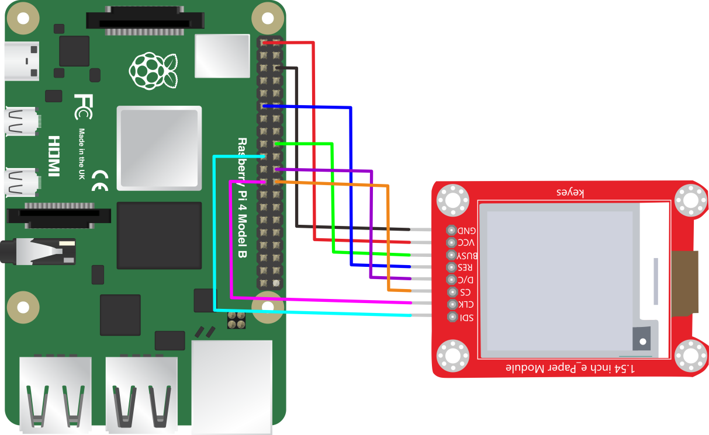
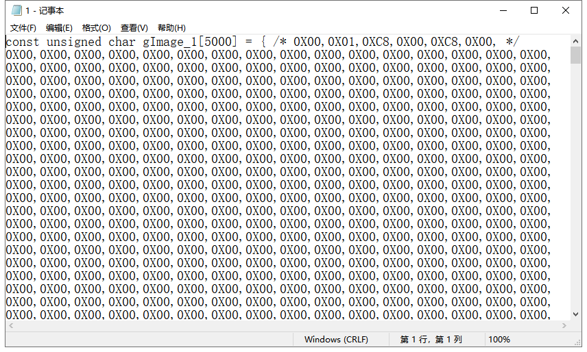

# KE0158 KEYES 电子墨水屏 1.54寸

**资料下载：[相关资料](./资料/KE0158相关资料.7z)**  


---

## 1. 说明
**KEYES 电子墨水屏模块** 配备一个 1.54 寸的显示屏，显示颜色为黑白色，分辨率为 200*200。该模块通过 SPI 通讯，可动态显示图案。为了方便使用，模块自带 4 个直径为 3mm 的定位孔，便于固定在其他设备上。特别注意：测试时使用的是 1.8.9 版本的 IDE 软件，其他版本可能会出现不兼容现象。

---

## 2. 技术参数
- **工作电压**：DC 5V  
- **工作电流**：150mA  
- **最大功率**：0.75W  
- **显示屏颜色**：黑白色  
- **显示屏大小**：1.54寸  
- **显示屏分辨率**：200*200  
- **接口类型**：间距为 2.54mm 的 8pin 排针  
- **工作温度范围**：-20℃ 到 +60℃  
- **定位孔大小**：直径 3mm  
- **尺寸**：56mm × 45mm × 7mm  
- **重量**：15.2g  

---

## 3. 接线方法
### UNO板连接方法


1. 将电子墨水屏的 VCC 接到 UNO 的 5V。
2. 将 GND 接到 UNO 的 GND。
3. 将 DIN 接到 UNO 的 11 号引脚。
4. 将 CLK 接到 UNO 的 13 号引脚。
5. 将 CS 接到 UNO 的 10 号引脚。
6. 将 RST 接到 UNO 的 9 号引脚。
7. 将 DC 接到 UNO 的 8 号引脚。

### 树莓派连接方法



1. 将电子墨水屏的 VCC 接到树莓派的 5V。
2. 将 GND 接到树莓派的 GND。
3. 将 DIN 接到树莓派的 MOSI（GPIO 10）。
4. 将 CLK 接到树莓派的 SCK（GPIO 11）。
5. 将 CS 接到树莓派的 CE0（GPIO 8）。
6. 将 RST 接到树莓派的任意 GPIO（如 GPIO 25）。
7. 将 DC 接到树莓派的任意 GPIO（如 GPIO 24）。

---

## 4. 测试代码链接
**安装库**

- 下载库文件：[epd1in54_V2](./资料/KE0158.7z)

- 打开Arduino IDE，选择“项目”，选择“导入库”，再选择“添加.ZIP库”。

  

- 找到下载资料的存放位置，打开文件夹找到库文件，选择要导入的库，点击“打开”。

  

- 安装成功界面。

  

- ### Arduino代码

```cpp
#include <SPI.h>
#include "epd1in54_V2.h"
#include "imagedata.h"

Epd epd;

void setup() {
    Serial.begin(9600);
    if (epd.Init() != 0) {
        Serial.println("e-Paper init failed");
        return;
    }
}

void loop() {
    epd.Display(IMAGE_DATA);
    delay(1000);
    epd.Display(IMAGE_DATA1);
    delay(1000);
}
```

### 树莓派代码（Python）
```python
#!/usr/bin/python
# -*- coding:utf-8 -*-
import sys
import os
picdir = os.path.join(os.path.dirname(os.path.dirname(os.path.realpath(__file__))), 'pic')
libdir = os.path.join(os.path.dirname(os.path.dirname(os.path.realpath(__file__))), 'lib')
if os.path.exists(libdir):
    sys.path.append(libdir)

import logging
from waveshare_epd import epd1in54_V2
import time
from PIL import Image, ImageDraw, ImageFont

logging.basicConfig(level=logging.DEBUG)

try:
    logging.info("epd1in54_V2 Demo")
    
    epd = epd1in54_V2.EPD()
    logging.info("init and Clear")
    epd.init()
    epd.Clear(0xFF)
    time.sleep(1)
    
    # Drawing on the image
    logging.info("1.Drawing on the image...")
    image = Image.new('1', (epd.width, epd.height), 255)  # 255: clear the frame
    
    draw = ImageDraw.Draw(image)
    font = ImageFont.truetype(os.path.join(picdir, 'Font.ttc'), 24)
    draw.rectangle((0, 10, 200, 34), fill=0)
    draw.text((8, 12), 'hello world', font=font, fill=255)
    epd.display(epd.getbuffer(image.rotate(90)))
    time.sleep(2)
    
    # read bmp file 
    logging.info("2.read bmp file...")
    image = Image.open(os.path.join(picdir, '1in54.bmp'))
    epd.display(epd.getbuffer(image))
    time.sleep(2)
    
    logging.info("Clear...")
    epd.init()
    epd.Clear(0xFF)
    
    logging.info("Goto Sleep...")
    epd.sleep()
        
except IOError as e:
    logging.info(e)
    
except KeyboardInterrupt:    
    logging.info("ctrl + c:")
    epd1in54_V2.epdconfig.module_exit()
    exit()
```

---

## 5. Arduino代码设置方法
A. 安装 Image2Lcd 取模软件并注册。

B. 使用画图软件绘制所需图案，导出为黑白色，像素设置为 200*200。

C. 打开取模软件，设置如下图。


D. 点击打开，选择导出的图案，正显（白底黑字）则“颜色反转”打钩；负显（黑底白字）则不需要打钩。


E. 点击生成对应的 C 语言代码，将代码复制到代码中的 `const unsigned char IMAGE_DATA[] PROGMEM` 位置。  




---

## 6. 树莓派设置方法
A. 按照树莓派接线方法，将模块接到树莓派上（如树莓派 4B）。

B. 打开树莓派终端，输入以下指令进入配置界面，开启 SPI 接口功能：

```bash
sudo raspi-config
```
选择 `Interfacing Options -> SPI -> Yes`，


然后重启树莓派：

```bash
sudo reboot
```
C. 在树莓派终端，运行以下指令安装 BCM2835 库文件：
```bash
wget http://www.airspayce.com/mikem/bcm2835/bcm2835-1.60.tar.gz
tar zxvf bcm2835-1.60.tar.gz 
cd bcm2835-1.60/
sudo ./configure
sudo make
sudo make check
sudo make install
```
D. 安装完驱动后，将 `keyestudio-e-Paper` 压缩包复制到 `bcm2835-1.60` 文件夹，并解压。


E. 通过以下指令控制电子墨水屏显示不同图案：

```bash
cd bcm2835-1.60/keyestudio-e-Paper/python/examples/
ls
sudo python epd_1in54_V2_test.py
```


F. 注意，设置代码时，需要调用显示图案，显示图案的路径为 `/home/pi/bcm2835-1.60/keyestudio-e-Paper/python/pic`，图案的像素为 200*200。


---

## 7. 测试结果
按照接线图接线，上传测试代码成功，上电后，显示屏会循环显示各种图案。


---

## 8. 相关资料链接

- [树莓派官方网站](https://www.raspberrypi.org)

如有更多疑问，请联系 Keyes 官方客服或加入相关创客社区交流。祝使用愉快！