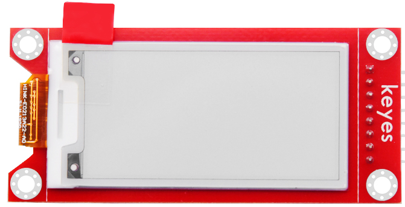
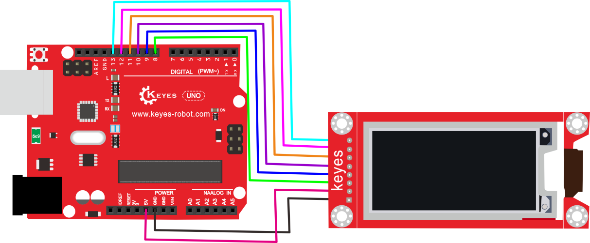
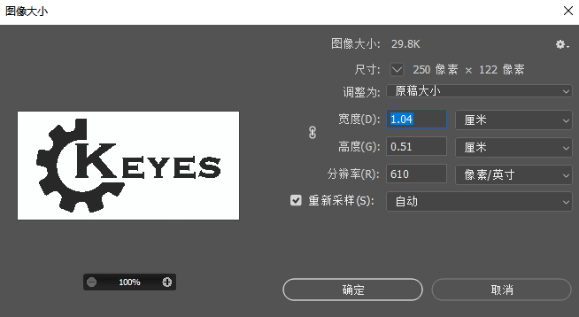
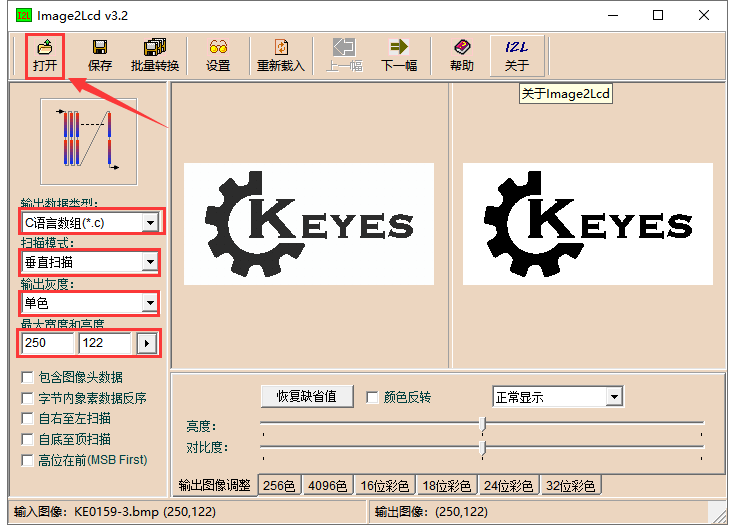
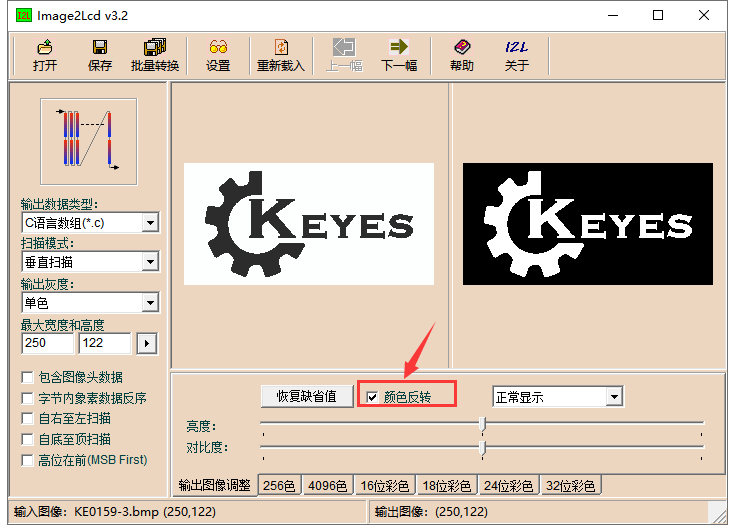
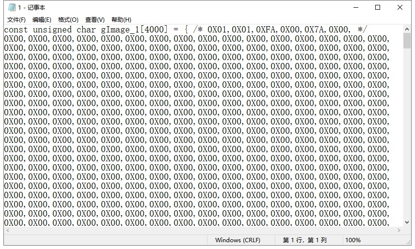
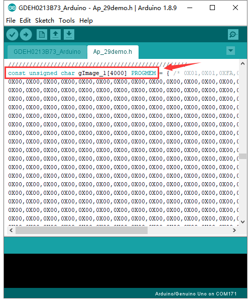
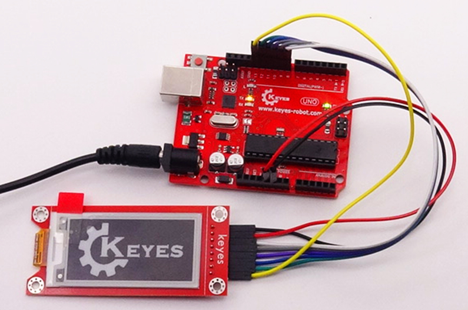

# KE0159 KEYES 电子墨水屏 2.13寸

资料下载：[KE0159相关资料](./资料/KE0159相关资料-1.7z)



---

## 1. 说明
**KEYES 电子墨水屏模块** 配备一个 2.13 寸的显示屏，显示颜色为黑白色，分辨率为 250*122。该模块通过 SPI 通讯，可动态显示图案。模块上带有 2 个拨码开关，P1 拨码必须拨打到“3”，拨打到“0.47”时可能出现问题。P2 拨码开关用于调节供电电压，拨打到“5VIN”时，供电电压为 5V；拨打到“3.3VIN”时，供电电压为 3.3V。为了方便使用，模块自带 2 个直径为 3mm 的定位孔。特别注意：测试时使用的是 1.8.9 版本的 IDE 软件，其他版本可能会出现不兼容现象。

---

## 2. 技术参数
- **工作电压**：DC 3.3 或 5V（拨码开关控制）  
- **工作电流**：100mA  
- **最大功率**：0.8W  
- **显示屏颜色**：黑白色  
- **显示屏大小**：2.13寸  
- **显示屏分辨率**：250*122  
- **接口类型**：间距为 2.54mm 的 8pin 排针  
- **工作温度范围**：-10℃ 到 +50℃  
- **定位孔大小**：直径 3mm  
- **尺寸**：79mm × 40mm × 7mm  
- **重量**：9.6g  
- **环保属性**：ROHS  

---

## 3. 接线方法
### UNO板连接方法



1. 将电子墨水屏的 VCC 接到 UNO 的 5V 或 3.3V（根据拨码开关设置）。
2. 将 GND 接到 UNO 的 GND。
3. 将 BUSY 接到 UNO 的 8 号引脚。
4. 将 RES 接到 UNO 的 9 号引脚。
5. 将 DC 接到 UNO 的 10 号引脚。
6. 将 CS 接到 UNO 的 11 号引脚。
7. 将 SCK 接到 UNO 的 12 号引脚。
8. 将 SDI 接到 UNO 的 13 号引脚。

---

## 4. 测试代码
```cpp
#include "Ap_29demo.h"

// IO settings
int BUSY_Pin = 8; 
int RES_Pin = 9; 
int DC_Pin = 10; 
int CS_Pin = 11; 
int SCK_Pin = 12; 
int SDI_Pin = 13; 

#define EPD_W21_MOSI_0  digitalWrite(SDI_Pin, LOW)
#define EPD_W21_MOSI_1  digitalWrite(SDI_Pin, HIGH) 
#define EPD_W21_CLK_0   digitalWrite(SCK_Pin, LOW)
#define EPD_W21_CLK_1   digitalWrite(SCK_Pin, HIGH)
#define EPD_W21_CS_0    digitalWrite(CS_Pin, LOW)
#define EPD_W21_CS_1    digitalWrite(CS_Pin, HIGH)
#define EPD_W21_DC_0    digitalWrite(DC_Pin, LOW)
#define EPD_W21_DC_1    digitalWrite(DC_Pin, HIGH)
#define EPD_W21_RST_0   digitalWrite(RES_Pin, LOW)
#define EPD_W21_RST_1   digitalWrite(RES_Pin, HIGH)
#define isEPD_W21_BUSY  digitalRead(BUSY_Pin)

// 250*122
#define ALLSCREEN_GRAGHBYTES  4000

void setup() {
    pinMode(BUSY_Pin, INPUT); 
    pinMode(RES_Pin, OUTPUT);  
    pinMode(DC_Pin, OUTPUT);    
    pinMode(CS_Pin, OUTPUT);    
    pinMode(SCK_Pin, OUTPUT);    
    pinMode(SDI_Pin, OUTPUT);    
}

void loop() {
    EPD_HW_Init(); // Electronic paper initialization
    EPD_WhiteScreen_ALL(gImage_1); // Refresh the picture in full screen
    delay(2000);
    
    // Partial refresh example
    EPD_HW_Init(); // Electronic paper initialization
    EPD_SetRAMValue_BaseMap(gImage_basemap); // Set background color
    delay(100);
    EPD_Dis_Part(0, 32, gImage_num1, 32, 32); // Display partial image
    delay(1000);   
    
    // Clean and enter deep sleep
    EPD_HW_Init(); // Electronic paper initialization
    EPD_WhiteScreen_White(); // Show all white
    EPD_DeepSleep(); // Enter deep sleep
    while(1); 
}

// Additional functions omitted for brevity
```

---

## 5. Arduino代码设置方法
A. 安装 Image2Lcd 取模软件并注册。

B. 因为该款屏不支持灰度，所以在制作图片时，需要做成 250*122 像素的纯黑白图片，保存为 .bmp 位图文件。




C. 打开取模软件，设置如下图。



D. 点击打开，选择导出的图案，正显（白底黑字）则“颜色反转”打钩；负显（黑底白字)则不需要打钩。



E. 点击生成对应的 C 语言代码，将代码复制到代码中的 `const unsigned char gImage_basemap[4000] PROGMEM` 或 `const unsigned char gImage_1[4000] PROGMEM` 位置。





---

## 6. 测试结果
按照接线图接线，上传测试代码成功，上电后，显示屏会循环显示各种图案。此时拨码开关 P1 拨打到“3”，拨码开关 P2 拨打到“5VIN”。



---

## 7. 相关资料链接
- [树莓派官方网站](https://www.raspberrypi.org)

如有更多疑问，请联系 Keyes 官方客服或加入相关创客社区交流。祝使用愉快！