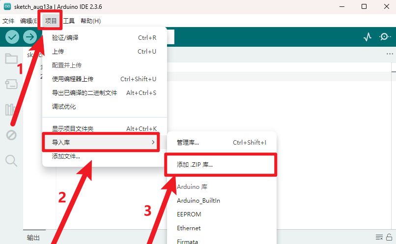

# KE0160 KEYES 圆形TFT LCD智能手表液晶屏模块


---

## 1. 说明
**KEYES 圆形TFT LCD智能手表液晶屏模块** 是一款 2.2 寸 TFT 液晶显示模块。它的输入电压为 3.3V ~ 5.5V，能够显示彩色图案和文字。模块的 LCD 刷屏速度最快约为 256 毫秒，支持多个图案循环显示和动态效果。目前库中定义了 19 种常用颜色，用户也可以自定义 16 位颜色代码。实验时，坐标以显示屏中心为原点，正负半轴最大绝对值为 64。模块自带 2 个直径为 3mm 的定位孔，方便固定在其他设备上。特别说明：参数“2.2英寸”是根据屏幕供应商提供的规格书标注，实际显示区域的尺寸约为 1.26 英寸（直径 32mm）。

---

## 2. 技术参数
- **工作电压**：DC 3.3V - 5.5V  
- **工作电流**：50mA  
- **最大功率**：0.5W  
- **分辨率**：128 * RGB * 128  
- **工作温度范围**：-25℃ 到 +60℃  
- **尺寸**：49mm × 46mm × 8mm  
- **接口**：8pin 排针接口（间距为 2.54mm）  
- **定位孔**：直径 3mm  
- **重量**：13.2g  

---

## 3. TFT LCD 尺寸图


---

## 4. 引脚说明
| 名称 | 功能描述 |
|------|----------|
| GND  | 电源负极 |
| VCC  | 电源正极 |
| LCK  | 液晶屏内部寄存器时钟线 |
| RS   | 液晶屏内部寄存器选择 |
| CS   | 片选信号 |
| WR   | 液晶屏数据输入 |
| SPI-SCL | 时钟信号 |
| SPI-MOSI | 主器件数据输出 |

---

## 5. 接线方法


1. 将 GND 接到电源负极。
2. 将 VCC 接到电源正极（3.3V 或 5V）。
3. 将 LCK 接到相应的时钟引脚。
4. 将 RS 接到相应的寄存器选择引脚。
5. 将 CS 接到片选信号引脚。
6. 将 WR 接到数据输入引脚。
7. 将 SPI-SCL 接到时钟信号引脚。
8. 将 SPI-MOSI 接到主器件数据输出引脚。

---

## 6. 测试代码
**安装库**

- 下载库文件：[KE0160](./资料/KE0160.7z)

- 打开Arduino IDE，选择“项目”，选择“导入库”，再选择“添加.ZIP库”。

  

- 找到下载资料的存放位置，打开文件夹找到库文件，选择要导入的库，点击“打开”。

  

- 安装成功界面。

  

### 代码1：绘制三角形

```cpp
#include "DFRobot_ST7687S_Latch.h"

#ifdef __AVR__
uint8_t pin_cs = 3, pin_rs = 5, pin_wr = 6, pin_lck = 7;
#else
uint8_t pin_cs = D3, pin_rs = D5, pin_wr = D6, pin_lck = D7;
#endif

DFRobot_ST7687S_Latch tft(pin_cs, pin_rs, pin_wr, pin_lck);

void setup(void) {
  Serial.begin(115200);
  tft.begin();
  tft.fillScreen(DISPLAY_WHITE);
}

void loop(void) {
  tft.drawTriangle(-20, -50, 0, 0, 50, 20, DISPLAY_ORANGE);  // 绘制三角形
  delay(1000);
  tft.fillTriangle(-20, -50, 0, 0, 50, 20, DISPLAY_ORANGE);  // 用颜色填充三角形
  delay(1000);
  tft.fillScreen(DISPLAY_WHITE);
}
```

### 代码2：显示文字
```cpp
#include "DFRobot_ST7687S_Latch.h"

#ifdef __AVR__
uint8_t pin_cs = 3, pin_rs = 5, pin_wr = 6, pin_lck = 7;
#else
uint8_t pin_cs = D3, pin_rs = D5, pin_wr = D6, pin_lck = D7;
#endif

DFRobot_ST7687S_Latch tft(pin_cs, pin_rs, pin_wr, pin_lck);

void setup(void) {
  Serial.begin(115200);
  tft.begin();
  tft.fillScreen(DISPLAY_BLACK);
}

void loop(void) {
  tft.setCursor(64, 64);
  tft.setTextBackground(DISPLAY_RED);  // 设置文本背景为红色
  tft.setTextColor(DISPLAY_WHITE);      // 设置文本颜色为白色
  tft.setTextSize(2);                   // 字体倍数为2
  tft.print("keyes");
  delay(1000);
}
```

### 注意事项
- 上传代码之前，必须将对应的库文件放置到 Arduino IDE 的库文件夹中。
- 上传代码时，使用的是 1.8.7 版本的 Arduino IDE 测试，其他版本 IDE 可能不兼容。

---

## 7. 测试结果
按照接线图接线，上传代码1，上电后，模块上的 TFT LCD 会显示对应的图案，绘制一个顶点分别为（-20,-50）、（0,0）、（50,20），边框颜色为橙色的三角形，并将其用橙色填充。上传代码2，以 2.2 寸屏的屏心（64,64）为起始位置，在屏上显示一个背景为红色、字体为白色、字体倍数为 2 的字符串“keyes”。


