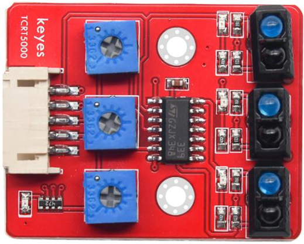
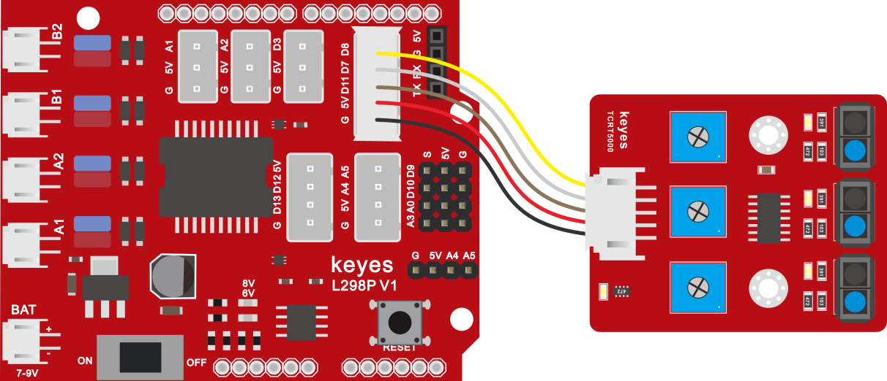
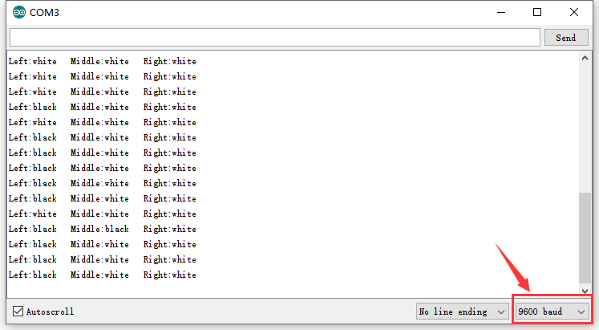

# KE0161 Keyes Connectors 循迹传感器



---

## 1. 介绍
**Keyes Connectors 循迹传感器** 是一款专为智能车 DIY 项目设计的传感器模块，主要用于实现循迹功能。该传感器模块集成了三个 TCRT5000 红外对管，能够检测地面上的黑白线条，从而帮助智能车沿着预定路径行驶。通过检测反射的红外线信号，传感器能够判断出底下的颜色状态，进而输出相应的电平信号。

---

## 2. 特点
- **高灵敏度**：采用 TCRT5000 红外对管，能够准确检测黑白线条。
- **简单连接**：通过特定接线（XH2.54 转 PH2.0 5P）与扩展板连接，方便快捷。
- **可调灵敏度**：传感器上配有三个电位器，可调节灵敏度，以适应不同环境。
- **小巧设计**：模块尺寸小，便于安装在各种设备上。
- **定位孔设计**：自带两个直径为 3mm 的定位孔，方便固定。

---

## 3. 规格参数
- **工作电压**：DC 3.3V - 5V  
- **接口**：5PIN 接口（PH2.0mm-5P 卧贴插座）  
- **输出信号**：数字信号  
- **检测高度**：0 - 3cm  
- **尺寸**：40mm × 32mm × 9mm  
- **重量**：6.8g  
- **定位孔大小**：直径 3mm  

---

## 4. 工作原理
Keyes Connectors 循迹传感器利用红外线对颜色的反射率差异进行工作。当传感器发出的红外线照射到地面时，黑色表面会吸收大部分红外线，导致反射信号较弱；而白色表面则会反射大部分红外线，导致反射信号较强。传感器通过检测反射信号的强弱，将其转化为电流信号，从而输出高电平或低电平，指示底下的颜色状态。

---

## 5. 接口
| 名称 | 功能描述 |
|------|----------|
| GND  | 电源负极 |
| VCC  | 电源正极 |
| OUT  | 输出信号 |
| ADJ1 | 左传感器灵敏度调节 |
| ADJ2 | 中间传感器灵敏度调节 |
| ADJ3 | 右传感器灵敏度调节 |

---

## 6. 连接图


---

## 7. 示例代码
```cpp
int sensor_L = 11; // 定义左边循迹传感器的脚位在 D11 脚
int sensor_M = 7;  // 定义中间循迹传感器的脚位在 D7 脚
int sensor_R = 8;  // 定义右边循迹传感器的脚位在 D8 脚
int left;
int middle;
int right;

void setup() {
  pinMode(sensor_L, INPUT); // 定义循迹传感器为输入模式
  pinMode(sensor_M, INPUT); // 定义循迹传感器为输入模式
  pinMode(sensor_R, INPUT); // 定义循迹传感器为输入模式  
  Serial.begin(9600);   
}

void loop() {
  left = digitalRead(sensor_L);
  middle = digitalRead(sensor_M);
  right = digitalRead(sensor_R);
  
  if (left == LOW) { // 读取传感器的状态，如果感应到白纸，状态是低电平
    Serial.print("Left:white");
  }
  if (left == HIGH) { // 读取传感器的状态，如果感应到黑纸，状态是高电平
    Serial.print("Left:black");
  }
  if (middle == LOW) { // 读取传感器的状态，如果感应到白纸，状态是低电平
    Serial.print("   Middle:white");
  }
  if (middle == HIGH) { // 读取传感器的状态，如果感应到黑纸，状态是高电平
    Serial.print("   Middle:black");
  }
  if (right == LOW) { // 读取传感器的状态，如果感应到白纸，状态是低电平
    Serial.println("   Right:white");
  }
  if (right == HIGH) { // 读取传感器的状态，如果感应到黑纸，状态是高电平
    Serial.println("   Right:black");
  }
  delay(200);
}
```

---

## 8. 实验现象
将传感器与扩展板搭配使用，按照连接图接好线，扩展板堆叠在 Arduino UNO 控制板上，烧录好代码，上电后，传感器在检测到黑色时，信号端输出高电平，对应的指示灯熄灭；在检测到其他颜色时，信号端输出低电平，对应的指示灯亮起。

打开串口监视器，设置波特率为 9600，显示如下信息：



- 左传感器检测到白色时，输出 "Left:white"
- 左传感器检测到黑色时，输出 "Left:black"
- 中间传感器检测到白色时，输出 "Middle:white"
- 中间传感器检测到黑色时，输出 "Middle:black"
- 右传感器检测到白色时，输出 "Right:white"
- 右传感器检测到黑色时，输出 "Right:black"

---

## 9. 注意事项
- 上传代码之前，确保将对应的库文件放置到 Arduino IDE 的库文件夹中。
- 上传代码时，使用的是 1.8.7 版本的 Arduino IDE 测试，其他版本 IDE 可能不兼容。
- 在调节灵敏度时，确保 LED 指示灯在不亮与亮之间的临界点，以获得最佳灵敏度。
- 确保传感器与地面之间的距离在 0-3cm 之间，以确保准确检测。

---

## 10. 参考链接
- [KEYES 官方网站](http://www.keyes-robot.com/)  
- [Arduino 官方网站](https://www.arduino.cc)  
- [TCRT5000 传感器资料](https://www.electronicwings.com/sensors/tcrt5000-infrared-obstacle-avoidance-sensor)  
- [Arduino IDE 下载](https://www.arduino.cc/en/software)  

如有更多疑问，请联系 Keyes 官方客服或加入相关创客社区交流。祝使用愉快！