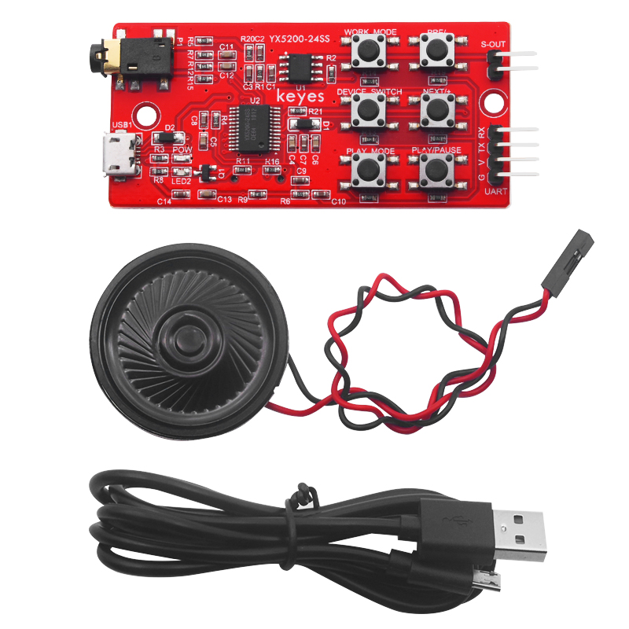

# KE0164 Keyes YX5200-24SS MP3模块+喇叭+USB线材 套件


---

## 目录
1. [介绍](#1-介绍)  
2. [特点](#2-特点)  
3. [规格参数](#3-规格参数)  
4. [工作原理](#4-工作原理)  
5. [接口说明](#5-接口说明)  
6. [连接图](#6-连接图)  
7. [示例代码](#7-示例代码)  
8. [实验现象](#8-实验现象)  
9. [注意事项](#9-注意事项)  
10. [参考链接](#10-参考链接)  

---

## 1. 介绍
**Keyes YX5200-24SS MP3模块** 是一款用于学习和开发的音乐模块。它的核心是 YX5200-24SS 语音芯片，完美集成了 MP3、WAV、WMA 的硬件接口，支持 TF 卡驱动。该模块具有使用方便、稳定可靠的特点，主要功能包括：
- 自带 TF 卡卡槽，直接读取和播放卡中音乐。
- 自带串口通信接口（UART），通过串口控制音乐播放。
- 自带 micro USB 接口（USB1），读取 SD 卡内容及下载音乐。
- 自带耳机接口（P1），方便接入耳机听音乐。
- 集成音频放大芯片和自带喇叭接口（S-OUT），可直接外接喇叭播放，音频放大倍数为 8 倍。
- 外置六个常用按键，方便控制和验证指令。



---

## 2. 特点
- **多种音频格式支持**：支持 MP3、WAV、WMA 格式的音频文件。
- **高音质输出**：集成音频放大芯片，提供高质量音频输出。
- **便捷的接口**：提供 USB、TF 卡、耳机和喇叭接口，方便连接和使用。
- **简单的控制方式**：通过按键和串口指令控制音乐播放，易于操作。
- **小巧轻便**：模块尺寸小，适合各种项目和应用。

---

## 3. 规格参数
- **工作电压**：DC 5V  
- **工作电流**：最大 1A  
- **最大功耗**：5W  
- **工作温度**：10~40℃  
- **音频放大倍数**：8 倍  
- **支持 TF 卡**：最大 32G  
- **尺寸**：33mm × 77mm × 9mm  
- **重量**：11.2g  

---

## 4. 工作原理
YX5200-24SS 模块通过 UART 接口接收控制指令，控制音频文件的播放、暂停、音量调节等功能。模块内置的音频解码芯片能够解码存储在 TF 卡中的音频文件，并通过音频放大器输出音频信号。用户可以通过按键或串口发送指令来控制模块的工作状态。


---

## 5. 接口说明
- **TF 卡槽**：用于插入 TF 卡，读取音频文件。
- **USB 接口**：用于连接电脑，下载音频文件到 TF 卡。
- **耳机接口（P1）**：用于连接耳机，直接听音乐。
- **喇叭接口（S-OUT）**：用于连接外部喇叭，输出音频。
- **按键接口**：用于控制模块的播放、暂停、音量等功能。

---

## 6. 连接图


---

## 7. 示例代码
以下是通过串口控制 YX5200-24SS 模块的示例代码：
```cpp
#include <SoftwareSerial.h>

SoftwareSerial mySerial(10, 11); // RX, TX

void setup() {
  mySerial.begin(9600); // 设置串口波特率
  Serial.begin(9600);
}

void loop() {
  // 播放第一首曲目
  mySerial.write(0x7E); // 起始符
  mySerial.write(0xFF); // 版本号
  mySerial.write(0x06); // 数据长度
  mySerial.write(0x03); // 指令：播放指定曲目
  mySerial.write(0x00); // 保留
  mySerial.write(0x01); // 曲目编号
  mySerial.write(0xFE); // 校验位
  mySerial.write(0xF7); // 结束符
  mySerial.write(0xEF); // 结束符

  delay(10000); // 播放10秒

  // 暂停播放
  mySerial.write(0x7E);
  mySerial.write(0xFF);
  mySerial.write(0x06);
  mySerial.write(0x0E); // 指令：暂停
  mySerial.write(0x00);
  mySerial.write(0x00);
  mySerial.write(0xFE);
  mySerial.write(0xED);
  mySerial.write(0xEF);

  delay(2000); // 暂停2秒

  // 播放下一首曲目
  mySerial.write(0x7E);
  mySerial.write(0xFF);
  mySerial.write(0x06);
  mySerial.write(0x01); // 指令：下一首
  mySerial.write(0x00);
  mySerial.write(0x00);
  mySerial.write(0xFE);
  mySerial.write(0xFA);
  mySerial.write(0xEF);

  delay(10000); // 播放10秒
}
```

---

## 8. 实验现象
在将 YX5200-24SS 模块连接到 Arduino 并上传示例代码后，模块能够成功播放 TF 卡中的音频文件。通过按键或串口指令可以控制音频的播放、暂停和切换，音质清晰，音量可调。

---

## 9. 注意事项
- 确保 TF 卡格式为 FAT32，并且音频文件命名符合要求。
- 在连接喇叭时，注意功率匹配，避免损坏模块。
- 使用 USB 接口时，确保连接稳定，避免数据传输中断。
- 在调试过程中，注意观察模块的指示灯状态，及时排查故障。

---

## 10. 参考链接
- [YX5200-24SS 数据手册](https://www.keyes.com.cn)  
- [MP3 模块使用教程](https://www.electronicwings.com/nrf/hc-06-bluetooth-module)  

如有更多疑问，请联系 Keyes 官方客服或加入相关创客社区交流。祝使用愉快！