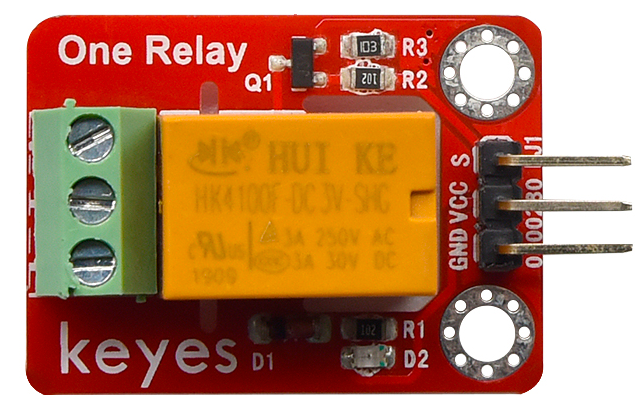
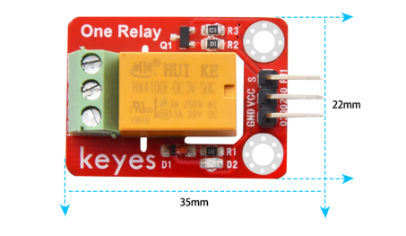
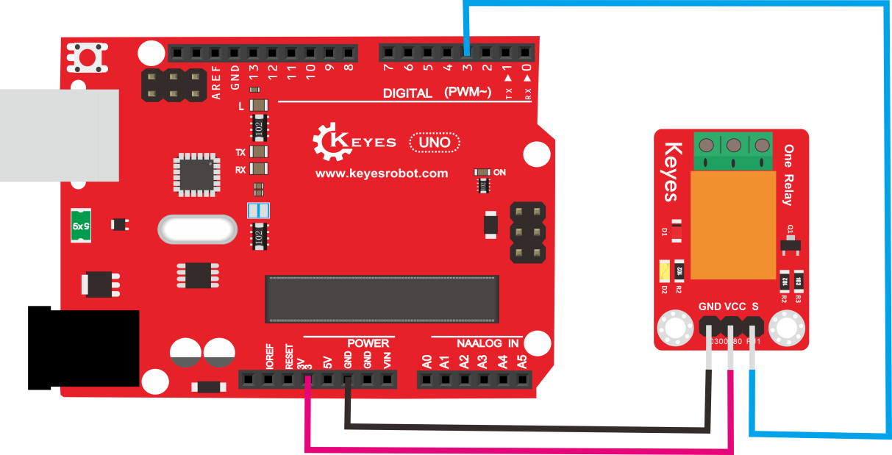
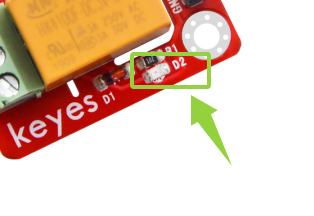

# KE0169 Keyes 3V 单路继电器模块



---

## 1.概述

这是一个常用的单路继电器模块，采用 HK4100F-DC 3V-SHC 继电器元件。它通常应用于自动化控制电路中，利用小电流控制大电流的运作，起到自动调节、安全保护和电路转换的作用。模块上有三个绿色接线柱，分别为 NO、COM 和 NC 端（背后丝印）。当继电器未接控制信号时，COM 端和 NC 端连通，COM 端和 NO 端断开。

控制时，将 GND 接单片机 GND，VCC 接单片机 3.3V，S 接单片机数字口。当 S 信号端设置为高电平时，继电器开启，COM 端和 NO 端连通；当 S 信号端设置为低电平时，继电器关闭，COM 端和 NC 端连通。同时，模块自带两个直径为 3mm 的定位孔，方便固定在其他设备上。

---

## 2.特点

- **小电流控制大电流**：适用于自动化控制电路。
- **高可靠性**：机械寿命可达 100,000 次，电气寿命也可达 100,000 次。
- **简单易用**：通过高电平信号控制继电器的开关状态。
- **便于安装**：自带定位孔，方便固定。

---

## 3.规格参数

- **工作电压**：DC 3.3V  
- **额定电流**：50-120mA  
- **线圈阻抗**：25-60Ω  
- **机械寿命**：在无负载情况下 100,000 次  
- **电气寿命**：3A/250VAC Cosφ=1，施加额定电压时有 100,000 次；3A/30VDC，施加额定电压有 100,000 次  
- **最大操作频率**：电气每分钟 30 次；机械每分钟 300 次  
- **绝缘阻抗**：在施加 500VDC 时绝缘阻抗大于等于 100MΩ  
- **接点容量**：3A/250VAC，3A/30VDC  
- **工作温度**：-15℃ 到 +60℃  
- **接口**：3pin 间距为 2.54mm 排针接口  
- **信号**：高电平继电器吸合  



---

## 4.工作原理

继电器模块通过接收来自单片机的控制信号（高电平或低电平）来控制电路的开关状态。当 S 信号端为高电平时，继电器吸合，COM 端与 NO 端连通；当 S 信号端为低电平时，继电器断开，COM 端与 NC 端连通。这样可以实现对大电流设备的控制。

---

## 5.接口

- **GND**：接单片机 GND。
- **VCC**：接单片机 3.3V。
- **S**：接单片机数字口，用于控制继电器的开关。

---

## 6.连接图



---

## 7.示例代码

```cpp
int Relay = 3; // 定义数字口3

void setup() {
  pinMode(Relay, OUTPUT); // 将 Relay 设置为输出
}

void loop() {
  digitalWrite(Relay, HIGH); // 打开继电器
  delay(2000); // 延时 2S
  digitalWrite(Relay, LOW); // 关闭继电器
  delay(2000); // 延时 2S
}
```

---

## 8.实验现象

按照连接图接好线并烧录代码，上电后，继电器开启（NO 和 COM 端连通）2 秒，停止（NC 和 COM 端连通）2 秒，循环交替。开启时继电器上的 D2 灯亮起。



---

## 9.注意事项

- 确保继电器的额定电流和电压在安全范围内，避免损坏模块。
- 在接线时，注意接线柱的标识，确保正确连接。
- 使用时注意继电器的工作温度范围，避免过热。

---

## 10.参考链接

- [Keyes 官方网站](http://www.keyes-robot.com/)  
- [继电器模块使用指南](https://www.electronicwings.com/nrf/hc-06-bluetooth-module)  
- [Arduino 官方网站](https://www.arduino.cc)  

如有更多疑问，请联系 Keyes 官方客服或加入相关创客社区交流。祝使用愉快！