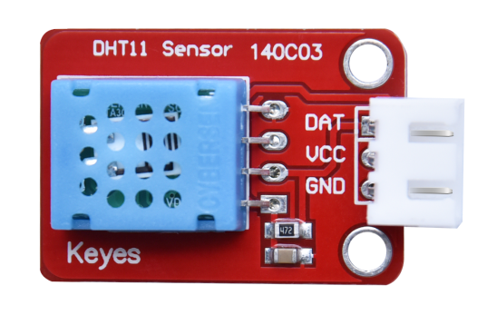
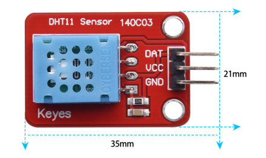
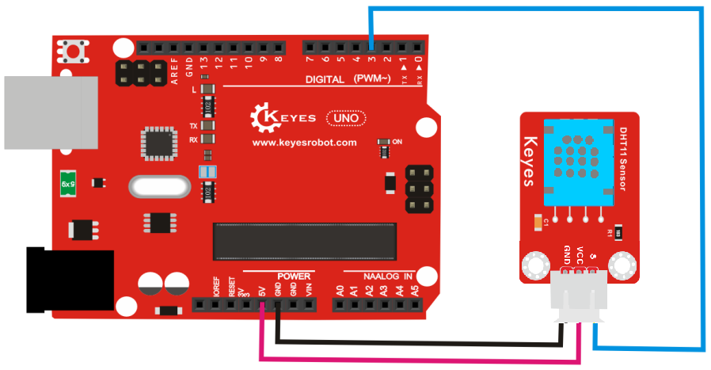
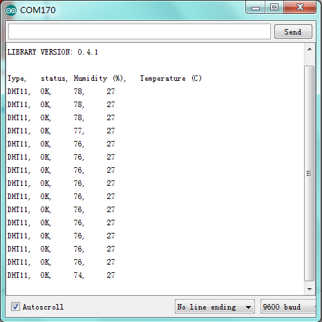

# KE0172 Keyes XHT11 温湿度传感器综合指南



---

## 1. 介绍
KE0172 Keyes XHT11 温湿度传感器是一款兼容 DHT11 的数字温湿度传感器，能够实时测量环境的温度和湿度。该传感器采用焊盘孔设计，方便用户进行二次开发和集成。它适用于各种气象监测、环境监测和智能家居等应用。

---

## 2. 特点
- **高精度**：能够准确测量温度和湿度。
- **快速响应**：响应时间约为 1 秒。
- **兼容性强**：兼容 DHT11，易于与 Arduino 等开发板配合使用。
- **简单易用**：只需三根引脚即可完成连接，方便集成。

---

## 3. 规格参数
- **工作电压**：3.3V - 5V  
- **测量范围**：
  - 温度：0℃ - 50℃
  - 湿度：20% - 90% RH  
- **测量精度**：
  - 温度：±2℃
  - 湿度：±5% RH  
- **响应时间**：约 1 秒  
- **接口**：3 引脚（VCC、GND、DATA）  
- **尺寸**：约 20mm x 12mm  



---

## 4. 工作原理
XHT11 温湿度传感器通过内部的数字信号处理器将环境的温度和湿度转换为数字信号，并通过单一的数据引脚输出。传感器在工作时会周期性地发送数据，用户可以通过读取数据引脚上的信号来获取当前的温湿度值。

---

## 5. 接口
- **VCC**：连接到电源（3.3V - 5V）
- **GND**：连接到地
- **DATA**：连接到单片机的数字引脚

---

## 6. 连接图


### 连接示例
- 将 VCC 引脚连接到 Arduino 的 5V 引脚。
- 将 GND 引脚连接到 Arduino 的 GND 引脚。
- 将 DATA 引脚连接到 Arduino 的数字引脚（如 D3）。

---

## 7. 示例代码
以下是一个简单的示例代码，用于读取 XHT11 温湿度传感器的数据：
```cpp
#include "DHT.h"

#define DHTPIN 3     // 数据引脚连接到数字引脚3
#define DHTTYPE DHT11   // 定义传感器类型为 DHT11

DHT dht(DHTPIN, DHTTYPE);

void setup() {
  Serial.begin(9600); // 初始化串口
  dht.begin();        // 初始化 DHT 传感器
}

void loop() {
  delay(2000); // 等待 2 秒钟

  // 读取温度和湿度
  float h = dht.readHumidity();
  float t = dht.readTemperature();

  // 检查是否读取失败
  if (isnan(h) || isnan(t)) {
    Serial.println("读取失败！");
    return;
  }

  // 输出温度和湿度
  Serial.print("湿度: ");
  Serial.print(h);
  Serial.print("%  温度: ");
  Serial.print(t);
  Serial.println("°C");
}
```

---

## 8. 实验现象
按照连接图接好线并烧录代码，上电后，串口监视器将显示实时的温度和湿度数据。每 2 秒更新一次。



---

## 9. 注意事项
- 确保传感器的供电电压在 3.3V - 5V 范围内，避免损坏传感器。
- 在读取数据时，确保传感器有足够的时间进行响应（建议每 2 秒读取一次）。
- 使用合适的库（如 DHT 库）来简化数据读取过程。

---

## 10. 参考链接
- [Keyes 官方网站](http://www.keyes-robot.com/)  
- [DHT 库 GitHub 页面](https://github.com/adafruit/DHT-sensor-library)  
- [Arduino 官方网站](https://www.arduino.cc)  

如有更多疑问，请联系 Keyes 官方客服或加入相关创客社区交流。祝使用愉快！