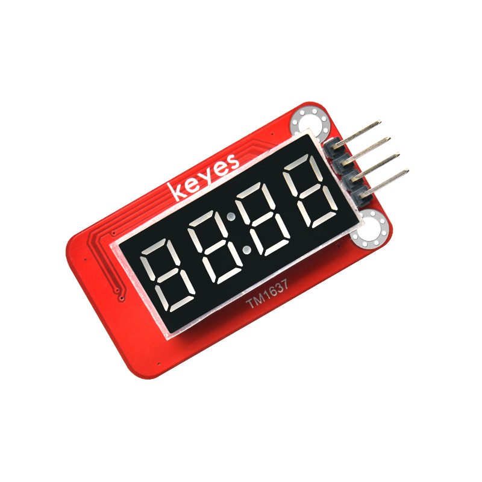
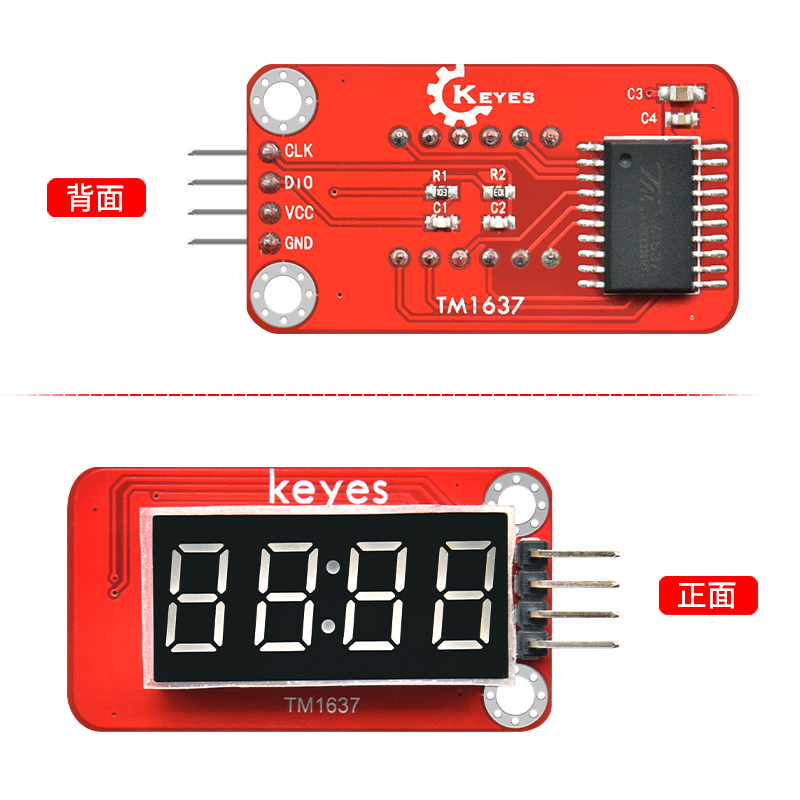
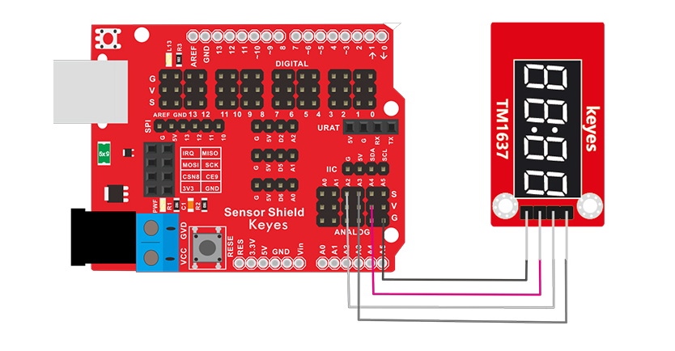

# KE0178 Keyes TM1637 4位数码管模块综合指南



---

## 1. 简介
KE0178 Keyes TM1637 4位数码管模块是一款基于 TM1637 驱动芯片的数码管显示模块，具有 4 位数码管显示功能，适用于各种电子项目和 DIY 实验。该模块采用焊盘孔设计，方便用户进行连接和扩展，适合与 Arduino 等开发板配合使用。



---

## 2. 特点
- **4 位显示**：可以同时显示 4 位数字，适合计时、计数等应用。
- **焊接排针**：模块设计为焊盘孔，方便用户焊接排针进行连接。
- **兼容性强**：可与 Arduino 等开发板兼容使用，适合各种项目。
- **简单易用**：适合初学者和教育用途，易于上手。

---

## 3. 规格参数
- **工作电压**：DC 3.3V - 5V  
- **显示类型**：4 位数码管  
- **引脚数量**：4  
- **尺寸**：约 50mm x 20mm  

---

## 4. 接口
- **VCC**：连接到电源正极（3.3V 或 5V）。
- **GND**：连接到电源负极（GND）。
- **DIO**：数据输入/输出引脚。
- **CLK**：时钟引脚。

---

## 5. 连接图


### 引脚定义
- **VCC**：连接到 Arduino 的 5V 引脚。
- **GND**：连接到 Arduino 的 GND 引脚。
- **DIO**：连接到 Arduino 的引脚（如 A2）。
- **CLK**：连接到 Arduino 的引脚（如 A3）。

---

## 6. 示例代码
以下是一个简单的示例代码，用于控制 TM1637 数码管模块显示数字：
```cpp
#include <TM1637Display.h>

#define CLK 3  // 时钟引脚连接到A3
#define DIO 2  // 数据引脚连接到A2

TM1637Display display(CLK, DIO);

void setup() {
  display.setBrightness(0x0f); // 设置亮度
}

void loop() {
  for (int i = 0; i < 10000; i++) {
    display.showNumberDec(i); // 显示数字
    delay(1000);              // 延时 1 秒
  }
}
```

---

## 7. 实验现象
上传程序后，TM1637 数码管模块将依次显示从 0 到 9999 的数字，每秒更新一次，表示程序正常运行。

---

## 8. 注意事项
- 确保数码管模块连接正确，避免短路。
- 在使用过程中，注意电源电压在 3.3V - 5V 范围内。
- 使用合适的库文件以确保程序正常运行。

